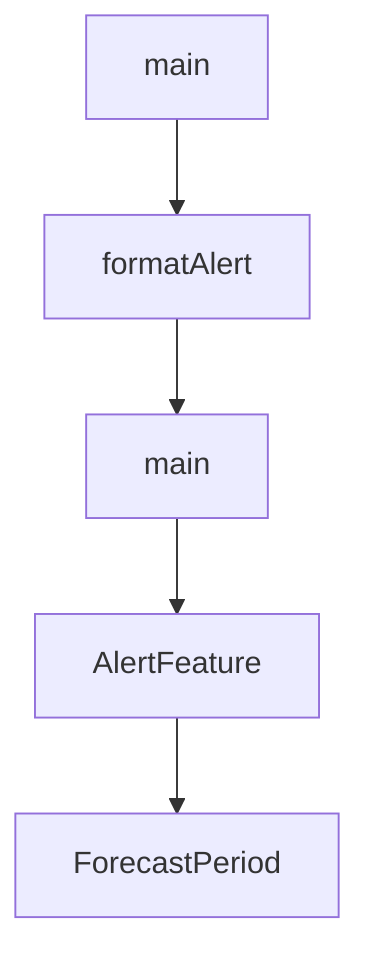

# Chapter 5: Smoke Tests and Mock Infrastructure

Welcome to **Chapter 5: Smoke Tests and Mock Infrastructure**. In this part of **MCP Quickstart Resources Tutorial: Cross-Language MCP Servers and Clients by Example**, you will build an intuitive mental model first, then move into concrete implementation details and practical production tradeoffs.


This chapter explains the lightweight test harness used to verify quickstart behavior.

## Learning Goals

- run smoke tests across supported language examples
- use mock client/server helpers for isolated protocol checks
- extend test coverage without external API dependencies
- integrate quickstart tests into CI workflows

## Test Infrastructure Components

| Helper | Role |
|:-------|:-----|
| `mcp-test-client.ts` | probes server readiness and tool listing |
| `mock-mcp-server.ts` | validates client-side protocol calls |
| `smoke-test.sh` | orchestrates cross-runtime checks |

## Source References

- [Smoke Tests Guide](https://github.com/modelcontextprotocol/quickstart-resources/blob/main/tests/README.md)
- [CI Workflow](https://github.com/modelcontextprotocol/quickstart-resources/blob/main/.github/workflows/ci.yml)

## Summary

You now have a repeatable validation loop for quickstart server/client quality.

Next: [Chapter 6: Cross-Language Consistency and Extension Strategy](06-cross-language-consistency-and-extension-strategy.md)

## Source Code Walkthrough

### `weather-server-python/weather.py`

The `main` function in [`weather-server-python/weather.py`](https://github.com/modelcontextprotocol/quickstart-resources/blob/HEAD/weather-server-python/weather.py) handles a key part of this chapter's functionality:

```py


def main():
    # Initialize and run the server
    mcp.run(transport="stdio")


if __name__ == "__main__":
    main()

```

This function is important because it defines how MCP Quickstart Resources Tutorial: Cross-Language MCP Servers and Clients by Example implements the patterns covered in this chapter.

### `weather-server-typescript/src/index.ts`

The `formatAlert` function in [`weather-server-typescript/src/index.ts`](https://github.com/modelcontextprotocol/quickstart-resources/blob/HEAD/weather-server-typescript/src/index.ts) handles a key part of this chapter's functionality:

```ts

// Format alert data
function formatAlert(feature: AlertFeature): string {
  const props = feature.properties;
  return [
    `Event: ${props.event || "Unknown"}`,
    `Area: ${props.areaDesc || "Unknown"}`,
    `Severity: ${props.severity || "Unknown"}`,
    `Status: ${props.status || "Unknown"}`,
    `Headline: ${props.headline || "No headline"}`,
    "---",
  ].join("\n");
}

interface ForecastPeriod {
  name?: string;
  temperature?: number;
  temperatureUnit?: string;
  windSpeed?: string;
  windDirection?: string;
  shortForecast?: string;
}

interface AlertsResponse {
  features: AlertFeature[];
}

interface PointsResponse {
  properties: {
    forecast?: string;
  };
}
```

This function is important because it defines how MCP Quickstart Resources Tutorial: Cross-Language MCP Servers and Clients by Example implements the patterns covered in this chapter.

### `weather-server-typescript/src/index.ts`

The `main` function in [`weather-server-typescript/src/index.ts`](https://github.com/modelcontextprotocol/quickstart-resources/blob/HEAD/weather-server-typescript/src/index.ts) handles a key part of this chapter's functionality:

```ts

// Start the server
async function main() {
  const transport = new StdioServerTransport();
  await server.connect(transport);
  console.error("Weather MCP Server running on stdio");
}

main().catch((error) => {
  console.error("Fatal error in main():", error);
  process.exit(1);
});

```

This function is important because it defines how MCP Quickstart Resources Tutorial: Cross-Language MCP Servers and Clients by Example implements the patterns covered in this chapter.

### `weather-server-typescript/src/index.ts`

The `AlertFeature` interface in [`weather-server-typescript/src/index.ts`](https://github.com/modelcontextprotocol/quickstart-resources/blob/HEAD/weather-server-typescript/src/index.ts) handles a key part of this chapter's functionality:

```ts
}

interface AlertFeature {
  properties: {
    event?: string;
    areaDesc?: string;
    severity?: string;
    status?: string;
    headline?: string;
  };
}

// Format alert data
function formatAlert(feature: AlertFeature): string {
  const props = feature.properties;
  return [
    `Event: ${props.event || "Unknown"}`,
    `Area: ${props.areaDesc || "Unknown"}`,
    `Severity: ${props.severity || "Unknown"}`,
    `Status: ${props.status || "Unknown"}`,
    `Headline: ${props.headline || "No headline"}`,
    "---",
  ].join("\n");
}

interface ForecastPeriod {
  name?: string;
  temperature?: number;
  temperatureUnit?: string;
  windSpeed?: string;
  windDirection?: string;
  shortForecast?: string;
```

This interface is important because it defines how MCP Quickstart Resources Tutorial: Cross-Language MCP Servers and Clients by Example implements the patterns covered in this chapter.


## How These Components Connect


