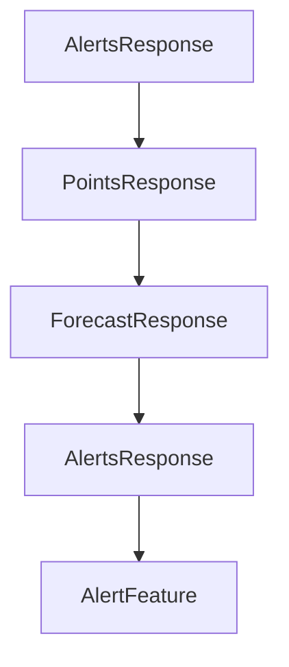

# Chapter 6: Cross-Language Consistency and Extension Strategy

Welcome to **Chapter 6: Cross-Language Consistency and Extension Strategy**. In this part of **MCP Quickstart Resources Tutorial: Cross-Language MCP Servers and Clients by Example**, you will build an intuitive mental model first, then move into concrete implementation details and practical production tradeoffs.


This chapter outlines how to extend quickstart assets while preserving behavior parity.

## Learning Goals

- define canonical behavior contracts across language implementations
- introduce new tools/resources without breaking consistency
- manage code divergence risk in multi-runtime teams
- document extension decisions for long-term maintainability

## Extension Controls

1. establish a shared protocol/behavior checklist before adding features
2. test feature parity across all maintained runtimes
3. keep language-specific optimizations isolated from protocol semantics
4. update smoke tests whenever capability surfaces change

## Source References

- [Quickstart Resources README](https://github.com/modelcontextprotocol/quickstart-resources/blob/main/README.md)
- [Smoke Tests Guide](https://github.com/modelcontextprotocol/quickstart-resources/blob/main/tests/README.md)

## Summary

You now have a strategy for controlled multi-language MCP feature evolution.

Next: [Chapter 7: CI, Toolchain Setup, and Troubleshooting](07-ci-toolchain-setup-and-troubleshooting.md)

## Source Code Walkthrough

### `weather-server-typescript/src/index.ts`

The `AlertsResponse` interface in [`weather-server-typescript/src/index.ts`](https://github.com/modelcontextprotocol/quickstart-resources/blob/HEAD/weather-server-typescript/src/index.ts) handles a key part of this chapter's functionality:

```ts
}

interface AlertsResponse {
  features: AlertFeature[];
}

interface PointsResponse {
  properties: {
    forecast?: string;
  };
}

interface ForecastResponse {
  properties: {
    periods: ForecastPeriod[];
  };
}

// Create server instance
const server = new McpServer({
  name: "weather",
  version: "1.0.0",
});

// Register weather tools
server.registerTool(
  "get-alerts",
  {
    title: "Get Weather Alerts",
    description: "Get weather alerts for a state",
    inputSchema: {
      state: z.string().length(2).describe("Two-letter state code (e.g. CA, NY)"),
```

This interface is important because it defines how MCP Quickstart Resources Tutorial: Cross-Language MCP Servers and Clients by Example implements the patterns covered in this chapter.

### `weather-server-typescript/src/index.ts`

The `PointsResponse` interface in [`weather-server-typescript/src/index.ts`](https://github.com/modelcontextprotocol/quickstart-resources/blob/HEAD/weather-server-typescript/src/index.ts) handles a key part of this chapter's functionality:

```ts
}

interface PointsResponse {
  properties: {
    forecast?: string;
  };
}

interface ForecastResponse {
  properties: {
    periods: ForecastPeriod[];
  };
}

// Create server instance
const server = new McpServer({
  name: "weather",
  version: "1.0.0",
});

// Register weather tools
server.registerTool(
  "get-alerts",
  {
    title: "Get Weather Alerts",
    description: "Get weather alerts for a state",
    inputSchema: {
      state: z.string().length(2).describe("Two-letter state code (e.g. CA, NY)"),
    },
  },
  async ({ state }) => {
    const stateCode = state.toUpperCase();
```

This interface is important because it defines how MCP Quickstart Resources Tutorial: Cross-Language MCP Servers and Clients by Example implements the patterns covered in this chapter.

### `weather-server-typescript/src/index.ts`

The `ForecastResponse` interface in [`weather-server-typescript/src/index.ts`](https://github.com/modelcontextprotocol/quickstart-resources/blob/HEAD/weather-server-typescript/src/index.ts) handles a key part of this chapter's functionality:

```ts
}

interface ForecastResponse {
  properties: {
    periods: ForecastPeriod[];
  };
}

// Create server instance
const server = new McpServer({
  name: "weather",
  version: "1.0.0",
});

// Register weather tools
server.registerTool(
  "get-alerts",
  {
    title: "Get Weather Alerts",
    description: "Get weather alerts for a state",
    inputSchema: {
      state: z.string().length(2).describe("Two-letter state code (e.g. CA, NY)"),
    },
  },
  async ({ state }) => {
    const stateCode = state.toUpperCase();
    const alertsUrl = `${NWS_API_BASE}/alerts?area=${stateCode}`;
    const alertsData = await makeNWSRequest<AlertsResponse>(alertsUrl);

    if (!alertsData) {
      return {
        content: [
```

This interface is important because it defines how MCP Quickstart Resources Tutorial: Cross-Language MCP Servers and Clients by Example implements the patterns covered in this chapter.

### `weather-server-rust/src/main.rs`

The `AlertsResponse` interface in [`weather-server-rust/src/main.rs`](https://github.com/modelcontextprotocol/quickstart-resources/blob/HEAD/weather-server-rust/src/main.rs) handles a key part of this chapter's functionality:

```rs

#[derive(Debug, Deserialize)]
struct AlertsResponse {
    features: Vec<AlertFeature>,
}

#[derive(Debug, Deserialize)]
struct AlertFeature {
    properties: AlertProperties,
}

#[derive(Debug, Deserialize)]
struct AlertProperties {
    event: Option<String>,
    #[serde(rename = "areaDesc")]
    area_desc: Option<String>,
    severity: Option<String>,
    description: Option<String>,
    instruction: Option<String>,
}

#[derive(Debug, Deserialize)]
struct PointsResponse {
    properties: PointsProperties,
}

#[derive(Debug, Deserialize)]
struct PointsProperties {
    forecast: String,
}

#[derive(Debug, Deserialize)]
```

This interface is important because it defines how MCP Quickstart Resources Tutorial: Cross-Language MCP Servers and Clients by Example implements the patterns covered in this chapter.


## How These Components Connect


