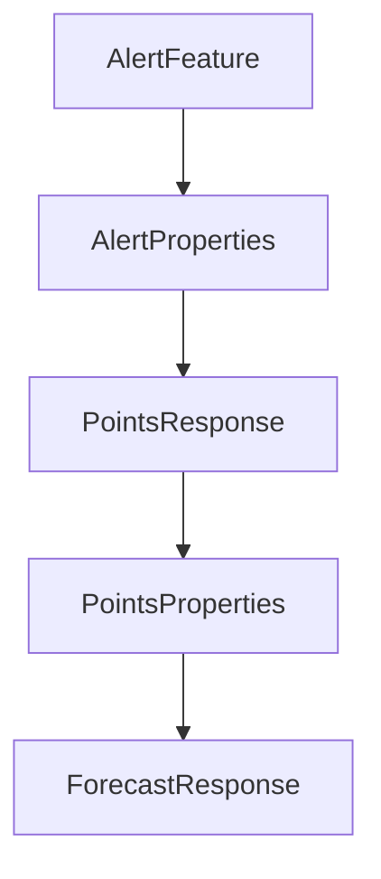

# Chapter 7: CI, Toolchain Setup, and Troubleshooting

Welcome to **Chapter 7: CI, Toolchain Setup, and Troubleshooting**. In this part of **MCP Quickstart Resources Tutorial: Cross-Language MCP Servers and Clients by Example**, you will build an intuitive mental model first, then move into concrete implementation details and practical production tradeoffs.


This chapter focuses on practical operations and maintenance concerns for multi-runtime quickstart usage.

## Learning Goals

- align Node/Python/Rust toolchain prerequisites in development and CI
- diagnose common dependency and runtime errors quickly
- maintain lightweight smoke coverage with clear failure boundaries
- improve contributor onboarding for multi-language test environments

## Source References

- [Smoke Tests Guide - Requirements/Troubleshooting](https://github.com/modelcontextprotocol/quickstart-resources/blob/main/tests/README.md)
- [CI Workflow](https://github.com/modelcontextprotocol/quickstart-resources/blob/main/.github/workflows/ci.yml)

## Summary

You now have an operations baseline for sustaining quickstart-based development loops.

Next: [Chapter 8: From Tutorial Assets to Production Systems](08-from-tutorial-assets-to-production-systems.md)

## Depth Expansion Playbook

## Source Code Walkthrough

### `weather-server-rust/src/main.rs`

The `AlertFeature` interface in [`weather-server-rust/src/main.rs`](https://github.com/modelcontextprotocol/quickstart-resources/blob/HEAD/weather-server-rust/src/main.rs) handles a key part of this chapter's functionality:

```rs
#[derive(Debug, Deserialize)]
struct AlertsResponse {
    features: Vec<AlertFeature>,
}

#[derive(Debug, Deserialize)]
struct AlertFeature {
    properties: AlertProperties,
}

#[derive(Debug, Deserialize)]
struct AlertProperties {
    event: Option<String>,
    #[serde(rename = "areaDesc")]
    area_desc: Option<String>,
    severity: Option<String>,
    description: Option<String>,
    instruction: Option<String>,
}

#[derive(Debug, Deserialize)]
struct PointsResponse {
    properties: PointsProperties,
}

#[derive(Debug, Deserialize)]
struct PointsProperties {
    forecast: String,
}

#[derive(Debug, Deserialize)]
struct ForecastResponse {
```

This interface is important because it defines how MCP Quickstart Resources Tutorial: Cross-Language MCP Servers and Clients by Example implements the patterns covered in this chapter.

### `weather-server-rust/src/main.rs`

The `AlertProperties` interface in [`weather-server-rust/src/main.rs`](https://github.com/modelcontextprotocol/quickstart-resources/blob/HEAD/weather-server-rust/src/main.rs) handles a key part of this chapter's functionality:

```rs
#[derive(Debug, Deserialize)]
struct AlertFeature {
    properties: AlertProperties,
}

#[derive(Debug, Deserialize)]
struct AlertProperties {
    event: Option<String>,
    #[serde(rename = "areaDesc")]
    area_desc: Option<String>,
    severity: Option<String>,
    description: Option<String>,
    instruction: Option<String>,
}

#[derive(Debug, Deserialize)]
struct PointsResponse {
    properties: PointsProperties,
}

#[derive(Debug, Deserialize)]
struct PointsProperties {
    forecast: String,
}

#[derive(Debug, Deserialize)]
struct ForecastResponse {
    properties: ForecastProperties,
}

#[derive(Debug, Deserialize)]
struct ForecastProperties {
```

This interface is important because it defines how MCP Quickstart Resources Tutorial: Cross-Language MCP Servers and Clients by Example implements the patterns covered in this chapter.

### `weather-server-rust/src/main.rs`

The `PointsResponse` interface in [`weather-server-rust/src/main.rs`](https://github.com/modelcontextprotocol/quickstart-resources/blob/HEAD/weather-server-rust/src/main.rs) handles a key part of this chapter's functionality:

```rs

#[derive(Debug, Deserialize)]
struct PointsResponse {
    properties: PointsProperties,
}

#[derive(Debug, Deserialize)]
struct PointsProperties {
    forecast: String,
}

#[derive(Debug, Deserialize)]
struct ForecastResponse {
    properties: ForecastProperties,
}

#[derive(Debug, Deserialize)]
struct ForecastProperties {
    periods: Vec<ForecastPeriod>,
}

#[derive(Debug, Deserialize)]
struct ForecastPeriod {
    name: String,
    temperature: i32,
    #[serde(rename = "temperatureUnit")]
    temperature_unit: String,
    #[serde(rename = "windSpeed")]
    wind_speed: String,
    #[serde(rename = "windDirection")]
    wind_direction: String,
    #[serde(rename = "detailedForecast")]
```

This interface is important because it defines how MCP Quickstart Resources Tutorial: Cross-Language MCP Servers and Clients by Example implements the patterns covered in this chapter.

### `weather-server-rust/src/main.rs`

The `PointsProperties` interface in [`weather-server-rust/src/main.rs`](https://github.com/modelcontextprotocol/quickstart-resources/blob/HEAD/weather-server-rust/src/main.rs) handles a key part of this chapter's functionality:

```rs
#[derive(Debug, Deserialize)]
struct PointsResponse {
    properties: PointsProperties,
}

#[derive(Debug, Deserialize)]
struct PointsProperties {
    forecast: String,
}

#[derive(Debug, Deserialize)]
struct ForecastResponse {
    properties: ForecastProperties,
}

#[derive(Debug, Deserialize)]
struct ForecastProperties {
    periods: Vec<ForecastPeriod>,
}

#[derive(Debug, Deserialize)]
struct ForecastPeriod {
    name: String,
    temperature: i32,
    #[serde(rename = "temperatureUnit")]
    temperature_unit: String,
    #[serde(rename = "windSpeed")]
    wind_speed: String,
    #[serde(rename = "windDirection")]
    wind_direction: String,
    #[serde(rename = "detailedForecast")]
    detailed_forecast: String,
```

This interface is important because it defines how MCP Quickstart Resources Tutorial: Cross-Language MCP Servers and Clients by Example implements the patterns covered in this chapter.


## How These Components Connect


