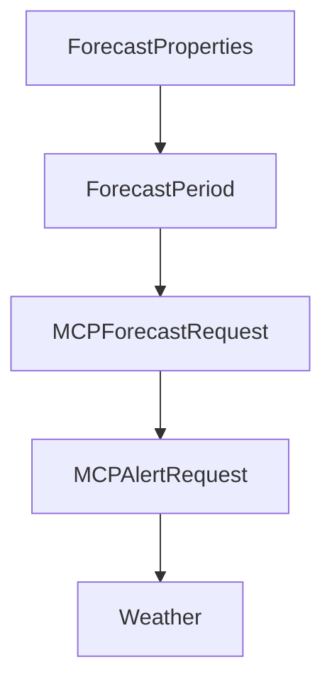

# Chapter 8: From Tutorial Assets to Production Systems

Welcome to **Chapter 8: From Tutorial Assets to Production Systems**. In this part of **MCP Quickstart Resources Tutorial: Cross-Language MCP Servers and Clients by Example**, you will build an intuitive mental model first, then move into concrete implementation details and practical production tradeoffs.


This chapter defines a migration path from tutorial reference code to production MCP services.

## Learning Goals

- identify quickstart assumptions that do not hold in production
- harden transport, schema, auth, and observability layers
- maintain compatibility tests while refactoring core architecture
- set release and governance controls for production MCP systems

## Productionization Checklist

| Area | Baseline Action |
|:-----|:----------------|
| security | add auth controls and secrets management |
| reliability | introduce retries, timeouts, and monitoring |
| quality | expand tests beyond smoke coverage |
| governance | document compatibility/versioning policies |

## Source References

- [Quickstart Resources README](https://github.com/modelcontextprotocol/quickstart-resources/blob/main/README.md)
- [Smoke Tests Guide](https://github.com/modelcontextprotocol/quickstart-resources/blob/main/tests/README.md)
- [MCP Specification](https://modelcontextprotocol.io/specification/2025-11-25)

## Summary

You now have a roadmap for evolving quickstart MCP assets into durable production systems.

Return to the [MCP Quickstart Resources Tutorial index](README.md).

## Depth Expansion Playbook

## Source Code Walkthrough

### `weather-server-rust/src/main.rs`

The `ForecastProperties` interface in [`weather-server-rust/src/main.rs`](https://github.com/modelcontextprotocol/quickstart-resources/blob/HEAD/weather-server-rust/src/main.rs) handles a key part of this chapter's functionality:

```rs
#[derive(Debug, Deserialize)]
struct ForecastResponse {
    properties: ForecastProperties,
}

#[derive(Debug, Deserialize)]
struct ForecastProperties {
    periods: Vec<ForecastPeriod>,
}

#[derive(Debug, Deserialize)]
struct ForecastPeriod {
    name: String,
    temperature: i32,
    #[serde(rename = "temperatureUnit")]
    temperature_unit: String,
    #[serde(rename = "windSpeed")]
    wind_speed: String,
    #[serde(rename = "windDirection")]
    wind_direction: String,
    #[serde(rename = "detailedForecast")]
    detailed_forecast: String,
}

async fn make_nws_request<T: DeserializeOwned>(url: &str) -> Result<T> {
    let client = reqwest::Client::new();
    let rsp = client
        .get(url)
        .header(reqwest::header::USER_AGENT, USER_AGENT)
        .header(reqwest::header::ACCEPT, "application/geo+json")
        .send()
        .await?
```

This interface is important because it defines how MCP Quickstart Resources Tutorial: Cross-Language MCP Servers and Clients by Example implements the patterns covered in this chapter.

### `weather-server-rust/src/main.rs`

The `ForecastPeriod` interface in [`weather-server-rust/src/main.rs`](https://github.com/modelcontextprotocol/quickstart-resources/blob/HEAD/weather-server-rust/src/main.rs) handles a key part of this chapter's functionality:

```rs
#[derive(Debug, Deserialize)]
struct ForecastProperties {
    periods: Vec<ForecastPeriod>,
}

#[derive(Debug, Deserialize)]
struct ForecastPeriod {
    name: String,
    temperature: i32,
    #[serde(rename = "temperatureUnit")]
    temperature_unit: String,
    #[serde(rename = "windSpeed")]
    wind_speed: String,
    #[serde(rename = "windDirection")]
    wind_direction: String,
    #[serde(rename = "detailedForecast")]
    detailed_forecast: String,
}

async fn make_nws_request<T: DeserializeOwned>(url: &str) -> Result<T> {
    let client = reqwest::Client::new();
    let rsp = client
        .get(url)
        .header(reqwest::header::USER_AGENT, USER_AGENT)
        .header(reqwest::header::ACCEPT, "application/geo+json")
        .send()
        .await?
        .error_for_status()?;
    Ok(rsp.json::<T>().await?)
}

fn format_alert(feature: &AlertFeature) -> String {
```

This interface is important because it defines how MCP Quickstart Resources Tutorial: Cross-Language MCP Servers and Clients by Example implements the patterns covered in this chapter.

### `weather-server-rust/src/main.rs`

The `MCPForecastRequest` interface in [`weather-server-rust/src/main.rs`](https://github.com/modelcontextprotocol/quickstart-resources/blob/HEAD/weather-server-rust/src/main.rs) handles a key part of this chapter's functionality:

```rs

#[derive(serde::Deserialize, schemars::JsonSchema)]
pub struct MCPForecastRequest {
    latitude: f32,
    longitude: f32,
}

#[derive(serde::Deserialize, schemars::JsonSchema)]
pub struct MCPAlertRequest {
    state: String,
}

pub struct Weather {
    tool_router: ToolRouter<Weather>,
}

#[tool_router]
impl Weather {
    fn new() -> Self {
        Self {
            tool_router: Self::tool_router(),
        }
    }

    #[tool(description = "Get weather alerts for a US state.")]
    async fn get_alerts(
        &self,
        Parameters(MCPAlertRequest { state }): Parameters<MCPAlertRequest>,
    ) -> String {
        let url = format!(
            "{}/alerts/active/area/{}",
            NWS_API_BASE,
```

This interface is important because it defines how MCP Quickstart Resources Tutorial: Cross-Language MCP Servers and Clients by Example implements the patterns covered in this chapter.

### `weather-server-rust/src/main.rs`

The `MCPAlertRequest` interface in [`weather-server-rust/src/main.rs`](https://github.com/modelcontextprotocol/quickstart-resources/blob/HEAD/weather-server-rust/src/main.rs) handles a key part of this chapter's functionality:

```rs

#[derive(serde::Deserialize, schemars::JsonSchema)]
pub struct MCPAlertRequest {
    state: String,
}

pub struct Weather {
    tool_router: ToolRouter<Weather>,
}

#[tool_router]
impl Weather {
    fn new() -> Self {
        Self {
            tool_router: Self::tool_router(),
        }
    }

    #[tool(description = "Get weather alerts for a US state.")]
    async fn get_alerts(
        &self,
        Parameters(MCPAlertRequest { state }): Parameters<MCPAlertRequest>,
    ) -> String {
        let url = format!(
            "{}/alerts/active/area/{}",
            NWS_API_BASE,
            state.to_uppercase()
        );

        match make_nws_request::<AlertsResponse>(&url).await {
            Ok(data) => {
                if data.features.is_empty() {
```

This interface is important because it defines how MCP Quickstart Resources Tutorial: Cross-Language MCP Servers and Clients by Example implements the patterns covered in this chapter.


## How These Components Connect


