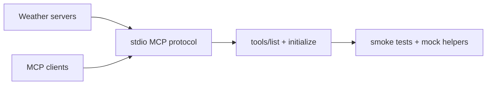

# MCP Quickstart Resources Tutorial: Cross-Language MCP Servers and Clients by Example

> Learn how to use `modelcontextprotocol/quickstart-resources` as a practical reference for multi-language MCP server/client implementations, protocol smoke testing, and onboarding workflows.

## Why This Track Matters

`quickstart-resources` is the fastest way to compare MCP fundamentals across multiple languages. It mirrors official tutorial patterns for weather servers and chatbot clients, making it useful for onboarding, teaching, and cross-runtime validation.

This track focuses on:

- understanding cross-language parity across server and client examples
- using quickstart assets as baseline reference implementations
- validating protocol behavior with built-in smoke test infrastructure
- extending examples into production-grade projects safely

## Current Snapshot (Verified February 12, 2026)

- repository: [`modelcontextprotocol/quickstart-resources`](https://github.com/modelcontextprotocol/quickstart-resources)
- stars: about **984**
- recent activity: updated on **February 12, 2026**
- supported example stacks: Go, Python, TypeScript, Rust
- test posture: includes smoke tests and mock MCP server/client helpers
- license note: metadata currently reports `NOASSERTION`; verify repository license terms before redistribution

## Mental Model

## Chapter Guide

| Chapter | Key Question | Outcome |
|:--------|:-------------|:--------|
| [01 - Getting Started and Repository Topology](01-getting-started-and-repository-topology.md) | What does the quickstart corpus include and how should I use it? | Faster orientation |
| [02 - Weather Server Patterns Across Languages](02-weather-server-patterns-across-languages.md) | How do server examples compare across Go/Python/Rust/TypeScript? | Better architecture intuition |
| [03 - MCP Client Patterns and LLM Chat Loops](03-mcp-client-patterns-and-llm-chat-loops.md) | How do client examples integrate MCP capabilities into chatbot flows? | Practical client baseline |
| [04 - Protocol Flow and stdio Transport Behavior](04-protocol-flow-and-stdio-transport-behavior.md) | Which protocol interactions are implemented consistently? | Stronger protocol understanding |
| [05 - Smoke Tests and Mock Infrastructure](05-smoke-tests-and-mock-infrastructure.md) | How can teams validate quickstart behavior automatically? | Better reliability |
| [06 - Cross-Language Consistency and Extension Strategy](06-cross-language-consistency-and-extension-strategy.md) | How should teams extend examples while preserving parity? | Lower drift |
| [07 - CI, Toolchain Setup, and Troubleshooting](07-ci-toolchain-setup-and-troubleshooting.md) | How do I keep multi-runtime example suites healthy? | Faster maintenance |
| [08 - From Tutorial Assets to Production Systems](08-from-tutorial-assets-to-production-systems.md) | How do you move beyond quickstart code without regressions? | Safer productionization |

## What You Will Learn

- how to read and compare MCP reference code across runtime ecosystems
- how to validate minimal MCP protocol behavior with lightweight test tools
- how to extend tutorial examples into maintainable server/client projects
- how to structure multi-language onboarding for teams adopting MCP

## Source References

- [Quickstart Resources README](https://github.com/modelcontextprotocol/quickstart-resources/blob/main/README.md)
- [Weather Server (Go)](https://github.com/modelcontextprotocol/quickstart-resources/blob/main/weather-server-go/README.md)
- [Weather Server (Python)](https://github.com/modelcontextprotocol/quickstart-resources/blob/main/weather-server-python/README.md)
- [Weather Server (Rust)](https://github.com/modelcontextprotocol/quickstart-resources/blob/main/weather-server-rust/README.md)
- [Weather Server (TypeScript)](https://github.com/modelcontextprotocol/quickstart-resources/blob/main/weather-server-typescript/README.md)
- [MCP Client (Go)](https://github.com/modelcontextprotocol/quickstart-resources/blob/main/mcp-client-go/README.md)
- [MCP Client (Python)](https://github.com/modelcontextprotocol/quickstart-resources/blob/main/mcp-client-python/README.md)
- [MCP Client (TypeScript)](https://github.com/modelcontextprotocol/quickstart-resources/blob/main/mcp-client-typescript/README.md)
- [Smoke Tests Guide](https://github.com/modelcontextprotocol/quickstart-resources/blob/main/tests/README.md)

## Related Tutorials

- [MCP Python SDK Tutorial](../mcp-python-sdk-tutorial/)
- [MCP TypeScript SDK Tutorial](../mcp-typescript-sdk-tutorial/)
- [MCP Go SDK Tutorial](../mcp-go-sdk-tutorial/)
- [MCP Rust SDK Tutorial](../mcp-rust-sdk-tutorial/)

---

Start with [Chapter 1: Getting Started and Repository Topology](01-getting-started-and-repository-topology.md).
