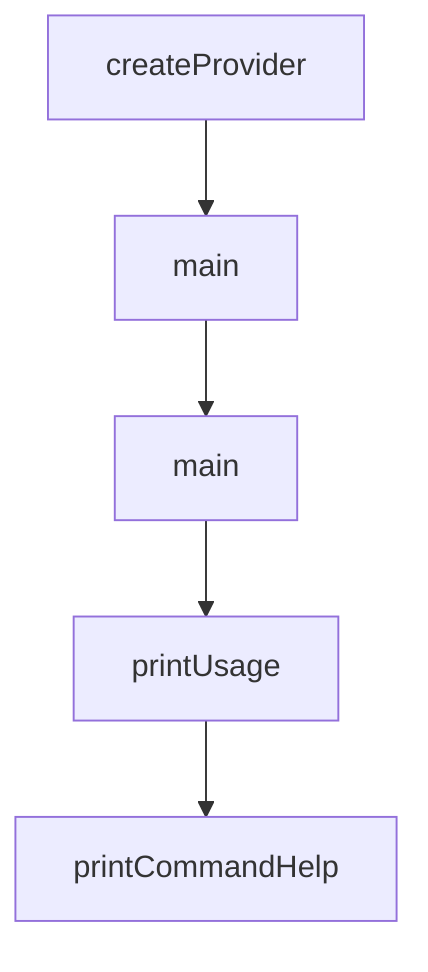

# Chapter 1: Getting Started and First Publish

Welcome to **Chapter 1: Getting Started and First Publish**. In this part of **MCP Registry Tutorial: Publishing, Discovery, and Governance for MCP Servers**, you will build an intuitive mental model first, then move into concrete implementation details and practical production tradeoffs.


This chapter sets up the first end-to-end publish flow using `mcp-publisher`.

## Learning Goals

- prepare a minimal valid `server.json`
- align package metadata and registry naming requirements
- authenticate and publish with the official CLI
- verify publication via registry API search

## Fast Start Loop

1. publish your package artifact first (npm/PyPI/NuGet/OCI/MCPB)
2. generate `server.json` with `mcp-publisher init`
3. authenticate with `mcp-publisher login <method>`
4. run `mcp-publisher publish`
5. verify with `GET /v0.1/servers?search=<server-name>`

## Baseline Commands

```bash
# Install tool
brew install mcp-publisher

# Create template
mcp-publisher init

# Authenticate (example: GitHub)
mcp-publisher login github

# Publish
mcp-publisher publish
```

## Source References

- [Quickstart: Publish a Server](https://github.com/modelcontextprotocol/registry/blob/main/docs/modelcontextprotocol-io/quickstart.mdx)
- [Publisher CLI Commands](https://github.com/modelcontextprotocol/registry/blob/main/docs/reference/cli/commands.md)

## Summary

You now have a working baseline for first publication.

Next: [Chapter 2: Registry Architecture and Data Flow](02-registry-architecture-and-data-flow.md)

## Depth Expansion Playbook

## Source Code Walkthrough

### `deploy/main.go`

The `createProvider` function in [`deploy/main.go`](https://github.com/modelcontextprotocol/registry/blob/HEAD/deploy/main.go) handles a key part of this chapter's functionality:

```go
)

// createProvider creates the appropriate cluster provider based on configuration
func createProvider(ctx *pulumi.Context) (providers.ClusterProvider, error) {
	conf := config.New(ctx, "mcp-registry")
	providerName := conf.Get("provider")
	if providerName == "" {
		providerName = "local" // Default to local provider
	}

	switch providerName {
	case "gcp":
		return &gcp.Provider{}, nil
	case "local":
		return &local.Provider{}, nil
	default:
		return nil, fmt.Errorf("unsupported provider: %s", providerName)
	}
}

func main() {
	pulumi.Run(func(ctx *pulumi.Context) error {
		// Get configuration
		conf := config.New(ctx, "mcp-registry")
		environment := conf.Require("environment")

		// Create provider
		provider, err := createProvider(ctx)
		if err != nil {
			return err
		}

```

This function is important because it defines how MCP Registry Tutorial: Publishing, Discovery, and Governance for MCP Servers implements the patterns covered in this chapter.

### `deploy/main.go`

The `main` function in [`deploy/main.go`](https://github.com/modelcontextprotocol/registry/blob/HEAD/deploy/main.go) handles a key part of this chapter's functionality:

```go
package main

import (
	"fmt"

	"github.com/pulumi/pulumi/sdk/v3/go/pulumi"
	"github.com/pulumi/pulumi/sdk/v3/go/pulumi/config"

	"github.com/modelcontextprotocol/registry/deploy/infra/pkg/k8s"
	"github.com/modelcontextprotocol/registry/deploy/infra/pkg/providers"
	"github.com/modelcontextprotocol/registry/deploy/infra/pkg/providers/gcp"
	"github.com/modelcontextprotocol/registry/deploy/infra/pkg/providers/local"
)

// createProvider creates the appropriate cluster provider based on configuration
func createProvider(ctx *pulumi.Context) (providers.ClusterProvider, error) {
	conf := config.New(ctx, "mcp-registry")
	providerName := conf.Get("provider")
	if providerName == "" {
		providerName = "local" // Default to local provider
	}

	switch providerName {
	case "gcp":
		return &gcp.Provider{}, nil
	case "local":
		return &local.Provider{}, nil
	default:
		return nil, fmt.Errorf("unsupported provider: %s", providerName)
	}
```

This function is important because it defines how MCP Registry Tutorial: Publishing, Discovery, and Governance for MCP Servers implements the patterns covered in this chapter.

### `cmd/publisher/main.go`

The `main` function in [`cmd/publisher/main.go`](https://github.com/modelcontextprotocol/registry/blob/HEAD/cmd/publisher/main.go) handles a key part of this chapter's functionality:

```go
package main

import (
	"fmt"
	"log"
	"os"

	"github.com/modelcontextprotocol/registry/cmd/publisher/commands"
)

// Version info for the MCP Publisher tool
// These variables are injected at build time via ldflags by goreleaser
var (
	// Version is the current version of the MCP Publisher tool
	Version = "dev"

	// BuildTime is the time at which the binary was built
	BuildTime = "unknown"

	// GitCommit is the git commit that was compiled
	GitCommit = "unknown"
)

func main() {
	if len(os.Args) < 2 {
		printUsage()
		os.Exit(1)
	}

	// Check for help flag for subcommands
```

This function is important because it defines how MCP Registry Tutorial: Publishing, Discovery, and Governance for MCP Servers implements the patterns covered in this chapter.

### `cmd/publisher/main.go`

The `printUsage` function in [`cmd/publisher/main.go`](https://github.com/modelcontextprotocol/registry/blob/HEAD/cmd/publisher/main.go) handles a key part of this chapter's functionality:

```go
func main() {
	if len(os.Args) < 2 {
		printUsage()
		os.Exit(1)
	}

	// Check for help flag for subcommands
	if len(os.Args) >= 3 && (os.Args[2] == "--help" || os.Args[2] == "-h") {
		printCommandHelp(os.Args[1])
		return
	}

	var err error
	switch os.Args[1] {
	case "init":
		err = commands.InitCommand()
	case "login":
		err = commands.LoginCommand(os.Args[2:])
	case "logout":
		err = commands.LogoutCommand()
	case "publish":
		err = commands.PublishCommand(os.Args[2:])
	case "status":
		err = commands.StatusCommand(os.Args[2:])
	case "validate":
		err = commands.ValidateCommand(os.Args[2:])
	case "--version", "-v", "version":
		log.Printf("mcp-publisher %s (commit: %s, built: %s)", Version, GitCommit, BuildTime)
		return
	case "--help", "-h", "help":
		printUsage()
	default:
```

This function is important because it defines how MCP Registry Tutorial: Publishing, Discovery, and Governance for MCP Servers implements the patterns covered in this chapter.


## How These Components Connect


