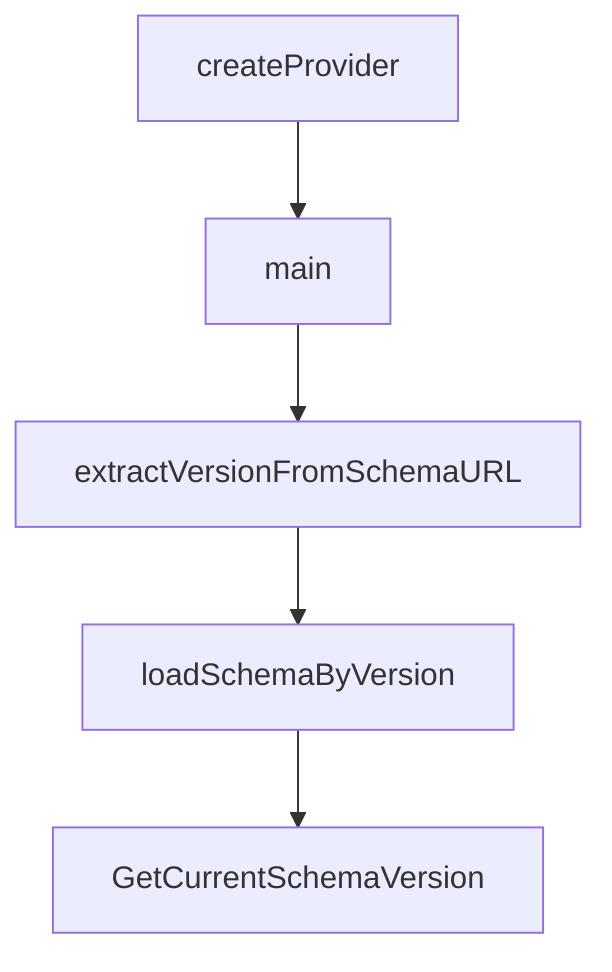

# Chapter 1: Getting Started and First Publish

Welcome to **Chapter 1: Getting Started and First Publish**. In this part of **MCP Registry Tutorial: Publishing, Discovery, and Governance for MCP Servers**, you will build an intuitive mental model first, then move into concrete implementation details and practical production tradeoffs.


This chapter sets up the first end-to-end publish flow using `mcp-publisher`.

## Learning Goals

- prepare a minimal valid `server.json`
- align package metadata and registry naming requirements
- authenticate and publish with the official CLI
- verify publication via registry API search

## Fast Start Loop

1. publish your package artifact first (npm/PyPI/NuGet/OCI/MCPB)
2. generate `server.json` with `mcp-publisher init`
3. authenticate with `mcp-publisher login <method>`
4. run `mcp-publisher publish`
5. verify with `GET /v0.1/servers?search=<server-name>`

## Baseline Commands

```bash
# Install tool
brew install mcp-publisher

# Create template
mcp-publisher init

# Authenticate (example: GitHub)
mcp-publisher login github

# Publish
mcp-publisher publish
```

## Source References

- [Quickstart: Publish a Server](https://github.com/modelcontextprotocol/registry/blob/main/docs/modelcontextprotocol-io/quickstart.mdx)
- [Publisher CLI Commands](https://github.com/modelcontextprotocol/registry/blob/main/docs/reference/cli/commands.md)

## Summary

You now have a working baseline for first publication.

Next: [Chapter 2: Registry Architecture and Data Flow](02-registry-architecture-and-data-flow.md)

## Source Code Walkthrough

### `deploy/main.go`

The `createProvider` function in [`deploy/main.go`](https://github.com/modelcontextprotocol/registry/blob/HEAD/deploy/main.go) handles a key part of this chapter's functionality:

```go
)

// createProvider creates the appropriate cluster provider based on configuration
func createProvider(ctx *pulumi.Context) (providers.ClusterProvider, error) {
	conf := config.New(ctx, "mcp-registry")
	providerName := conf.Get("provider")
	if providerName == "" {
		providerName = "local" // Default to local provider
	}

	switch providerName {
	case "gcp":
		return &gcp.Provider{}, nil
	case "local":
		return &local.Provider{}, nil
	default:
		return nil, fmt.Errorf("unsupported provider: %s", providerName)
	}
}

func main() {
	pulumi.Run(func(ctx *pulumi.Context) error {
		// Get configuration
		conf := config.New(ctx, "mcp-registry")
		environment := conf.Require("environment")

		// Create provider
		provider, err := createProvider(ctx)
		if err != nil {
			return err
		}

```

This function is important because it defines how MCP Registry Tutorial: Publishing, Discovery, and Governance for MCP Servers implements the patterns covered in this chapter.

### `deploy/main.go`

The `main` function in [`deploy/main.go`](https://github.com/modelcontextprotocol/registry/blob/HEAD/deploy/main.go) handles a key part of this chapter's functionality:

```go
package main

import (
	"fmt"

	"github.com/pulumi/pulumi/sdk/v3/go/pulumi"
	"github.com/pulumi/pulumi/sdk/v3/go/pulumi/config"

	"github.com/modelcontextprotocol/registry/deploy/infra/pkg/k8s"
	"github.com/modelcontextprotocol/registry/deploy/infra/pkg/providers"
	"github.com/modelcontextprotocol/registry/deploy/infra/pkg/providers/gcp"
	"github.com/modelcontextprotocol/registry/deploy/infra/pkg/providers/local"
)

// createProvider creates the appropriate cluster provider based on configuration
func createProvider(ctx *pulumi.Context) (providers.ClusterProvider, error) {
	conf := config.New(ctx, "mcp-registry")
	providerName := conf.Get("provider")
	if providerName == "" {
		providerName = "local" // Default to local provider
	}

	switch providerName {
	case "gcp":
		return &gcp.Provider{}, nil
	case "local":
		return &local.Provider{}, nil
	default:
		return nil, fmt.Errorf("unsupported provider: %s", providerName)
	}
```

This function is important because it defines how MCP Registry Tutorial: Publishing, Discovery, and Governance for MCP Servers implements the patterns covered in this chapter.

### `internal/validators/schema.go`

The `extractVersionFromSchemaURL` function in [`internal/validators/schema.go`](https://github.com/modelcontextprotocol/registry/blob/HEAD/internal/validators/schema.go) handles a key part of this chapter's functionality:

```go
var schemaFS embed.FS

// extractVersionFromSchemaURL extracts the version identifier from a schema URL
// e.g., "https://static.modelcontextprotocol.io/schemas/2025-10-17/server.schema.json" -> "2025-10-17"
// e.g., "https://static.modelcontextprotocol.io/schemas/draft/server.schema.json" -> "draft"
// Version identifier can contain: A-Z, a-z, 0-9, hyphen (-), underscore (_), tilde (~), and period (.)
func extractVersionFromSchemaURL(schemaURL string) (string, error) {
	// Pattern: /schemas/{identifier}/server.schema.json
	// Identifier allowed characters: A-Z, a-z, 0-9, -, _, ~, .
	re := regexp.MustCompile(`/schemas/([A-Za-z0-9_~.-]+)/server\.schema\.json`)
	matches := re.FindStringSubmatch(schemaURL)
	if len(matches) < 2 {
		return "", fmt.Errorf("invalid schema URL format: %s", schemaURL)
	}
	return matches[1], nil
}

// loadSchemaByVersion loads a schema file from the embedded filesystem by version
func loadSchemaByVersion(version string) ([]byte, error) {
	filename := fmt.Sprintf("schemas/%s.json", version)
	data, err := schemaFS.ReadFile(filename)
	if err != nil {
		return nil, fmt.Errorf("schema version %s not found in embedded schemas: %w", version, err)
	}
	return data, nil
}

// GetCurrentSchemaVersion returns the current schema URL from constants
func GetCurrentSchemaVersion() (string, error) {
	return model.CurrentSchemaURL, nil
}

```

This function is important because it defines how MCP Registry Tutorial: Publishing, Discovery, and Governance for MCP Servers implements the patterns covered in this chapter.

### `internal/validators/schema.go`

The `loadSchemaByVersion` function in [`internal/validators/schema.go`](https://github.com/modelcontextprotocol/registry/blob/HEAD/internal/validators/schema.go) handles a key part of this chapter's functionality:

```go
}

// loadSchemaByVersion loads a schema file from the embedded filesystem by version
func loadSchemaByVersion(version string) ([]byte, error) {
	filename := fmt.Sprintf("schemas/%s.json", version)
	data, err := schemaFS.ReadFile(filename)
	if err != nil {
		return nil, fmt.Errorf("schema version %s not found in embedded schemas: %w", version, err)
	}
	return data, nil
}

// GetCurrentSchemaVersion returns the current schema URL from constants
func GetCurrentSchemaVersion() (string, error) {
	return model.CurrentSchemaURL, nil
}

// validateServerJSONSchema validates the server JSON against the schema version specified in $schema using jsonschema
// Empty/missing schema always produces an error.
// If performValidation is true, performs full JSON Schema validation.
// If performValidation is false, only checks for empty schema (always an error) and handles non-current schemas per policy.
// nonCurrentPolicy determines how non-current (but valid) schema versions are handled when performValidation is true.
func validateServerJSONSchema(serverJSON *apiv0.ServerJSON, performValidation bool, nonCurrentPolicy SchemaVersionPolicy) *ValidationResult {
	result := &ValidationResult{Valid: true, Issues: []ValidationIssue{}}
	ctx := &ValidationContext{}

	// Empty/missing schema is always an error
	if serverJSON.Schema == "" {
		issue := NewValidationIssue(
			ValidationIssueTypeSemantic,
			ctx.Field("schema").String(),
			"$schema field is required",
```

This function is important because it defines how MCP Registry Tutorial: Publishing, Discovery, and Governance for MCP Servers implements the patterns covered in this chapter.


## How These Components Connect


