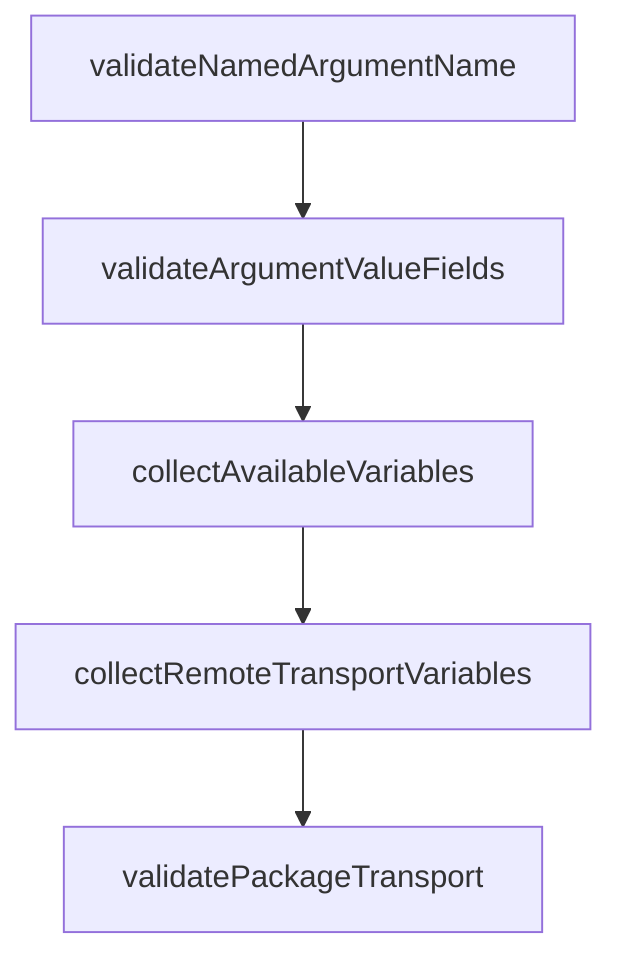

# Chapter 2: Registry Architecture and Data Flow

Welcome to **Chapter 2: Registry Architecture and Data Flow**. In this part of **MCP Registry Tutorial: Publishing, Discovery, and Governance for MCP Servers**, you will build an intuitive mental model first, then move into concrete implementation details and practical production tradeoffs.


The registry is a lightweight metadata service: publishers write versioned data, consumers read and cache it.

## Learning Goals

- map core components (API, DB, CLI, CDN)
- understand publication and discovery flows
- locate critical source areas for extension work
- reason about cache and polling expectations

## System Components

| Component | Primary Role |
|:----------|:-------------|
| Go API | read/write endpoints, auth flows, validation |
| PostgreSQL | versioned metadata, auth state, verification data |
| CDN layer | cache public read endpoints globally |
| `mcp-publisher` CLI | publisher entrypoint for auth and publish workflows |

## Data Flow Principle

Publish once to canonical metadata; downstream clients and aggregators consume via API and maintain their own caches.

## Source References

- [Registry README - Architecture](https://github.com/modelcontextprotocol/registry/blob/main/README.md#architecture)
- [Technical Architecture](https://github.com/modelcontextprotocol/registry/blob/main/docs/design/tech-architecture.md)
- [Design Principles](https://github.com/modelcontextprotocol/registry/blob/main/docs/design/design-principles.md)

## Summary

You now have a system-level model for registry behavior.

Next: [Chapter 3: server.json Schema and Package Verification](03-server-json-schema-and-package-verification.md)

## Depth Expansion Playbook

## Source Code Walkthrough

### `internal/validators/validators.go`

The `validateNamedArgumentName` function in [`internal/validators/validators.go`](https://github.com/modelcontextprotocol/registry/blob/HEAD/internal/validators/validators.go) handles a key part of this chapter's functionality:

```go
	if obj.Type == model.ArgumentTypeNamed {
		// Validate named argument name format
		nameResult := validateNamedArgumentName(ctx.Field("name"), obj.Name)
		result.Merge(nameResult)

		// Validate value and default don't start with the name
		valueResult := validateArgumentValueFields(ctx, obj.Name, obj.Value, obj.Default)
		result.Merge(valueResult)
	}
	return result
}

func validateNamedArgumentName(ctx *ValidationContext, name string) *ValidationResult {
	result := &ValidationResult{Valid: true, Issues: []ValidationIssue{}}

	// Check if name is required for named arguments
	if name == "" {
		issue := NewValidationIssueFromError(
			ValidationIssueTypeSemantic,
			ctx.String(),
			ErrNamedArgumentNameRequired,
			"named-argument-name-required",
		)
		result.AddIssue(issue)
		return result
	}

	// Check for invalid characters that suggest embedded values or descriptions
	// Valid: "--directory", "--port", "-v", "config", "verbose"
	// Invalid: "--directory <absolute_path_to_adfin_mcp_folder>", "--port 8080"
	if strings.Contains(name, "<") || strings.Contains(name, ">") ||
		strings.Contains(name, " ") || strings.Contains(name, "$") {
```

This function is important because it defines how MCP Registry Tutorial: Publishing, Discovery, and Governance for MCP Servers implements the patterns covered in this chapter.

### `internal/validators/validators.go`

The `validateArgumentValueFields` function in [`internal/validators/validators.go`](https://github.com/modelcontextprotocol/registry/blob/HEAD/internal/validators/validators.go) handles a key part of this chapter's functionality:

```go

		// Validate value and default don't start with the name
		valueResult := validateArgumentValueFields(ctx, obj.Name, obj.Value, obj.Default)
		result.Merge(valueResult)
	}
	return result
}

func validateNamedArgumentName(ctx *ValidationContext, name string) *ValidationResult {
	result := &ValidationResult{Valid: true, Issues: []ValidationIssue{}}

	// Check if name is required for named arguments
	if name == "" {
		issue := NewValidationIssueFromError(
			ValidationIssueTypeSemantic,
			ctx.String(),
			ErrNamedArgumentNameRequired,
			"named-argument-name-required",
		)
		result.AddIssue(issue)
		return result
	}

	// Check for invalid characters that suggest embedded values or descriptions
	// Valid: "--directory", "--port", "-v", "config", "verbose"
	// Invalid: "--directory <absolute_path_to_adfin_mcp_folder>", "--port 8080"
	if strings.Contains(name, "<") || strings.Contains(name, ">") ||
		strings.Contains(name, " ") || strings.Contains(name, "$") {
		issue := NewValidationIssueFromError(
			ValidationIssueTypeSemantic,
			ctx.String(),
			fmt.Errorf("%w: %s", ErrInvalidNamedArgumentName, name),
```

This function is important because it defines how MCP Registry Tutorial: Publishing, Discovery, and Governance for MCP Servers implements the patterns covered in this chapter.

### `internal/validators/validators.go`

The `collectAvailableVariables` function in [`internal/validators/validators.go`](https://github.com/modelcontextprotocol/registry/blob/HEAD/internal/validators/validators.go) handles a key part of this chapter's functionality:

```go

	// Validate transport with template variable support
	availableVariables := collectAvailableVariables(obj)
	transportResult := validatePackageTransport(ctx.Field("transport"), &obj.Transport, availableVariables)
	result.Merge(transportResult)

	return result
}

// validateVersion validates the version string.
// NB: we decided that we would not enforce strict semver for version strings
func validateVersion(ctx *ValidationContext, version string) *ValidationResult {
	result := &ValidationResult{Valid: true, Issues: []ValidationIssue{}}

	if version == "latest" {
		issue := NewValidationIssueFromError(
			ValidationIssueTypeSemantic,
			ctx.String(),
			ErrReservedVersionString,
			"reserved-version-string",
		)
		result.AddIssue(issue)
		return result
	}

	// Reject semver range-like inputs
	if looksLikeVersionRange(version) {
		issue := NewValidationIssueFromError(
			ValidationIssueTypeSemantic,
			ctx.String(),
			fmt.Errorf("%w: %q", ErrVersionLooksLikeRange, version),
			"version-looks-like-range",
```

This function is important because it defines how MCP Registry Tutorial: Publishing, Discovery, and Governance for MCP Servers implements the patterns covered in this chapter.

### `internal/validators/validators.go`

The `collectRemoteTransportVariables` function in [`internal/validators/validators.go`](https://github.com/modelcontextprotocol/registry/blob/HEAD/internal/validators/validators.go) handles a key part of this chapter's functionality:

```go
}

// collectRemoteTransportVariables extracts available variable names from a remote transport
func collectRemoteTransportVariables(transport *model.Transport) []string {
	var variables []string

	// Add variable names from the Variables map
	for variableName := range transport.Variables {
		if variableName != "" {
			variables = append(variables, variableName)
		}
	}

	return variables
}

// validatePackageTransport validates a package's transport with templating support
func validatePackageTransport(ctx *ValidationContext, transport *model.Transport, availableVariables []string) *ValidationResult {
	result := &ValidationResult{Valid: true, Issues: []ValidationIssue{}}

	// Validate transport type is supported
	switch transport.Type {
	case model.TransportTypeStdio:
		// Validate that URL is empty for stdio transport
		if transport.URL != "" {
			issue := NewValidationIssue(
				ValidationIssueTypeSemantic,
				ctx.Field("url").String(),
				fmt.Sprintf("url must be empty for %s transport type, got: %s", transport.Type, transport.URL),
				ValidationIssueSeverityError,
				"stdio-transport-url-not-empty",
			)
```

This function is important because it defines how MCP Registry Tutorial: Publishing, Discovery, and Governance for MCP Servers implements the patterns covered in this chapter.


## How These Components Connect


