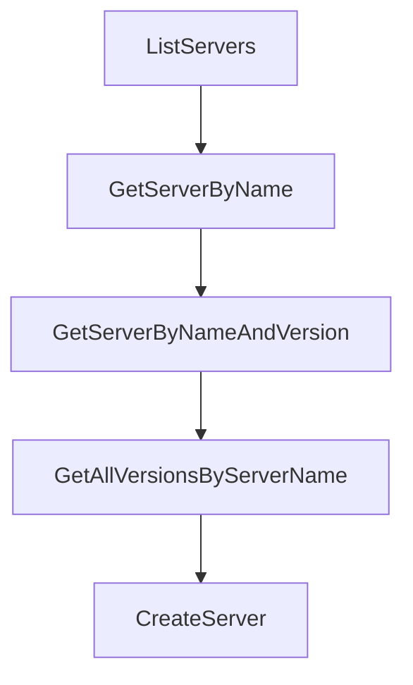

# Chapter 2: Registry Architecture and Data Flow

Welcome to **Chapter 2: Registry Architecture and Data Flow**. In this part of **MCP Registry Tutorial: Publishing, Discovery, and Governance for MCP Servers**, you will build an intuitive mental model first, then move into concrete implementation details and practical production tradeoffs.


The registry is a lightweight metadata service: publishers write versioned data, consumers read and cache it.

## Learning Goals

- map core components (API, DB, CLI, CDN)
- understand publication and discovery flows
- locate critical source areas for extension work
- reason about cache and polling expectations

## System Components

| Component | Primary Role |
|:----------|:-------------|
| Go API | read/write endpoints, auth flows, validation |
| PostgreSQL | versioned metadata, auth state, verification data |
| CDN layer | cache public read endpoints globally |
| `mcp-publisher` CLI | publisher entrypoint for auth and publish workflows |

## Data Flow Principle

Publish once to canonical metadata; downstream clients and aggregators consume via API and maintain their own caches.

## Source References

- [Registry README - Architecture](https://github.com/modelcontextprotocol/registry/blob/main/README.md#architecture)
- [Technical Architecture](https://github.com/modelcontextprotocol/registry/blob/main/docs/design/tech-architecture.md)
- [Design Principles](https://github.com/modelcontextprotocol/registry/blob/main/docs/design/design-principles.md)

## Summary

You now have a system-level model for registry behavior.

Next: [Chapter 3: server.json Schema and Package Verification](03-server-json-schema-and-package-verification.md)

## Source Code Walkthrough

### `internal/service/registry_service.go`

The `ListServers` function in [`internal/service/registry_service.go`](https://github.com/modelcontextprotocol/registry/blob/HEAD/internal/service/registry_service.go) handles a key part of this chapter's functionality:

```go
}

// ListServers returns registry entries with cursor-based pagination and optional filtering
func (s *registryServiceImpl) ListServers(ctx context.Context, filter *database.ServerFilter, cursor string, limit int) ([]*apiv0.ServerResponse, string, error) {
	// If limit is not set or negative, use a default limit
	if limit <= 0 {
		limit = 30
	}

	// Use the database's ListServers method with pagination and filtering
	serverRecords, nextCursor, err := s.db.ListServers(ctx, nil, filter, cursor, limit)
	if err != nil {
		return nil, "", err
	}

	return serverRecords, nextCursor, nil
}

// GetServerByName retrieves the latest version of a server by its server name
func (s *registryServiceImpl) GetServerByName(ctx context.Context, serverName string, includeDeleted bool) (*apiv0.ServerResponse, error) {
	serverRecord, err := s.db.GetServerByName(ctx, nil, serverName, includeDeleted)
	if err != nil {
		return nil, err
	}

	return serverRecord, nil
}

// GetServerByNameAndVersion retrieves a specific version of a server by server name and version
func (s *registryServiceImpl) GetServerByNameAndVersion(ctx context.Context, serverName string, version string, includeDeleted bool) (*apiv0.ServerResponse, error) {
	serverRecord, err := s.db.GetServerByNameAndVersion(ctx, nil, serverName, version, includeDeleted)
	if err != nil {
```

This function is important because it defines how MCP Registry Tutorial: Publishing, Discovery, and Governance for MCP Servers implements the patterns covered in this chapter.

### `internal/service/registry_service.go`

The `GetServerByName` function in [`internal/service/registry_service.go`](https://github.com/modelcontextprotocol/registry/blob/HEAD/internal/service/registry_service.go) handles a key part of this chapter's functionality:

```go
}

// GetServerByName retrieves the latest version of a server by its server name
func (s *registryServiceImpl) GetServerByName(ctx context.Context, serverName string, includeDeleted bool) (*apiv0.ServerResponse, error) {
	serverRecord, err := s.db.GetServerByName(ctx, nil, serverName, includeDeleted)
	if err != nil {
		return nil, err
	}

	return serverRecord, nil
}

// GetServerByNameAndVersion retrieves a specific version of a server by server name and version
func (s *registryServiceImpl) GetServerByNameAndVersion(ctx context.Context, serverName string, version string, includeDeleted bool) (*apiv0.ServerResponse, error) {
	serverRecord, err := s.db.GetServerByNameAndVersion(ctx, nil, serverName, version, includeDeleted)
	if err != nil {
		return nil, err
	}

	return serverRecord, nil
}

// GetAllVersionsByServerName retrieves all versions of a server by server name
func (s *registryServiceImpl) GetAllVersionsByServerName(ctx context.Context, serverName string, includeDeleted bool) ([]*apiv0.ServerResponse, error) {
	serverRecords, err := s.db.GetAllVersionsByServerName(ctx, nil, serverName, includeDeleted)
	if err != nil {
		return nil, err
	}

	return serverRecords, nil
}

```

This function is important because it defines how MCP Registry Tutorial: Publishing, Discovery, and Governance for MCP Servers implements the patterns covered in this chapter.

### `internal/service/registry_service.go`

The `GetServerByNameAndVersion` function in [`internal/service/registry_service.go`](https://github.com/modelcontextprotocol/registry/blob/HEAD/internal/service/registry_service.go) handles a key part of this chapter's functionality:

```go
}

// GetServerByNameAndVersion retrieves a specific version of a server by server name and version
func (s *registryServiceImpl) GetServerByNameAndVersion(ctx context.Context, serverName string, version string, includeDeleted bool) (*apiv0.ServerResponse, error) {
	serverRecord, err := s.db.GetServerByNameAndVersion(ctx, nil, serverName, version, includeDeleted)
	if err != nil {
		return nil, err
	}

	return serverRecord, nil
}

// GetAllVersionsByServerName retrieves all versions of a server by server name
func (s *registryServiceImpl) GetAllVersionsByServerName(ctx context.Context, serverName string, includeDeleted bool) ([]*apiv0.ServerResponse, error) {
	serverRecords, err := s.db.GetAllVersionsByServerName(ctx, nil, serverName, includeDeleted)
	if err != nil {
		return nil, err
	}

	return serverRecords, nil
}

// CreateServer creates a new server version
func (s *registryServiceImpl) CreateServer(ctx context.Context, req *apiv0.ServerJSON) (*apiv0.ServerResponse, error) {
	// Wrap the entire operation in a transaction
	return database.InTransactionT(ctx, s.db, func(ctx context.Context, tx pgx.Tx) (*apiv0.ServerResponse, error) {
		return s.createServerInTransaction(ctx, tx, req)
	})
}

// createServerInTransaction contains the actual CreateServer logic within a transaction
func (s *registryServiceImpl) createServerInTransaction(ctx context.Context, tx pgx.Tx, req *apiv0.ServerJSON) (*apiv0.ServerResponse, error) {
```

This function is important because it defines how MCP Registry Tutorial: Publishing, Discovery, and Governance for MCP Servers implements the patterns covered in this chapter.

### `internal/service/registry_service.go`

The `GetAllVersionsByServerName` function in [`internal/service/registry_service.go`](https://github.com/modelcontextprotocol/registry/blob/HEAD/internal/service/registry_service.go) handles a key part of this chapter's functionality:

```go
}

// GetAllVersionsByServerName retrieves all versions of a server by server name
func (s *registryServiceImpl) GetAllVersionsByServerName(ctx context.Context, serverName string, includeDeleted bool) ([]*apiv0.ServerResponse, error) {
	serverRecords, err := s.db.GetAllVersionsByServerName(ctx, nil, serverName, includeDeleted)
	if err != nil {
		return nil, err
	}

	return serverRecords, nil
}

// CreateServer creates a new server version
func (s *registryServiceImpl) CreateServer(ctx context.Context, req *apiv0.ServerJSON) (*apiv0.ServerResponse, error) {
	// Wrap the entire operation in a transaction
	return database.InTransactionT(ctx, s.db, func(ctx context.Context, tx pgx.Tx) (*apiv0.ServerResponse, error) {
		return s.createServerInTransaction(ctx, tx, req)
	})
}

// createServerInTransaction contains the actual CreateServer logic within a transaction
func (s *registryServiceImpl) createServerInTransaction(ctx context.Context, tx pgx.Tx, req *apiv0.ServerJSON) (*apiv0.ServerResponse, error) {
	// Validate the request
	if err := validators.ValidatePublishRequest(ctx, *req, s.cfg); err != nil {
		return nil, err
	}

	publishTime := time.Now()
	serverJSON := *req

	// Acquire advisory lock to prevent concurrent publishes of the same server
	if err := s.db.AcquirePublishLock(ctx, tx, serverJSON.Name); err != nil {
```

This function is important because it defines how MCP Registry Tutorial: Publishing, Discovery, and Governance for MCP Servers implements the patterns covered in this chapter.


## How These Components Connect


