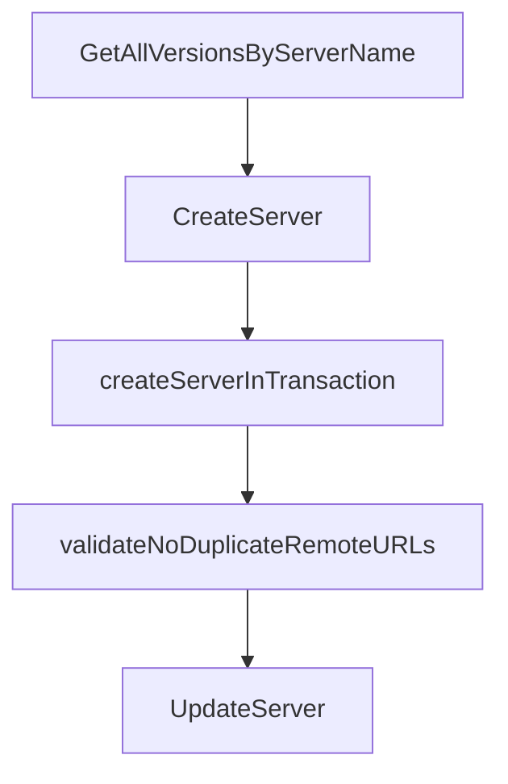

# Chapter 3: server.json Schema and Package Verification

Welcome to **Chapter 3: server.json Schema and Package Verification**. In this part of **MCP Registry Tutorial: Publishing, Discovery, and Governance for MCP Servers**, you will build an intuitive mental model first, then move into concrete implementation details and practical production tradeoffs.


The `server.json` spec is the core contract between publishers, registries, and consumers.

## Learning Goals

- model required fields and extension metadata safely
- understand supported package types and registry constraints
- satisfy ownership verification rules for each package ecosystem
- avoid common validation failures before publish

## Verification Overview

| Package Type | Ownership Signal |
|:-------------|:-----------------|
| npm | `mcpName` in `package.json` |
| PyPI / NuGet | `mcp-name: <server-name>` marker in README |
| OCI | `io.modelcontextprotocol.server.name` image annotation |
| MCPB | artifact URL pattern + file SHA-256 metadata |

## High-Value Validation Habit

Run `mcp-publisher validate` locally before each publish attempt and treat warnings as pre-release review items.

## Source References

- [server.json Format Specification](https://github.com/modelcontextprotocol/registry/blob/main/docs/reference/server-json/generic-server-json.md)
- [Official Registry Requirements](https://github.com/modelcontextprotocol/registry/blob/main/docs/reference/server-json/official-registry-requirements.md)
- [Supported Package Types](https://github.com/modelcontextprotocol/registry/blob/main/docs/modelcontextprotocol-io/package-types.mdx)
- [Publisher Validate Command](https://github.com/modelcontextprotocol/registry/blob/main/docs/reference/cli/commands.md#mcp-publisher-validate)

## Summary

You can now design metadata that is far less likely to fail publication checks.

Next: [Chapter 4: Authentication Models and Namespace Ownership](04-authentication-models-and-namespace-ownership.md)

## Depth Expansion Playbook

## Source Code Walkthrough

### `internal/service/registry_service.go`

The `GetAllVersionsByServerName` function in [`internal/service/registry_service.go`](https://github.com/modelcontextprotocol/registry/blob/HEAD/internal/service/registry_service.go) handles a key part of this chapter's functionality:

```go
}

// GetAllVersionsByServerName retrieves all versions of a server by server name
func (s *registryServiceImpl) GetAllVersionsByServerName(ctx context.Context, serverName string, includeDeleted bool) ([]*apiv0.ServerResponse, error) {
	serverRecords, err := s.db.GetAllVersionsByServerName(ctx, nil, serverName, includeDeleted)
	if err != nil {
		return nil, err
	}

	return serverRecords, nil
}

// CreateServer creates a new server version
func (s *registryServiceImpl) CreateServer(ctx context.Context, req *apiv0.ServerJSON) (*apiv0.ServerResponse, error) {
	// Wrap the entire operation in a transaction
	return database.InTransactionT(ctx, s.db, func(ctx context.Context, tx pgx.Tx) (*apiv0.ServerResponse, error) {
		return s.createServerInTransaction(ctx, tx, req)
	})
}

// createServerInTransaction contains the actual CreateServer logic within a transaction
func (s *registryServiceImpl) createServerInTransaction(ctx context.Context, tx pgx.Tx, req *apiv0.ServerJSON) (*apiv0.ServerResponse, error) {
	// Validate the request
	if err := validators.ValidatePublishRequest(ctx, *req, s.cfg); err != nil {
		return nil, err
	}

	publishTime := time.Now()
	serverJSON := *req

	// Acquire advisory lock to prevent concurrent publishes of the same server
	if err := s.db.AcquirePublishLock(ctx, tx, serverJSON.Name); err != nil {
```

This function is important because it defines how MCP Registry Tutorial: Publishing, Discovery, and Governance for MCP Servers implements the patterns covered in this chapter.

### `internal/service/registry_service.go`

The `CreateServer` function in [`internal/service/registry_service.go`](https://github.com/modelcontextprotocol/registry/blob/HEAD/internal/service/registry_service.go) handles a key part of this chapter's functionality:

```go
}

// CreateServer creates a new server version
func (s *registryServiceImpl) CreateServer(ctx context.Context, req *apiv0.ServerJSON) (*apiv0.ServerResponse, error) {
	// Wrap the entire operation in a transaction
	return database.InTransactionT(ctx, s.db, func(ctx context.Context, tx pgx.Tx) (*apiv0.ServerResponse, error) {
		return s.createServerInTransaction(ctx, tx, req)
	})
}

// createServerInTransaction contains the actual CreateServer logic within a transaction
func (s *registryServiceImpl) createServerInTransaction(ctx context.Context, tx pgx.Tx, req *apiv0.ServerJSON) (*apiv0.ServerResponse, error) {
	// Validate the request
	if err := validators.ValidatePublishRequest(ctx, *req, s.cfg); err != nil {
		return nil, err
	}

	publishTime := time.Now()
	serverJSON := *req

	// Acquire advisory lock to prevent concurrent publishes of the same server
	if err := s.db.AcquirePublishLock(ctx, tx, serverJSON.Name); err != nil {
		return nil, err
	}

	// Check for duplicate remote URLs
	if err := s.validateNoDuplicateRemoteURLs(ctx, tx, serverJSON); err != nil {
		return nil, err
	}

	// Check we haven't exceeded the maximum versions allowed for a server
	versionCount, err := s.db.CountServerVersions(ctx, tx, serverJSON.Name)
```

This function is important because it defines how MCP Registry Tutorial: Publishing, Discovery, and Governance for MCP Servers implements the patterns covered in this chapter.

### `internal/service/registry_service.go`

The `createServerInTransaction` function in [`internal/service/registry_service.go`](https://github.com/modelcontextprotocol/registry/blob/HEAD/internal/service/registry_service.go) handles a key part of this chapter's functionality:

```go
	// Wrap the entire operation in a transaction
	return database.InTransactionT(ctx, s.db, func(ctx context.Context, tx pgx.Tx) (*apiv0.ServerResponse, error) {
		return s.createServerInTransaction(ctx, tx, req)
	})
}

// createServerInTransaction contains the actual CreateServer logic within a transaction
func (s *registryServiceImpl) createServerInTransaction(ctx context.Context, tx pgx.Tx, req *apiv0.ServerJSON) (*apiv0.ServerResponse, error) {
	// Validate the request
	if err := validators.ValidatePublishRequest(ctx, *req, s.cfg); err != nil {
		return nil, err
	}

	publishTime := time.Now()
	serverJSON := *req

	// Acquire advisory lock to prevent concurrent publishes of the same server
	if err := s.db.AcquirePublishLock(ctx, tx, serverJSON.Name); err != nil {
		return nil, err
	}

	// Check for duplicate remote URLs
	if err := s.validateNoDuplicateRemoteURLs(ctx, tx, serverJSON); err != nil {
		return nil, err
	}

	// Check we haven't exceeded the maximum versions allowed for a server
	versionCount, err := s.db.CountServerVersions(ctx, tx, serverJSON.Name)
	if err != nil && !errors.Is(err, database.ErrNotFound) {
		return nil, err
	}
	if versionCount >= maxServerVersionsPerServer {
```

This function is important because it defines how MCP Registry Tutorial: Publishing, Discovery, and Governance for MCP Servers implements the patterns covered in this chapter.

### `internal/service/registry_service.go`

The `validateNoDuplicateRemoteURLs` function in [`internal/service/registry_service.go`](https://github.com/modelcontextprotocol/registry/blob/HEAD/internal/service/registry_service.go) handles a key part of this chapter's functionality:

```go

	// Check for duplicate remote URLs
	if err := s.validateNoDuplicateRemoteURLs(ctx, tx, serverJSON); err != nil {
		return nil, err
	}

	// Check we haven't exceeded the maximum versions allowed for a server
	versionCount, err := s.db.CountServerVersions(ctx, tx, serverJSON.Name)
	if err != nil && !errors.Is(err, database.ErrNotFound) {
		return nil, err
	}
	if versionCount >= maxServerVersionsPerServer {
		return nil, database.ErrMaxServersReached
	}

	// Check this isn't a duplicate version
	versionExists, err := s.db.CheckVersionExists(ctx, tx, serverJSON.Name, serverJSON.Version)
	if err != nil {
		return nil, err
	}
	if versionExists {
		return nil, database.ErrInvalidVersion
	}

	// Get current latest version to determine if new version should be latest
	currentLatest, err := s.db.GetCurrentLatestVersion(ctx, tx, serverJSON.Name)
	if err != nil && !errors.Is(err, database.ErrNotFound) {
		return nil, err
	}

	// Determine if this version should be marked as latest
	isNewLatest := true
```

This function is important because it defines how MCP Registry Tutorial: Publishing, Discovery, and Governance for MCP Servers implements the patterns covered in this chapter.


## How These Components Connect


