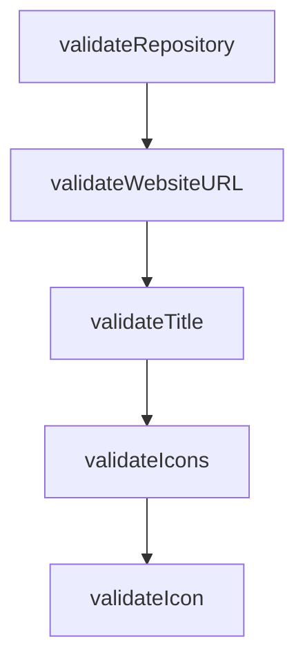

# Chapter 3: server.json Schema and Package Verification

Welcome to **Chapter 3: server.json Schema and Package Verification**. In this part of **MCP Registry Tutorial: Publishing, Discovery, and Governance for MCP Servers**, you will build an intuitive mental model first, then move into concrete implementation details and practical production tradeoffs.


The `server.json` spec is the core contract between publishers, registries, and consumers.

## Learning Goals

- model required fields and extension metadata safely
- understand supported package types and registry constraints
- satisfy ownership verification rules for each package ecosystem
- avoid common validation failures before publish

## Verification Overview

| Package Type | Ownership Signal |
|:-------------|:-----------------|
| npm | `mcpName` in `package.json` |
| PyPI / NuGet | `mcp-name: <server-name>` marker in README |
| OCI | `io.modelcontextprotocol.server.name` image annotation |
| MCPB | artifact URL pattern + file SHA-256 metadata |

## High-Value Validation Habit

Run `mcp-publisher validate` locally before each publish attempt and treat warnings as pre-release review items.

## Source References

- [server.json Format Specification](https://github.com/modelcontextprotocol/registry/blob/main/docs/reference/server-json/generic-server-json.md)
- [Official Registry Requirements](https://github.com/modelcontextprotocol/registry/blob/main/docs/reference/server-json/official-registry-requirements.md)
- [Supported Package Types](https://github.com/modelcontextprotocol/registry/blob/main/docs/modelcontextprotocol-io/package-types.mdx)
- [Publisher Validate Command](https://github.com/modelcontextprotocol/registry/blob/main/docs/reference/cli/commands.md#mcp-publisher-validate)

## Summary

You can now design metadata that is far less likely to fail publication checks.

Next: [Chapter 4: Authentication Models and Namespace Ownership](04-authentication-models-and-namespace-ownership.md)

## Source Code Walkthrough

### `internal/validators/validators.go`

The `validateRepository` function in [`internal/validators/validators.go`](https://github.com/modelcontextprotocol/registry/blob/HEAD/internal/validators/validators.go) handles a key part of this chapter's functionality:

```go

	// Validate repository
	repoResult := validateRepository(ctx.Field("repository"), serverJSON.Repository)
	result.Merge(repoResult)

	// Validate website URL if provided
	websiteResult := validateWebsiteURL(ctx.Field("websiteUrl"), serverJSON.WebsiteURL)
	result.Merge(websiteResult)

	// Validate title if provided
	titleResult := validateTitle(ctx.Field("title"), serverJSON.Title)
	result.Merge(titleResult)

	// Validate icons if provided
	iconsResult := validateIcons(ctx.Field("icons"), serverJSON.Icons)
	result.Merge(iconsResult)

	// Validate all packages (basic field validation)
	// Detailed package validation (including registry checks) is done during publish
	for i, pkg := range serverJSON.Packages {
		pkgResult := validatePackageField(ctx.Field("packages").Index(i), &pkg)
		result.Merge(pkgResult)
	}

	// Validate all remotes
	for i, remote := range serverJSON.Remotes {
		remoteResult := validateRemoteTransport(ctx.Field("remotes").Index(i), &remote)
		result.Merge(remoteResult)
	}

	return result
}
```

This function is important because it defines how MCP Registry Tutorial: Publishing, Discovery, and Governance for MCP Servers implements the patterns covered in this chapter.

### `internal/validators/validators.go`

The `validateWebsiteURL` function in [`internal/validators/validators.go`](https://github.com/modelcontextprotocol/registry/blob/HEAD/internal/validators/validators.go) handles a key part of this chapter's functionality:

```go

	// Validate website URL if provided
	websiteResult := validateWebsiteURL(ctx.Field("websiteUrl"), serverJSON.WebsiteURL)
	result.Merge(websiteResult)

	// Validate title if provided
	titleResult := validateTitle(ctx.Field("title"), serverJSON.Title)
	result.Merge(titleResult)

	// Validate icons if provided
	iconsResult := validateIcons(ctx.Field("icons"), serverJSON.Icons)
	result.Merge(iconsResult)

	// Validate all packages (basic field validation)
	// Detailed package validation (including registry checks) is done during publish
	for i, pkg := range serverJSON.Packages {
		pkgResult := validatePackageField(ctx.Field("packages").Index(i), &pkg)
		result.Merge(pkgResult)
	}

	// Validate all remotes
	for i, remote := range serverJSON.Remotes {
		remoteResult := validateRemoteTransport(ctx.Field("remotes").Index(i), &remote)
		result.Merge(remoteResult)
	}

	return result
}

func validateRepository(ctx *ValidationContext, obj *model.Repository) *ValidationResult {
	result := &ValidationResult{Valid: true, Issues: []ValidationIssue{}}

```

This function is important because it defines how MCP Registry Tutorial: Publishing, Discovery, and Governance for MCP Servers implements the patterns covered in this chapter.

### `internal/validators/validators.go`

The `validateTitle` function in [`internal/validators/validators.go`](https://github.com/modelcontextprotocol/registry/blob/HEAD/internal/validators/validators.go) handles a key part of this chapter's functionality:

```go

	// Validate title if provided
	titleResult := validateTitle(ctx.Field("title"), serverJSON.Title)
	result.Merge(titleResult)

	// Validate icons if provided
	iconsResult := validateIcons(ctx.Field("icons"), serverJSON.Icons)
	result.Merge(iconsResult)

	// Validate all packages (basic field validation)
	// Detailed package validation (including registry checks) is done during publish
	for i, pkg := range serverJSON.Packages {
		pkgResult := validatePackageField(ctx.Field("packages").Index(i), &pkg)
		result.Merge(pkgResult)
	}

	// Validate all remotes
	for i, remote := range serverJSON.Remotes {
		remoteResult := validateRemoteTransport(ctx.Field("remotes").Index(i), &remote)
		result.Merge(remoteResult)
	}

	return result
}

func validateRepository(ctx *ValidationContext, obj *model.Repository) *ValidationResult {
	result := &ValidationResult{Valid: true, Issues: []ValidationIssue{}}

	// Skip validation if repository is nil or empty (optional field)
	if obj == nil || (obj.URL == "" && obj.Source == "") {
		return result
	}
```

This function is important because it defines how MCP Registry Tutorial: Publishing, Discovery, and Governance for MCP Servers implements the patterns covered in this chapter.

### `internal/validators/validators.go`

The `validateIcons` function in [`internal/validators/validators.go`](https://github.com/modelcontextprotocol/registry/blob/HEAD/internal/validators/validators.go) handles a key part of this chapter's functionality:

```go

	// Validate icons if provided
	iconsResult := validateIcons(ctx.Field("icons"), serverJSON.Icons)
	result.Merge(iconsResult)

	// Validate all packages (basic field validation)
	// Detailed package validation (including registry checks) is done during publish
	for i, pkg := range serverJSON.Packages {
		pkgResult := validatePackageField(ctx.Field("packages").Index(i), &pkg)
		result.Merge(pkgResult)
	}

	// Validate all remotes
	for i, remote := range serverJSON.Remotes {
		remoteResult := validateRemoteTransport(ctx.Field("remotes").Index(i), &remote)
		result.Merge(remoteResult)
	}

	return result
}

func validateRepository(ctx *ValidationContext, obj *model.Repository) *ValidationResult {
	result := &ValidationResult{Valid: true, Issues: []ValidationIssue{}}

	// Skip validation if repository is nil or empty (optional field)
	if obj == nil || (obj.URL == "" && obj.Source == "") {
		return result
	}

	// validate the repository source
	repoSource := RepositorySource(obj.Source)
	if !IsValidRepositoryURL(repoSource, obj.URL) {
```

This function is important because it defines how MCP Registry Tutorial: Publishing, Discovery, and Governance for MCP Servers implements the patterns covered in this chapter.


## How These Components Connect


