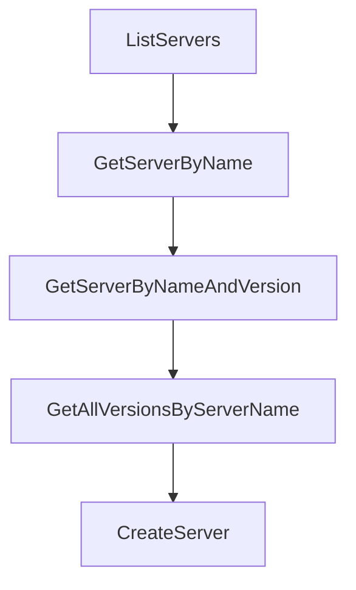

# Chapter 4: Authentication Models and Namespace Ownership

Welcome to **Chapter 4: Authentication Models and Namespace Ownership**. In this part of **MCP Registry Tutorial: Publishing, Discovery, and Governance for MCP Servers**, you will build an intuitive mental model first, then move into concrete implementation details and practical production tradeoffs.


Authentication method and server-name namespace must align, or publishing is rejected.

## Learning Goals

- choose auth mode based on namespace strategy
- implement GitHub, DNS, or HTTP verification paths
- handle CI-friendly auth flows with least friction
- prevent namespace mismatch errors early

## Auth Decision Table

| Auth Method | Namespace Pattern | Typical Context |
|:------------|:------------------|:----------------|
| GitHub OAuth/OIDC | `io.github.<user-or-org>/*` | open-source repo publishers |
| DNS | reverse-domain namespace | owned domains with DNS control |
| HTTP | reverse-domain namespace | owned domains with `.well-known` control |
| OIDC admin exchange | admin workflows | registry operations |

## Practical Guardrail

Define server naming convention first, then standardize one primary auth path in docs and CI templates.

## Source References

- [Authentication Guide](https://github.com/modelcontextprotocol/registry/blob/main/docs/modelcontextprotocol-io/authentication.mdx)
- [Registry Authorization Spec](https://github.com/modelcontextprotocol/registry/blob/main/docs/reference/api/registry-authorization.md)
- [Official Registry API - Authentication](https://github.com/modelcontextprotocol/registry/blob/main/docs/reference/api/official-registry-api.md#authentication)

## Summary

You now have a reliable mapping from namespace policy to authentication workflow.

Next: [Chapter 5: API Consumption, Subregistries, and Sync Strategies](05-api-consumption-subregistries-and-sync-strategies.md)

## Depth Expansion Playbook

## Source Code Walkthrough

### `internal/database/postgres.go`

The `ListServers` function in [`internal/database/postgres.go`](https://github.com/modelcontextprotocol/registry/blob/HEAD/internal/database/postgres.go) handles a key part of this chapter's functionality:

```go
}

func (db *PostgreSQL) ListServers(
	ctx context.Context,
	tx pgx.Tx,
	filter *ServerFilter,
	cursor string,
	limit int,
) ([]*apiv0.ServerResponse, string, error) {
	if limit <= 0 {
		limit = 10
	}

	if ctx.Err() != nil {
		return nil, "", ctx.Err()
	}

	// Build WHERE clause conditions
	argIndex := 1
	whereConditions, args, argIndex := buildFilterConditions(filter, argIndex)

	// Add cursor pagination
	cursorCondition, cursorArgs, argIndex := addCursorCondition(cursor, argIndex)
	if cursorCondition != "" {
		whereConditions = append(whereConditions, cursorCondition)
		args = append(args, cursorArgs...)
	}
	_ = argIndex // Silence unused variable warning

	// Build the WHERE clause
	whereClause := ""
	if len(whereConditions) > 0 {
```

This function is important because it defines how MCP Registry Tutorial: Publishing, Discovery, and Governance for MCP Servers implements the patterns covered in this chapter.

### `internal/database/postgres.go`

The `GetServerByName` function in [`internal/database/postgres.go`](https://github.com/modelcontextprotocol/registry/blob/HEAD/internal/database/postgres.go) handles a key part of this chapter's functionality:

```go
}

// GetServerByName retrieves the latest version of a server by server name
func (db *PostgreSQL) GetServerByName(ctx context.Context, tx pgx.Tx, serverName string, includeDeleted bool) (*apiv0.ServerResponse, error) {
	if ctx.Err() != nil {
		return nil, ctx.Err()
	}

	// Build filter conditions
	isLatest := true
	filter := &ServerFilter{
		Name:           &serverName,
		IsLatest:       &isLatest,
		IncludeDeleted: &includeDeleted,
	}

	argIndex := 1
	whereConditions, args, _ := buildFilterConditions(filter, argIndex)

	whereClause := ""
	if len(whereConditions) > 0 {
		whereClause = "WHERE " + strings.Join(whereConditions, " AND ")
	}

	query := fmt.Sprintf(`
		SELECT server_name, version, status, status_changed_at, status_message, published_at, updated_at, is_latest, value
		FROM servers
		%s
		ORDER BY published_at DESC
		LIMIT 1
	`, whereClause)

```

This function is important because it defines how MCP Registry Tutorial: Publishing, Discovery, and Governance for MCP Servers implements the patterns covered in this chapter.

### `internal/database/postgres.go`

The `GetServerByNameAndVersion` function in [`internal/database/postgres.go`](https://github.com/modelcontextprotocol/registry/blob/HEAD/internal/database/postgres.go) handles a key part of this chapter's functionality:

```go
}

// GetServerByNameAndVersion retrieves a specific version of a server by server name and version
func (db *PostgreSQL) GetServerByNameAndVersion(ctx context.Context, tx pgx.Tx, serverName string, version string, includeDeleted bool) (*apiv0.ServerResponse, error) {
	if ctx.Err() != nil {
		return nil, ctx.Err()
	}

	// Build filter conditions
	filter := &ServerFilter{
		Name:           &serverName,
		Version:        &version,
		IncludeDeleted: &includeDeleted,
	}

	argIndex := 1
	whereConditions, args, _ := buildFilterConditions(filter, argIndex)

	whereClause := ""
	if len(whereConditions) > 0 {
		whereClause = "WHERE " + strings.Join(whereConditions, " AND ")
	}

	query := fmt.Sprintf(`
		SELECT server_name, version, status, status_changed_at, status_message, published_at, updated_at, is_latest, value
		FROM servers
		%s
		LIMIT 1
	`, whereClause)

	var name, vers, status string
	var statusChangedAt, publishedAt, updatedAt time.Time
```

This function is important because it defines how MCP Registry Tutorial: Publishing, Discovery, and Governance for MCP Servers implements the patterns covered in this chapter.

### `internal/database/postgres.go`

The `GetAllVersionsByServerName` function in [`internal/database/postgres.go`](https://github.com/modelcontextprotocol/registry/blob/HEAD/internal/database/postgres.go) handles a key part of this chapter's functionality:

```go
}

// GetAllVersionsByServerName retrieves all versions of a server by server name
func (db *PostgreSQL) GetAllVersionsByServerName(ctx context.Context, tx pgx.Tx, serverName string, includeDeleted bool) ([]*apiv0.ServerResponse, error) {
	if ctx.Err() != nil {
		return nil, ctx.Err()
	}

	// Build filter conditions
	filter := &ServerFilter{
		Name:           &serverName,
		IncludeDeleted: &includeDeleted,
	}

	argIndex := 1
	whereConditions, args, _ := buildFilterConditions(filter, argIndex)

	whereClause := ""
	if len(whereConditions) > 0 {
		whereClause = "WHERE " + strings.Join(whereConditions, " AND ")
	}

	query := fmt.Sprintf(`
		SELECT server_name, version, status, status_changed_at, status_message, published_at, updated_at, is_latest, value
		FROM servers
		%s
		ORDER BY published_at DESC
	`, whereClause)

	rows, err := db.getExecutor(tx).Query(ctx, query, args...)
	if err != nil {
		return nil, fmt.Errorf("failed to query server versions: %w", err)
```

This function is important because it defines how MCP Registry Tutorial: Publishing, Discovery, and Governance for MCP Servers implements the patterns covered in this chapter.


## How These Components Connect


