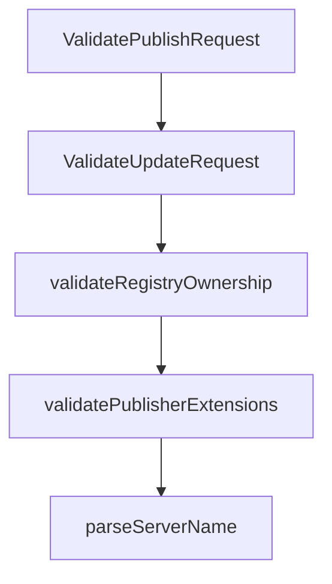

# Chapter 4: Authentication Models and Namespace Ownership

Welcome to **Chapter 4: Authentication Models and Namespace Ownership**. In this part of **MCP Registry Tutorial: Publishing, Discovery, and Governance for MCP Servers**, you will build an intuitive mental model first, then move into concrete implementation details and practical production tradeoffs.


Authentication method and server-name namespace must align, or publishing is rejected.

## Learning Goals

- choose auth mode based on namespace strategy
- implement GitHub, DNS, or HTTP verification paths
- handle CI-friendly auth flows with least friction
- prevent namespace mismatch errors early

## Auth Decision Table

| Auth Method | Namespace Pattern | Typical Context |
|:------------|:------------------|:----------------|
| GitHub OAuth/OIDC | `io.github.<user-or-org>/*` | open-source repo publishers |
| DNS | reverse-domain namespace | owned domains with DNS control |
| HTTP | reverse-domain namespace | owned domains with `.well-known` control |
| OIDC admin exchange | admin workflows | registry operations |

## Practical Guardrail

Define server naming convention first, then standardize one primary auth path in docs and CI templates.

## Source References

- [Authentication Guide](https://github.com/modelcontextprotocol/registry/blob/main/docs/modelcontextprotocol-io/authentication.mdx)
- [Registry Authorization Spec](https://github.com/modelcontextprotocol/registry/blob/main/docs/reference/api/registry-authorization.md)
- [Official Registry API - Authentication](https://github.com/modelcontextprotocol/registry/blob/main/docs/reference/api/official-registry-api.md#authentication)

## Summary

You now have a reliable mapping from namespace policy to authentication workflow.

Next: [Chapter 5: API Consumption, Subregistries, and Sync Strategies](05-api-consumption-subregistries-and-sync-strategies.md)

## Source Code Walkthrough

### `internal/validators/validators.go`

The `ValidatePublishRequest` function in [`internal/validators/validators.go`](https://github.com/modelcontextprotocol/registry/blob/HEAD/internal/validators/validators.go) handles a key part of this chapter's functionality:

```go
}

// ValidatePublishRequest validates a complete publish request including extensions
// Note: ValidateServerJSON should be called separately before this function
func ValidatePublishRequest(ctx context.Context, req apiv0.ServerJSON, cfg *config.Config) error {
	// Validate publisher extensions in _meta
	if err := validatePublisherExtensions(req); err != nil {
		return err
	}

	// Validate registry ownership for all packages if validation is enabled
	if cfg.EnableRegistryValidation {
		if err := validateRegistryOwnership(ctx, req); err != nil {
			return err
		}
	}

	return nil
}

// ValidateUpdateRequest validates an update request including registry ownership
// Note: ValidateServerJSON should be called separately before this function
func ValidateUpdateRequest(ctx context.Context, req apiv0.ServerJSON, cfg *config.Config, skipRegistryValidation bool) error {
	if cfg.EnableRegistryValidation && !skipRegistryValidation {
		if err := validateRegistryOwnership(ctx, req); err != nil {
			return err
		}
	}

	return nil
}

```

This function is important because it defines how MCP Registry Tutorial: Publishing, Discovery, and Governance for MCP Servers implements the patterns covered in this chapter.

### `internal/validators/validators.go`

The `ValidateUpdateRequest` function in [`internal/validators/validators.go`](https://github.com/modelcontextprotocol/registry/blob/HEAD/internal/validators/validators.go) handles a key part of this chapter's functionality:

```go
}

// ValidateUpdateRequest validates an update request including registry ownership
// Note: ValidateServerJSON should be called separately before this function
func ValidateUpdateRequest(ctx context.Context, req apiv0.ServerJSON, cfg *config.Config, skipRegistryValidation bool) error {
	if cfg.EnableRegistryValidation && !skipRegistryValidation {
		if err := validateRegistryOwnership(ctx, req); err != nil {
			return err
		}
	}

	return nil
}

func validateRegistryOwnership(ctx context.Context, req apiv0.ServerJSON) error {
	for i, pkg := range req.Packages {
		if err := ValidatePackage(ctx, pkg, req.Name); err != nil {
			return fmt.Errorf("registry validation failed for package %d (%s): %w", i, pkg.Identifier, err)
		}
	}
	return nil
}

func validatePublisherExtensions(req apiv0.ServerJSON) error {
	const maxExtensionSize = 4 * 1024 // 4KB limit

	// Check size limit for _meta publisher-provided extension
	if req.Meta != nil && req.Meta.PublisherProvided != nil {
		extensionsJSON, err := json.Marshal(req.Meta.PublisherProvided)
		if err != nil {
			return fmt.Errorf("failed to marshal _meta.io.modelcontextprotocol.registry/publisher-provided extension: %w", err)
		}
```

This function is important because it defines how MCP Registry Tutorial: Publishing, Discovery, and Governance for MCP Servers implements the patterns covered in this chapter.

### `internal/validators/validators.go`

The `validateRegistryOwnership` function in [`internal/validators/validators.go`](https://github.com/modelcontextprotocol/registry/blob/HEAD/internal/validators/validators.go) handles a key part of this chapter's functionality:

```go
	// Validate registry ownership for all packages if validation is enabled
	if cfg.EnableRegistryValidation {
		if err := validateRegistryOwnership(ctx, req); err != nil {
			return err
		}
	}

	return nil
}

// ValidateUpdateRequest validates an update request including registry ownership
// Note: ValidateServerJSON should be called separately before this function
func ValidateUpdateRequest(ctx context.Context, req apiv0.ServerJSON, cfg *config.Config, skipRegistryValidation bool) error {
	if cfg.EnableRegistryValidation && !skipRegistryValidation {
		if err := validateRegistryOwnership(ctx, req); err != nil {
			return err
		}
	}

	return nil
}

func validateRegistryOwnership(ctx context.Context, req apiv0.ServerJSON) error {
	for i, pkg := range req.Packages {
		if err := ValidatePackage(ctx, pkg, req.Name); err != nil {
			return fmt.Errorf("registry validation failed for package %d (%s): %w", i, pkg.Identifier, err)
		}
	}
	return nil
}

func validatePublisherExtensions(req apiv0.ServerJSON) error {
```

This function is important because it defines how MCP Registry Tutorial: Publishing, Discovery, and Governance for MCP Servers implements the patterns covered in this chapter.

### `internal/validators/validators.go`

The `validatePublisherExtensions` function in [`internal/validators/validators.go`](https://github.com/modelcontextprotocol/registry/blob/HEAD/internal/validators/validators.go) handles a key part of this chapter's functionality:

```go
func ValidatePublishRequest(ctx context.Context, req apiv0.ServerJSON, cfg *config.Config) error {
	// Validate publisher extensions in _meta
	if err := validatePublisherExtensions(req); err != nil {
		return err
	}

	// Validate registry ownership for all packages if validation is enabled
	if cfg.EnableRegistryValidation {
		if err := validateRegistryOwnership(ctx, req); err != nil {
			return err
		}
	}

	return nil
}

// ValidateUpdateRequest validates an update request including registry ownership
// Note: ValidateServerJSON should be called separately before this function
func ValidateUpdateRequest(ctx context.Context, req apiv0.ServerJSON, cfg *config.Config, skipRegistryValidation bool) error {
	if cfg.EnableRegistryValidation && !skipRegistryValidation {
		if err := validateRegistryOwnership(ctx, req); err != nil {
			return err
		}
	}

	return nil
}

func validateRegistryOwnership(ctx context.Context, req apiv0.ServerJSON) error {
	for i, pkg := range req.Packages {
		if err := ValidatePackage(ctx, pkg, req.Name); err != nil {
			return fmt.Errorf("registry validation failed for package %d (%s): %w", i, pkg.Identifier, err)
```

This function is important because it defines how MCP Registry Tutorial: Publishing, Discovery, and Governance for MCP Servers implements the patterns covered in this chapter.


## How These Components Connect


