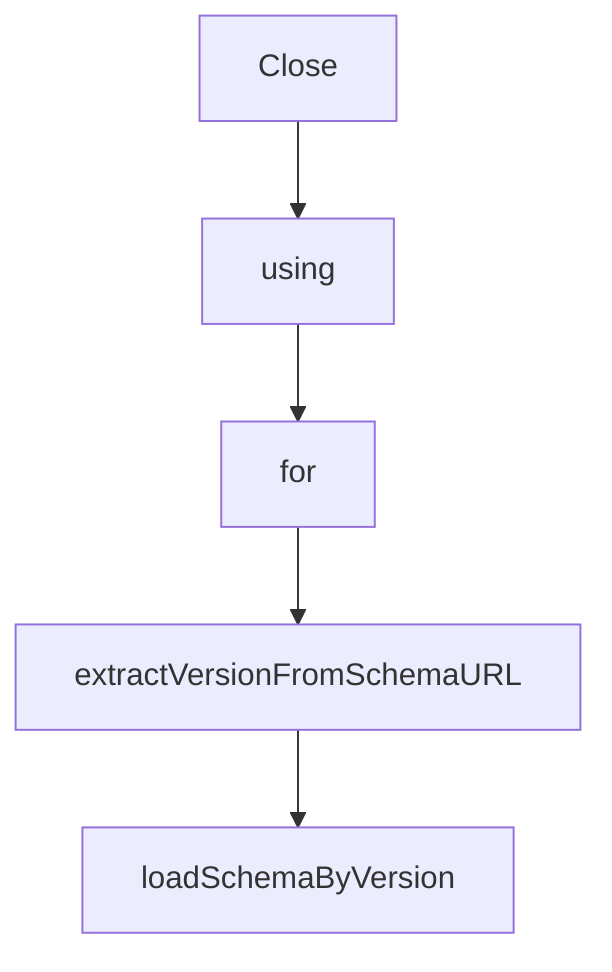

# Chapter 5: API Consumption, Subregistries, and Sync Strategies

Welcome to **Chapter 5: API Consumption, Subregistries, and Sync Strategies**. In this part of **MCP Registry Tutorial: Publishing, Discovery, and Governance for MCP Servers**, you will build an intuitive mental model first, then move into concrete implementation details and practical production tradeoffs.


Most ecosystem consumers are not direct end-user clients; they are aggregators and subregistries with their own storage and ranking logic.

## Learning Goals

- consume `GET /v0.1/servers` with cursor-based pagination
- apply `updated_since` for incremental sync
- preserve URL encoding and metadata fidelity
- extend data safely in subregistry `_meta` namespaces

## Sync Pattern

1. full backfill with pagination
2. periodic incremental jobs using `updated_since`
3. refresh status fields (`active`, `deprecated`, `deleted`)
4. publish curated downstream index from local store

## API Handling Notes

- treat cursors as opaque values
- always URL-encode `serverName` and `version`
- use retry and backoff around polling jobs
- keep your own durability guarantees; official registry is not your long-term data store

## Source References

- [Generic Registry API](https://github.com/modelcontextprotocol/registry/blob/main/docs/reference/api/generic-registry-api.md)
- [Official Registry API Extensions](https://github.com/modelcontextprotocol/registry/blob/main/docs/reference/api/official-registry-api.md)
- [Registry Aggregators Guide](https://github.com/modelcontextprotocol/registry/blob/main/docs/modelcontextprotocol-io/registry-aggregators.mdx)
- [OpenAPI Spec](https://github.com/modelcontextprotocol/registry/blob/main/docs/reference/api/openapi.yaml)

## Summary

You now have a stable ingestion model for registry-backed discovery systems.

Next: [Chapter 6: Versioning, Governance, and Moderation Lifecycle](06-versioning-governance-and-moderation-lifecycle.md)

## Depth Expansion Playbook

## Source Code Walkthrough

### `internal/database/postgres.go`

The `Close` function in [`internal/database/postgres.go`](https://github.com/modelcontextprotocol/registry/blob/HEAD/internal/database/postgres.go) handles a key part of this chapter's functionality:

```go
		return nil, "", fmt.Errorf("failed to query servers: %w", err)
	}
	defer rows.Close()

	var results []*apiv0.ServerResponse
	for rows.Next() {
		var serverName, version, status string
		var statusChangedAt, publishedAt, updatedAt time.Time
		var statusMessage *string
		var isLatest bool
		var valueJSON []byte

		err := rows.Scan(&serverName, &version, &status, &statusChangedAt, &statusMessage, &publishedAt, &updatedAt, &isLatest, &valueJSON)
		if err != nil {
			return nil, "", fmt.Errorf("failed to scan server row: %w", err)
		}

		// Parse the ServerJSON from JSONB
		var serverJSON apiv0.ServerJSON
		if err := json.Unmarshal(valueJSON, &serverJSON); err != nil {
			return nil, "", fmt.Errorf("failed to unmarshal server JSON: %w", err)
		}

		// Build ServerResponse with separated metadata
		serverResponse := &apiv0.ServerResponse{
			Server: serverJSON,
			Meta: apiv0.ResponseMeta{
				Official: &apiv0.RegistryExtensions{
					Status:          model.Status(status),
					StatusChangedAt: statusChangedAt,
					StatusMessage:   statusMessage,
					PublishedAt:     publishedAt,
```

This function is important because it defines how MCP Registry Tutorial: Publishing, Discovery, and Governance for MCP Servers implements the patterns covered in this chapter.

### `internal/database/postgres.go`

The `using` interface in [`internal/database/postgres.go`](https://github.com/modelcontextprotocol/registry/blob/HEAD/internal/database/postgres.go) handles a key part of this chapter's functionality:

```go
)

// PostgreSQL is an implementation of the Database interface using PostgreSQL
type PostgreSQL struct {
	pool *pgxpool.Pool
}

// Executor is an interface for executing queries (satisfied by both pgx.Tx and pgxpool.Pool)
type Executor interface {
	Exec(ctx context.Context, sql string, arguments ...any) (pgconn.CommandTag, error)
	Query(ctx context.Context, sql string, args ...any) (pgx.Rows, error)
	QueryRow(ctx context.Context, sql string, args ...any) pgx.Row
}

// getExecutor returns the appropriate executor (transaction or pool)
func (db *PostgreSQL) getExecutor(tx pgx.Tx) Executor {
	if tx != nil {
		return tx
	}
	return db.pool
}

// NewPostgreSQL creates a new instance of the PostgreSQL database
func NewPostgreSQL(ctx context.Context, connectionURI string) (*PostgreSQL, error) {
	// Parse connection config for pool settings
	config, err := pgxpool.ParseConfig(connectionURI)
	if err != nil {
		return nil, fmt.Errorf("failed to parse PostgreSQL config: %w", err)
	}

	// Configure pool for stability-focused defaults
	config.MaxConns = 30                      // Handle good concurrent load
```

This interface is important because it defines how MCP Registry Tutorial: Publishing, Discovery, and Governance for MCP Servers implements the patterns covered in this chapter.

### `internal/database/postgres.go`

The `for` interface in [`internal/database/postgres.go`](https://github.com/modelcontextprotocol/registry/blob/HEAD/internal/database/postgres.go) handles a key part of this chapter's functionality:

```go
}

// Executor is an interface for executing queries (satisfied by both pgx.Tx and pgxpool.Pool)
type Executor interface {
	Exec(ctx context.Context, sql string, arguments ...any) (pgconn.CommandTag, error)
	Query(ctx context.Context, sql string, args ...any) (pgx.Rows, error)
	QueryRow(ctx context.Context, sql string, args ...any) pgx.Row
}

// getExecutor returns the appropriate executor (transaction or pool)
func (db *PostgreSQL) getExecutor(tx pgx.Tx) Executor {
	if tx != nil {
		return tx
	}
	return db.pool
}

// NewPostgreSQL creates a new instance of the PostgreSQL database
func NewPostgreSQL(ctx context.Context, connectionURI string) (*PostgreSQL, error) {
	// Parse connection config for pool settings
	config, err := pgxpool.ParseConfig(connectionURI)
	if err != nil {
		return nil, fmt.Errorf("failed to parse PostgreSQL config: %w", err)
	}

	// Configure pool for stability-focused defaults
	config.MaxConns = 30                      // Handle good concurrent load
	config.MinConns = 5                       // Keep connections warm for fast response
	config.MaxConnIdleTime = 30 * time.Minute // Keep connections available for bursts
	config.MaxConnLifetime = 2 * time.Hour    // Refresh connections regularly for stability

	// Create connection pool with configured settings
```

This interface is important because it defines how MCP Registry Tutorial: Publishing, Discovery, and Governance for MCP Servers implements the patterns covered in this chapter.

### `internal/validators/schema.go`

The `extractVersionFromSchemaURL` function in [`internal/validators/schema.go`](https://github.com/modelcontextprotocol/registry/blob/HEAD/internal/validators/schema.go) handles a key part of this chapter's functionality:

```go
var schemaFS embed.FS

// extractVersionFromSchemaURL extracts the version identifier from a schema URL
// e.g., "https://static.modelcontextprotocol.io/schemas/2025-10-17/server.schema.json" -> "2025-10-17"
// e.g., "https://static.modelcontextprotocol.io/schemas/draft/server.schema.json" -> "draft"
// Version identifier can contain: A-Z, a-z, 0-9, hyphen (-), underscore (_), tilde (~), and period (.)
func extractVersionFromSchemaURL(schemaURL string) (string, error) {
	// Pattern: /schemas/{identifier}/server.schema.json
	// Identifier allowed characters: A-Z, a-z, 0-9, -, _, ~, .
	re := regexp.MustCompile(`/schemas/([A-Za-z0-9_~.-]+)/server\.schema\.json`)
	matches := re.FindStringSubmatch(schemaURL)
	if len(matches) < 2 {
		return "", fmt.Errorf("invalid schema URL format: %s", schemaURL)
	}
	return matches[1], nil
}

// loadSchemaByVersion loads a schema file from the embedded filesystem by version
func loadSchemaByVersion(version string) ([]byte, error) {
	filename := fmt.Sprintf("schemas/%s.json", version)
	data, err := schemaFS.ReadFile(filename)
	if err != nil {
		return nil, fmt.Errorf("schema version %s not found in embedded schemas: %w", version, err)
	}
	return data, nil
}

// GetCurrentSchemaVersion returns the current schema URL from constants
func GetCurrentSchemaVersion() (string, error) {
	return model.CurrentSchemaURL, nil
}

```

This function is important because it defines how MCP Registry Tutorial: Publishing, Discovery, and Governance for MCP Servers implements the patterns covered in this chapter.


## How These Components Connect


