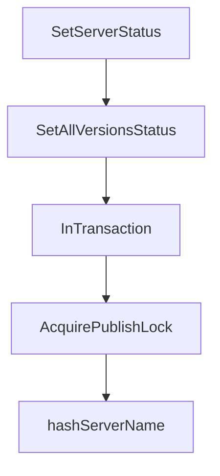

# Chapter 5: API Consumption, Subregistries, and Sync Strategies

Welcome to **Chapter 5: API Consumption, Subregistries, and Sync Strategies**. In this part of **MCP Registry Tutorial: Publishing, Discovery, and Governance for MCP Servers**, you will build an intuitive mental model first, then move into concrete implementation details and practical production tradeoffs.


Most ecosystem consumers are not direct end-user clients; they are aggregators and subregistries with their own storage and ranking logic.

## Learning Goals

- consume `GET /v0.1/servers` with cursor-based pagination
- apply `updated_since` for incremental sync
- preserve URL encoding and metadata fidelity
- extend data safely in subregistry `_meta` namespaces

## Sync Pattern

1. full backfill with pagination
2. periodic incremental jobs using `updated_since`
3. refresh status fields (`active`, `deprecated`, `deleted`)
4. publish curated downstream index from local store

## API Handling Notes

- treat cursors as opaque values
- always URL-encode `serverName` and `version`
- use retry and backoff around polling jobs
- keep your own durability guarantees; official registry is not your long-term data store

## Source References

- [Generic Registry API](https://github.com/modelcontextprotocol/registry/blob/main/docs/reference/api/generic-registry-api.md)
- [Official Registry API Extensions](https://github.com/modelcontextprotocol/registry/blob/main/docs/reference/api/official-registry-api.md)
- [Registry Aggregators Guide](https://github.com/modelcontextprotocol/registry/blob/main/docs/modelcontextprotocol-io/registry-aggregators.mdx)
- [OpenAPI Spec](https://github.com/modelcontextprotocol/registry/blob/main/docs/reference/api/openapi.yaml)

## Summary

You now have a stable ingestion model for registry-backed discovery systems.

Next: [Chapter 6: Versioning, Governance, and Moderation Lifecycle](06-versioning-governance-and-moderation-lifecycle.md)

## Source Code Walkthrough

### `internal/database/postgres.go`

The `SetServerStatus` function in [`internal/database/postgres.go`](https://github.com/modelcontextprotocol/registry/blob/HEAD/internal/database/postgres.go) handles a key part of this chapter's functionality:

```go
}

// SetServerStatus updates the status of a specific server version
func (db *PostgreSQL) SetServerStatus(ctx context.Context, tx pgx.Tx, serverName, version string, status model.Status, statusMessage *string) (*apiv0.ServerResponse, error) {
	if ctx.Err() != nil {
		return nil, ctx.Err()
	}

	// Update the status and related fields
	// Only update status_changed_at when status actually changes
	query := `
		UPDATE servers
		SET
			status = $1,
			status_changed_at = CASE WHEN status != $1::varchar THEN NOW() ELSE status_changed_at END,
			updated_at = NOW(),
			status_message = $4
		WHERE server_name = $2 AND version = $3
		RETURNING server_name, version, status, value, published_at, updated_at, is_latest, status_changed_at, status_message
	`

	var name, vers, currentStatus string
	var publishedAt, updatedAt, statusChangedAt time.Time
	var isLatest bool
	var valueJSON []byte
	var resultStatusMessage *string

	err := db.getExecutor(tx).QueryRow(ctx, query, string(status), serverName, version, statusMessage).Scan(&name, &vers, &currentStatus, &valueJSON, &publishedAt, &updatedAt, &isLatest, &statusChangedAt, &resultStatusMessage)
	if err != nil {
		if errors.Is(err, pgx.ErrNoRows) {
			return nil, ErrNotFound
		}
```

This function is important because it defines how MCP Registry Tutorial: Publishing, Discovery, and Governance for MCP Servers implements the patterns covered in this chapter.

### `internal/database/postgres.go`

The `SetAllVersionsStatus` function in [`internal/database/postgres.go`](https://github.com/modelcontextprotocol/registry/blob/HEAD/internal/database/postgres.go) handles a key part of this chapter's functionality:

```go
}

// SetAllVersionsStatus updates the status of all versions of a server in a single query
func (db *PostgreSQL) SetAllVersionsStatus(ctx context.Context, tx pgx.Tx, serverName string, status model.Status, statusMessage *string) ([]*apiv0.ServerResponse, error) {
	if ctx.Err() != nil {
		return nil, ctx.Err()
	}

	// Update the status and related fields for all versions
	// Only update rows where status or status_message actually changes
	// Only update status_changed_at when status actually changes
	query := `
		UPDATE servers
		SET
			status = $1,
			status_changed_at = CASE WHEN status != $1::varchar THEN NOW() ELSE status_changed_at END,
			updated_at = NOW(),
			status_message = $2
		WHERE server_name = $3
			AND (status != $1::varchar OR status_message IS DISTINCT FROM $2)
		RETURNING server_name, version, status, value, published_at, updated_at, is_latest, status_changed_at, status_message
	`

	rows, err := db.getExecutor(tx).Query(ctx, query, string(status), statusMessage, serverName)
	if err != nil {
		return nil, fmt.Errorf("failed to update all server versions status: %w", err)
	}
	defer rows.Close()

	var results []*apiv0.ServerResponse
	for rows.Next() {
		var name, vers, currentStatus string
```

This function is important because it defines how MCP Registry Tutorial: Publishing, Discovery, and Governance for MCP Servers implements the patterns covered in this chapter.

### `internal/database/postgres.go`

The `InTransaction` function in [`internal/database/postgres.go`](https://github.com/modelcontextprotocol/registry/blob/HEAD/internal/database/postgres.go) handles a key part of this chapter's functionality:

```go
}

// InTransaction executes a function within a database transaction
func (db *PostgreSQL) InTransaction(ctx context.Context, fn func(ctx context.Context, tx pgx.Tx) error) error {
	if ctx.Err() != nil {
		return ctx.Err()
	}

	tx, err := db.pool.Begin(ctx)
	if err != nil {
		return fmt.Errorf("failed to begin transaction: %w", err)
	}
	//nolint:contextcheck // Intentionally using separate context for rollback to ensure cleanup even if request is cancelled
	defer func() {
		rollbackCtx, cancel := context.WithTimeout(context.Background(), 1*time.Second)
		defer cancel()
		if rbErr := tx.Rollback(rollbackCtx); rbErr != nil && !errors.Is(rbErr, pgx.ErrTxClosed) {
			log.Printf("failed to rollback transaction: %v", rbErr)
		}
	}()

	if err := fn(ctx, tx); err != nil {
		return err
	}

	if err := tx.Commit(ctx); err != nil {
		return fmt.Errorf("failed to commit transaction: %w", err)
	}

	return nil
}

```

This function is important because it defines how MCP Registry Tutorial: Publishing, Discovery, and Governance for MCP Servers implements the patterns covered in this chapter.

### `internal/database/postgres.go`

The `AcquirePublishLock` function in [`internal/database/postgres.go`](https://github.com/modelcontextprotocol/registry/blob/HEAD/internal/database/postgres.go) handles a key part of this chapter's functionality:

```go
}

// AcquirePublishLock acquires an exclusive advisory lock for publishing a server
// This prevents race conditions when multiple versions are published concurrently
// Using pg_advisory_xact_lock which auto-releases on transaction end
func (db *PostgreSQL) AcquirePublishLock(ctx context.Context, tx pgx.Tx, serverName string) error {
	if ctx.Err() != nil {
		return ctx.Err()
	}

	lockID := hashServerName(serverName)

	if _, err := db.getExecutor(tx).Exec(ctx, "SELECT pg_advisory_xact_lock($1)", lockID); err != nil {
		return fmt.Errorf("failed to acquire publish lock: %w", err)
	}

	return nil
}

// hashServerName creates a consistent hash of the server name for advisory locking
// We use FNV-1a hash and mask to 63 bits to fit in PostgreSQL's bigint range
func hashServerName(name string) int64 {
	const (
		offset64 = 14695981039346656037
		prime64  = 1099511628211
	)
	hash := uint64(offset64)
	for i := 0; i < len(name); i++ {
		hash ^= uint64(name[i])
		hash *= prime64
	}
	//nolint:gosec // Intentional conversion with masking to 63 bits
```

This function is important because it defines how MCP Registry Tutorial: Publishing, Discovery, and Governance for MCP Servers implements the patterns covered in this chapter.


## How These Components Connect


