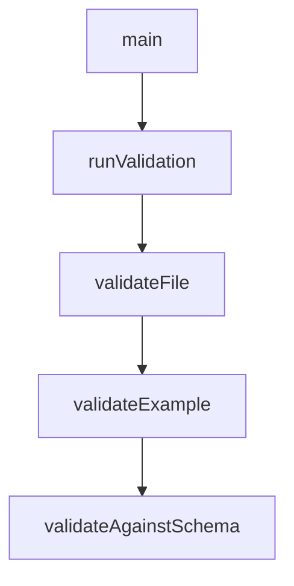

# Chapter 6: Versioning, Governance, and Moderation Lifecycle

Welcome to **Chapter 6: Versioning, Governance, and Moderation Lifecycle**. In this part of **MCP Registry Tutorial: Publishing, Discovery, and Governance for MCP Servers**, you will build an intuitive mental model first, then move into concrete implementation details and practical production tradeoffs.


Registry metadata is designed to be append-oriented and version-immutable, with lifecycle signaling through status and moderation operations.

## Learning Goals

- apply versioning strategy that avoids accidental "latest" regressions
- distinguish immutable metadata from mutable status fields
- understand moderation and abuse-handling implications for consumers
- plan governance policies for your own subregistry or internal mirror

## Versioning Guidance

| Practice | Why |
|:---------|:----|
| semantic versioning where possible | stable sort + predictable latest behavior |
| avoid version ranges | explicitly prohibited in official validation |
| align server/package versions for local servers | reduces operator confusion |
| use prerelease tags for metadata-only publishes | keeps artifact version semantics clearer |

## Governance Detail

Consumers should treat `deleted` as a strong trust signal and remove or quarantine those entries from user-facing catalogs.

## Source References

- [Versioning Guide](https://github.com/modelcontextprotocol/registry/blob/main/docs/modelcontextprotocol-io/versioning.mdx)
- [FAQ](https://github.com/modelcontextprotocol/registry/blob/main/docs/modelcontextprotocol-io/faq.mdx)
- [Official Registry Requirements](https://github.com/modelcontextprotocol/registry/blob/main/docs/reference/server-json/official-registry-requirements.md)

## Summary

You now have lifecycle rules for safer metadata governance.

Next: [Chapter 7: Admin Operations, Deployment, and Observability](07-admin-operations-deployment-and-observability.md)

## Depth Expansion Playbook

## Source Code Walkthrough

### `tools/validate-examples/main.go`

The `main` function in [`tools/validate-examples/main.go`](https://github.com/modelcontextprotocol/registry/blob/HEAD/tools/validate-examples/main.go) handles a key part of this chapter's functionality:

```go
// validate-examples validates JSON examples in documentation files
// against both schema.json and Go validators.
package main

import (
	"bytes"
	"encoding/json"
	"fmt"
	"log"
	"os"
	"path/filepath"
	"regexp"
	"strings"

	"github.com/modelcontextprotocol/registry/internal/validators"
	apiv0 "github.com/modelcontextprotocol/registry/pkg/api/v0"
	jsonschema "github.com/santhosh-tekuri/jsonschema/v5"
)

type validationTarget struct {
	path          string
	requireSchema bool
	expectedCount *int
}

func main() {
	log.SetFlags(0) // Remove timestamp from logs

	if err := runValidation(); err != nil {
		log.Fatalf("Error: %v", err)
	}
}
```

This function is important because it defines how MCP Registry Tutorial: Publishing, Discovery, and Governance for MCP Servers implements the patterns covered in this chapter.

### `tools/validate-examples/main.go`

The `runValidation` function in [`tools/validate-examples/main.go`](https://github.com/modelcontextprotocol/registry/blob/HEAD/tools/validate-examples/main.go) handles a key part of this chapter's functionality:

```go
	log.SetFlags(0) // Remove timestamp from logs

	if err := runValidation(); err != nil {
		log.Fatalf("Error: %v", err)
	}
}

func runValidation() error {
	// Define what we validate and how
	expectedServerJSONCount := 15
	targets := []validationTarget{
		{
			path:          filepath.Join("docs", "reference", "server-json", "generic-server-json.md"),
			requireSchema: false,
			expectedCount: &expectedServerJSONCount,
		},
		{
			path:          filepath.Join("docs", "modelcontextprotocol-io", "package-types.mdx"),
			requireSchema: true,
			expectedCount: nil, // No count validation for guide
		},
		{
			path:          filepath.Join("docs", "modelcontextprotocol-io", "quickstart.mdx"),
			requireSchema: true,
			expectedCount: nil, // No count validation for guide
		},
		{
			path:          filepath.Join("docs", "modelcontextprotocol-io", "remote-servers.mdx"),
			requireSchema: true,
			expectedCount: nil, // No count validation for guide
		},
	}
```

This function is important because it defines how MCP Registry Tutorial: Publishing, Discovery, and Governance for MCP Servers implements the patterns covered in this chapter.

### `tools/validate-examples/main.go`

The `validateFile` function in [`tools/validate-examples/main.go`](https://github.com/modelcontextprotocol/registry/blob/HEAD/tools/validate-examples/main.go) handles a key part of this chapter's functionality:

```go

	for _, target := range targets {
		if err := validateFile(target, baseSchema); err != nil {
			return err
		}
		log.Println()
	}

	log.Println("All validations passed!")
	return nil
}

func validateFile(target validationTarget, baseSchema *jsonschema.Schema) error {
	examples, err := extractExamples(target.path, target.requireSchema)
	if err != nil {
		return fmt.Errorf("failed to extract examples from %s: %w", target.path, err)
	}

	log.Printf("Validating %s: found %d examples\n", target.path, len(examples))

	if target.expectedCount != nil && len(examples) != *target.expectedCount {
		return fmt.Errorf("expected %d examples in %s but found %d - if this is intentional, update expectedCount in tools/validate-examples/main.go",
			*target.expectedCount, target.path, len(examples))
	}

	if len(examples) == 0 {
		log.Println("  No examples to validate")
		return nil
	}

	log.Println()

```

This function is important because it defines how MCP Registry Tutorial: Publishing, Discovery, and Governance for MCP Servers implements the patterns covered in this chapter.

### `tools/validate-examples/main.go`

The `validateExample` function in [`tools/validate-examples/main.go`](https://github.com/modelcontextprotocol/registry/blob/HEAD/tools/validate-examples/main.go) handles a key part of this chapter's functionality:

```go
		log.Printf("  Example %d (line %d):", i+1, example.line)

		if validateExample(example, baseSchema) {
			validatedCount++
		}

		log.Println()
	}

	if validatedCount != len(examples) {
		return fmt.Errorf("validation failed for %s: expected %d examples to pass but only %d did",
			target.path, len(examples), validatedCount)
	}

	return nil
}

func validateExample(ex example, baseSchema *jsonschema.Schema) bool {
	var data any
	if err := json.Unmarshal([]byte(ex.content), &data); err != nil {
		log.Printf("    ❌ Invalid JSON: %v", err)
		return false
	}

	// Extract server portion if this is a PublishRequest format
	serverData := data
	publishRequestValid := true
	if dataMap, ok := data.(map[string]any); ok {
		if server, exists := dataMap["server"]; exists {
			// This is a PublishRequest format - validate only expected properties exist
			for key := range dataMap {
				if key != "server" && key != "x-publisher" {
```

This function is important because it defines how MCP Registry Tutorial: Publishing, Discovery, and Governance for MCP Servers implements the patterns covered in this chapter.


## How These Components Connect


