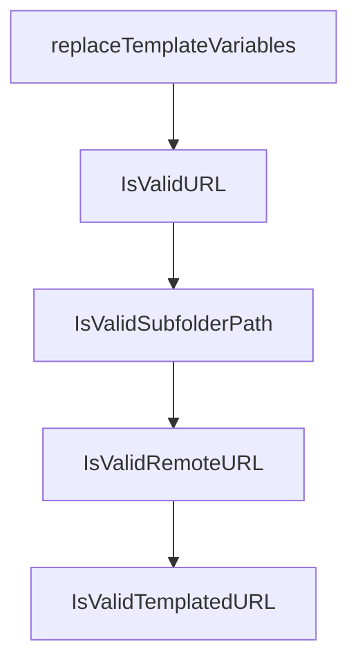

# Chapter 6: Versioning, Governance, and Moderation Lifecycle

Welcome to **Chapter 6: Versioning, Governance, and Moderation Lifecycle**. In this part of **MCP Registry Tutorial: Publishing, Discovery, and Governance for MCP Servers**, you will build an intuitive mental model first, then move into concrete implementation details and practical production tradeoffs.


Registry metadata is designed to be append-oriented and version-immutable, with lifecycle signaling through status and moderation operations.

## Learning Goals

- apply versioning strategy that avoids accidental "latest" regressions
- distinguish immutable metadata from mutable status fields
- understand moderation and abuse-handling implications for consumers
- plan governance policies for your own subregistry or internal mirror

## Versioning Guidance

| Practice | Why |
|:---------|:----|
| semantic versioning where possible | stable sort + predictable latest behavior |
| avoid version ranges | explicitly prohibited in official validation |
| align server/package versions for local servers | reduces operator confusion |
| use prerelease tags for metadata-only publishes | keeps artifact version semantics clearer |

## Governance Detail

Consumers should treat `deleted` as a strong trust signal and remove or quarantine those entries from user-facing catalogs.

## Source References

- [Versioning Guide](https://github.com/modelcontextprotocol/registry/blob/main/docs/modelcontextprotocol-io/versioning.mdx)
- [FAQ](https://github.com/modelcontextprotocol/registry/blob/main/docs/modelcontextprotocol-io/faq.mdx)
- [Official Registry Requirements](https://github.com/modelcontextprotocol/registry/blob/main/docs/reference/server-json/official-registry-requirements.md)

## Summary

You now have lifecycle rules for safer metadata governance.

Next: [Chapter 7: Admin Operations, Deployment, and Observability](07-admin-operations-deployment-and-observability.md)

## Source Code Walkthrough

### `internal/validators/utils.go`

The `replaceTemplateVariables` function in [`internal/validators/utils.go`](https://github.com/modelcontextprotocol/registry/blob/HEAD/internal/validators/utils.go) handles a key part of this chapter's functionality:

```go
}

// replaceTemplateVariables replaces template variables with placeholder values for URL validation
func replaceTemplateVariables(rawURL string) string {
	// Replace common template variables with valid placeholder values for parsing
	templateReplacements := map[string]string{
		"{host}":     "example.com",
		"{port}":     "8080",
		"{path}":     "api",
		"{protocol}": "http",
		"{scheme}":   "http",
	}

	result := rawURL
	for placeholder, replacement := range templateReplacements {
		result = strings.ReplaceAll(result, placeholder, replacement)
	}

	// Handle any remaining {variable} patterns with context-appropriate placeholders
	// If the variable is in a port position (after a colon in the host), use a numeric placeholder
	// Pattern: :/{variable} or :{variable}/ or :{variable} at end
	portRe := regexp.MustCompile(`:(\{[^}]+\})(/|$)`)
	result = portRe.ReplaceAllString(result, ":8080$2")

	// Replace any other remaining {variable} patterns with generic placeholder
	re := regexp.MustCompile(`\{[^}]+\}`)
	result = re.ReplaceAllString(result, "placeholder")

	return result
}

// IsValidURL checks if a URL is in valid format (basic structure validation)
```

This function is important because it defines how MCP Registry Tutorial: Publishing, Discovery, and Governance for MCP Servers implements the patterns covered in this chapter.

### `internal/validators/utils.go`

The `IsValidURL` function in [`internal/validators/utils.go`](https://github.com/modelcontextprotocol/registry/blob/HEAD/internal/validators/utils.go) handles a key part of this chapter's functionality:

```go
}

// IsValidURL checks if a URL is in valid format (basic structure validation)
func IsValidURL(rawURL string) bool {
	// Replace template variables with placeholders for parsing
	testURL := replaceTemplateVariables(rawURL)

	// Parse the URL
	u, err := url.Parse(testURL)
	if err != nil {
		return false
	}

	// Check if scheme is present (http or https)
	if u.Scheme != "http" && u.Scheme != "https" {
		return false
	}

	if u.Host == "" {
		return false
	}
	return true
}

// IsValidSubfolderPath checks if a subfolder path is valid
func IsValidSubfolderPath(path string) bool {
	// Empty path is valid (subfolder is optional)
	if path == "" {
		return true
	}

	// Must not start with / (must be relative)
```

This function is important because it defines how MCP Registry Tutorial: Publishing, Discovery, and Governance for MCP Servers implements the patterns covered in this chapter.

### `internal/validators/utils.go`

The `IsValidSubfolderPath` function in [`internal/validators/utils.go`](https://github.com/modelcontextprotocol/registry/blob/HEAD/internal/validators/utils.go) handles a key part of this chapter's functionality:

```go
}

// IsValidSubfolderPath checks if a subfolder path is valid
func IsValidSubfolderPath(path string) bool {
	// Empty path is valid (subfolder is optional)
	if path == "" {
		return true
	}

	// Must not start with / (must be relative)
	if strings.HasPrefix(path, "/") {
		return false
	}

	// Must not end with / (clean path format)
	if strings.HasSuffix(path, "/") {
		return false
	}

	// Check for valid path characters (alphanumeric, dash, underscore, dot, forward slash)
	validPathRegex := regexp.MustCompile(`^[a-zA-Z0-9\-_./]+$`)
	if !validPathRegex.MatchString(path) {
		return false
	}

	// Check that path segments are valid
	segments := strings.Split(path, "/")
	for _, segment := range segments {
		// Disallow empty segments ("//"), current dir ("."), and parent dir ("..")
		if segment == "" || segment == "." || segment == ".." {
			return false
		}
```

This function is important because it defines how MCP Registry Tutorial: Publishing, Discovery, and Governance for MCP Servers implements the patterns covered in this chapter.

### `internal/validators/utils.go`

The `IsValidRemoteURL` function in [`internal/validators/utils.go`](https://github.com/modelcontextprotocol/registry/blob/HEAD/internal/validators/utils.go) handles a key part of this chapter's functionality:

```go
}

// IsValidRemoteURL checks if a URL is valid for remotes (stricter than packages - no localhost allowed)
func IsValidRemoteURL(rawURL string) bool {
	// First check basic URL structure
	if !IsValidURL(rawURL) {
		return false
	}

	// Replace template variables with placeholders before parsing for localhost check
	testURL := replaceTemplateVariables(rawURL)

	// Parse the URL to check for localhost restriction
	u, err := url.Parse(testURL)
	if err != nil {
		return false
	}

	// Reject localhost URLs for remotes (security/production concerns)
	hostname := u.Hostname()
	if hostname == "localhost" || hostname == "127.0.0.1" || strings.HasSuffix(hostname, ".localhost") {
		return false
	}

	if u.Scheme != "https" {
		return false
	}

	return true
}

// IsValidTemplatedURL validates a URL with template variables against available variables
```

This function is important because it defines how MCP Registry Tutorial: Publishing, Discovery, and Governance for MCP Servers implements the patterns covered in this chapter.


## How These Components Connect


