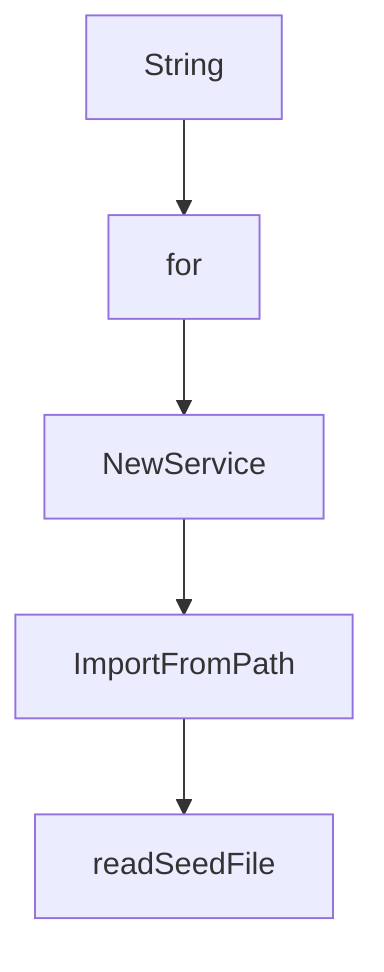

# Chapter 7: Admin Operations, Deployment, and Observability

Welcome to **Chapter 7: Admin Operations, Deployment, and Observability**. In this part of **MCP Registry Tutorial: Publishing, Discovery, and Governance for MCP Servers**, you will build an intuitive mental model first, then move into concrete implementation details and practical production tradeoffs.


Operational workflows include server-version edits, takedowns, health checks, deployment orchestration, and safe database access.

## Learning Goals

- perform scoped admin edits without violating immutability constraints
- execute takedown actions consistently across versions when required
- understand deployment entry points and production support surfaces
- use read-only database sessions for investigation workflows

## Operations Checklist

- authenticate with admin tooling and short-lived tokens
- snapshot target server/version payload before edits
- apply version-specific or all-version changes intentionally
- monitor `/v0.1/health`, metrics, and rollout logs

## Deployment Surfaces

- `deploy/` for environment provisioning and rollout code
- GitHub workflows for staging/production deployment automation
- `tools/admin/*` for operator scripts

## Source References

- [Admin Operations](https://github.com/modelcontextprotocol/registry/blob/main/docs/administration/admin-operations.md)
- [Deploy README](https://github.com/modelcontextprotocol/registry/blob/main/deploy/README.md)
- [Official Registry API - Admin Endpoints](https://github.com/modelcontextprotocol/registry/blob/main/docs/reference/api/official-registry-api.md)

## Summary

You now have a practical operational playbook for registry administration.

Next: [Chapter 8: Production Rollout, Automation, and Contribution](08-production-rollout-automation-and-contribution.md)

## Source Code Walkthrough

### `internal/validators/validation_types.go`

The `String` function in [`internal/validators/validation_types.go`](https://github.com/modelcontextprotocol/registry/blob/HEAD/internal/validators/validation_types.go) handles a key part of this chapter's functionality:

```go
}

// String returns the current path as a string
func (ctx *ValidationContext) String() string {
	return ctx.path
}

```

This function is important because it defines how MCP Registry Tutorial: Publishing, Discovery, and Governance for MCP Servers implements the patterns covered in this chapter.

### `internal/database/database.go`

The `for` interface in [`internal/database/database.go`](https://github.com/modelcontextprotocol/registry/blob/HEAD/internal/database/database.go) handles a key part of this chapter's functionality:

```go
	ErrDatabase          = errors.New("database error")
	ErrInvalidVersion    = errors.New("invalid version: cannot publish duplicate version")
	ErrMaxServersReached = errors.New("maximum number of versions for this server reached (10000): please reach out at https://github.com/modelcontextprotocol/registry to explain your use case")
)

// ServerFilter defines filtering options for server queries
type ServerFilter struct {
	Name           *string    // for finding versions of same server
	RemoteURL      *string    // for duplicate URL detection
	UpdatedSince   *time.Time // for incremental sync filtering
	SubstringName  *string    // for substring search on name
	Version        *string    // for exact version matching
	IsLatest       *bool      // for filtering latest versions only
	IncludeDeleted *bool      // for including deleted packages in results (default: exclude)
}

// Database defines the interface for database operations
type Database interface {
	// CreateServer inserts a new server version with official metadata
	CreateServer(ctx context.Context, tx pgx.Tx, serverJSON *apiv0.ServerJSON, officialMeta *apiv0.RegistryExtensions) (*apiv0.ServerResponse, error)
	// UpdateServer updates an existing server record
	UpdateServer(ctx context.Context, tx pgx.Tx, serverName, version string, serverJSON *apiv0.ServerJSON) (*apiv0.ServerResponse, error)
	// SetServerStatus updates the status of a specific server version
	SetServerStatus(ctx context.Context, tx pgx.Tx, serverName, version string, status model.Status, statusMessage *string) (*apiv0.ServerResponse, error)
	// SetAllVersionsStatus updates the status of all versions of a server in a single query
	SetAllVersionsStatus(ctx context.Context, tx pgx.Tx, serverName string, status model.Status, statusMessage *string) ([]*apiv0.ServerResponse, error)
	// ListServers retrieve server entries with optional filtering
	ListServers(ctx context.Context, tx pgx.Tx, filter *ServerFilter, cursor string, limit int) ([]*apiv0.ServerResponse, string, error)
	// GetServerByName retrieve a single server by its name
	GetServerByName(ctx context.Context, tx pgx.Tx, serverName string, includeDeleted bool) (*apiv0.ServerResponse, error)
	// GetServerByNameAndVersion retrieve specific version of a server by server name and version
	GetServerByNameAndVersion(ctx context.Context, tx pgx.Tx, serverName string, version string, includeDeleted bool) (*apiv0.ServerResponse, error)
```

This interface is important because it defines how MCP Registry Tutorial: Publishing, Discovery, and Governance for MCP Servers implements the patterns covered in this chapter.

### `internal/importer/importer.go`

The `NewService` function in [`internal/importer/importer.go`](https://github.com/modelcontextprotocol/registry/blob/HEAD/internal/importer/importer.go) handles a key part of this chapter's functionality:

```go
}

// NewService creates a new importer service
func NewService(registry service.RegistryService) *Service {
	return &Service{registry: registry}
}

// ImportFromPath imports seed data from various sources:
// 1. Local file paths (*.json files) - expects ServerJSON array format
// 2. Direct HTTP URLs to seed.json files - expects ServerJSON array format
// 3. Registry root URLs (automatically appends /v0/servers and paginates)
func (s *Service) ImportFromPath(ctx context.Context, path string) error {
	servers, err := readSeedFile(ctx, path)
	if err != nil {
		return fmt.Errorf("failed to read seed data: %w", err)
	}

	// Import each server using registry service CreateServer
	var successfullyCreated []string
	var failedCreations []string

	for _, server := range servers {
		_, err := s.registry.CreateServer(ctx, server)
		if err != nil {
			failedCreations = append(failedCreations, fmt.Sprintf("%s: %v", server.Name, err))
			log.Printf("Failed to create server %s: %v", server.Name, err)
		} else {
			successfullyCreated = append(successfullyCreated, server.Name)
		}
	}

	// Report import results after actual creation attempts
```

This function is important because it defines how MCP Registry Tutorial: Publishing, Discovery, and Governance for MCP Servers implements the patterns covered in this chapter.

### `internal/importer/importer.go`

The `ImportFromPath` function in [`internal/importer/importer.go`](https://github.com/modelcontextprotocol/registry/blob/HEAD/internal/importer/importer.go) handles a key part of this chapter's functionality:

```go
}

// ImportFromPath imports seed data from various sources:
// 1. Local file paths (*.json files) - expects ServerJSON array format
// 2. Direct HTTP URLs to seed.json files - expects ServerJSON array format
// 3. Registry root URLs (automatically appends /v0/servers and paginates)
func (s *Service) ImportFromPath(ctx context.Context, path string) error {
	servers, err := readSeedFile(ctx, path)
	if err != nil {
		return fmt.Errorf("failed to read seed data: %w", err)
	}

	// Import each server using registry service CreateServer
	var successfullyCreated []string
	var failedCreations []string

	for _, server := range servers {
		_, err := s.registry.CreateServer(ctx, server)
		if err != nil {
			failedCreations = append(failedCreations, fmt.Sprintf("%s: %v", server.Name, err))
			log.Printf("Failed to create server %s: %v", server.Name, err)
		} else {
			successfullyCreated = append(successfullyCreated, server.Name)
		}
	}

	// Report import results after actual creation attempts
	if len(failedCreations) > 0 {
		log.Printf("Import completed with errors: %d servers created successfully, %d servers failed",
			len(successfullyCreated), len(failedCreations))
		log.Printf("Failed servers: %v", failedCreations)
		return fmt.Errorf("failed to import %d servers", len(failedCreations))
```

This function is important because it defines how MCP Registry Tutorial: Publishing, Discovery, and Governance for MCP Servers implements the patterns covered in this chapter.


## How These Components Connect


