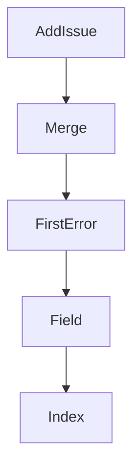

# Chapter 7: Admin Operations, Deployment, and Observability

Welcome to **Chapter 7: Admin Operations, Deployment, and Observability**. In this part of **MCP Registry Tutorial: Publishing, Discovery, and Governance for MCP Servers**, you will build an intuitive mental model first, then move into concrete implementation details and practical production tradeoffs.


Operational workflows include server-version edits, takedowns, health checks, deployment orchestration, and safe database access.

## Learning Goals

- perform scoped admin edits without violating immutability constraints
- execute takedown actions consistently across versions when required
- understand deployment entry points and production support surfaces
- use read-only database sessions for investigation workflows

## Operations Checklist

- authenticate with admin tooling and short-lived tokens
- snapshot target server/version payload before edits
- apply version-specific or all-version changes intentionally
- monitor `/v0.1/health`, metrics, and rollout logs

## Deployment Surfaces

- `deploy/` for environment provisioning and rollout code
- GitHub workflows for staging/production deployment automation
- `tools/admin/*` for operator scripts

## Source References

- [Admin Operations](https://github.com/modelcontextprotocol/registry/blob/main/docs/administration/admin-operations.md)
- [Deploy README](https://github.com/modelcontextprotocol/registry/blob/main/deploy/README.md)
- [Official Registry API - Admin Endpoints](https://github.com/modelcontextprotocol/registry/blob/main/docs/reference/api/official-registry-api.md)

## Summary

You now have a practical operational playbook for registry administration.

Next: [Chapter 8: Production Rollout, Automation, and Contribution](08-production-rollout-automation-and-contribution.md)

## Depth Expansion Playbook

## Source Code Walkthrough

### `internal/validators/validation_types.go`

The `AddIssue` function in [`internal/validators/validation_types.go`](https://github.com/modelcontextprotocol/registry/blob/HEAD/internal/validators/validation_types.go) handles a key part of this chapter's functionality:

```go
}

// AddIssue adds a validation issue to the result
func (vr *ValidationResult) AddIssue(issue ValidationIssue) {
	vr.Issues = append(vr.Issues, issue)
	if issue.Severity == ValidationIssueSeverityError {
		vr.Valid = false
	}
}

// Merge combines another validation result into this one
func (vr *ValidationResult) Merge(other *ValidationResult) {
	vr.Issues = append(vr.Issues, other.Issues...)
	if !other.Valid {
		vr.Valid = false
	}
}

// FirstError returns the first error-level issue as an error, or nil if valid
// This provides backward compatibility for code that expects an error return type
func (vr *ValidationResult) FirstError() error {
	if vr.Valid {
		return nil
	}
	for _, issue := range vr.Issues {
		if issue.Severity == ValidationIssueSeverityError {
			return fmt.Errorf("%s", issue.Message)
		}
	}
	return nil
}

```

This function is important because it defines how MCP Registry Tutorial: Publishing, Discovery, and Governance for MCP Servers implements the patterns covered in this chapter.

### `internal/validators/validation_types.go`

The `Merge` function in [`internal/validators/validation_types.go`](https://github.com/modelcontextprotocol/registry/blob/HEAD/internal/validators/validation_types.go) handles a key part of this chapter's functionality:

```go
}

// Merge combines another validation result into this one
func (vr *ValidationResult) Merge(other *ValidationResult) {
	vr.Issues = append(vr.Issues, other.Issues...)
	if !other.Valid {
		vr.Valid = false
	}
}

// FirstError returns the first error-level issue as an error, or nil if valid
// This provides backward compatibility for code that expects an error return type
func (vr *ValidationResult) FirstError() error {
	if vr.Valid {
		return nil
	}
	for _, issue := range vr.Issues {
		if issue.Severity == ValidationIssueSeverityError {
			return fmt.Errorf("%s", issue.Message)
		}
	}
	return nil
}

// Field adds a field name to the context path
func (ctx *ValidationContext) Field(name string) *ValidationContext {
	if ctx.path == "" {
		return &ValidationContext{path: name}
	}
	return &ValidationContext{path: ctx.path + "." + name}
}

```

This function is important because it defines how MCP Registry Tutorial: Publishing, Discovery, and Governance for MCP Servers implements the patterns covered in this chapter.

### `internal/validators/validation_types.go`

The `FirstError` function in [`internal/validators/validation_types.go`](https://github.com/modelcontextprotocol/registry/blob/HEAD/internal/validators/validation_types.go) handles a key part of this chapter's functionality:

```go
}

// FirstError returns the first error-level issue as an error, or nil if valid
// This provides backward compatibility for code that expects an error return type
func (vr *ValidationResult) FirstError() error {
	if vr.Valid {
		return nil
	}
	for _, issue := range vr.Issues {
		if issue.Severity == ValidationIssueSeverityError {
			return fmt.Errorf("%s", issue.Message)
		}
	}
	return nil
}

// Field adds a field name to the context path
func (ctx *ValidationContext) Field(name string) *ValidationContext {
	if ctx.path == "" {
		return &ValidationContext{path: name}
	}
	return &ValidationContext{path: ctx.path + "." + name}
}

// Index adds an array index to the context path
func (ctx *ValidationContext) Index(i int) *ValidationContext {
	return &ValidationContext{path: ctx.path + fmt.Sprintf("[%d]", i)}
}

// String returns the current path as a string
func (ctx *ValidationContext) String() string {
	return ctx.path
```

This function is important because it defines how MCP Registry Tutorial: Publishing, Discovery, and Governance for MCP Servers implements the patterns covered in this chapter.

### `internal/validators/validation_types.go`

The `Field` function in [`internal/validators/validation_types.go`](https://github.com/modelcontextprotocol/registry/blob/HEAD/internal/validators/validation_types.go) handles a key part of this chapter's functionality:

```go
}

// Field adds a field name to the context path
func (ctx *ValidationContext) Field(name string) *ValidationContext {
	if ctx.path == "" {
		return &ValidationContext{path: name}
	}
	return &ValidationContext{path: ctx.path + "." + name}
}

// Index adds an array index to the context path
func (ctx *ValidationContext) Index(i int) *ValidationContext {
	return &ValidationContext{path: ctx.path + fmt.Sprintf("[%d]", i)}
}

// String returns the current path as a string
func (ctx *ValidationContext) String() string {
	return ctx.path
}

```

This function is important because it defines how MCP Registry Tutorial: Publishing, Discovery, and Governance for MCP Servers implements the patterns covered in this chapter.


## How These Components Connect


