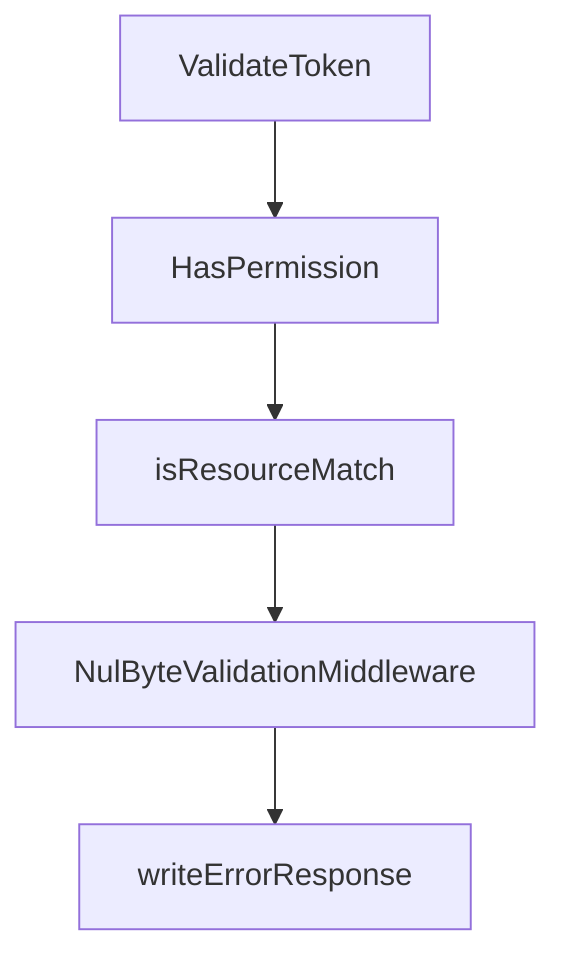

# Chapter 8: Production Rollout, Automation, and Contribution

Welcome to **Chapter 8: Production Rollout, Automation, and Contribution**. In this part of **MCP Registry Tutorial: Publishing, Discovery, and Governance for MCP Servers**, you will build an intuitive mental model first, then move into concrete implementation details and practical production tradeoffs.


Long-term registry success depends on disciplined publication automation and maintainable contribution workflows.

## Learning Goals

- automate publication in GitHub Actions with appropriate auth model
- align release tags, package publish steps, and registry publish order
- onboard maintainers with explicit access and process checklists
- contribute changes through documented channels with lower churn

## Automation Pattern

1. run tests and build artifact
2. publish artifact to package registry
3. authenticate (`github-oidc` preferred in CI)
4. publish `server.json`
5. verify with API query and monitor downstream sync

## Contribution and Team Practices

- keep maintainer onboarding checklist up to date
- use Discussions/Issues/PRs pipeline for major changes
- document policy and schema updates alongside code changes

## Source References

- [GitHub Actions Publishing Guide](https://github.com/modelcontextprotocol/registry/blob/main/docs/modelcontextprotocol-io/github-actions.mdx)
- [Maintainer Onboarding](https://github.com/modelcontextprotocol/registry/blob/main/docs/administration/maintainer-onboarding.md)
- [Contributing Documentation Index](https://github.com/modelcontextprotocol/registry/tree/main/docs/contributing)
- [Registry README - Contributing](https://github.com/modelcontextprotocol/registry/blob/main/README.md#contributing)

## Summary

You now have an end-to-end plan to publish, operate, and evolve registry workflows in production contexts.

Next: Continue with [MCP Inspector Tutorial](../mcp-inspector-tutorial/)

## Source Code Walkthrough

### `internal/auth/jwt.go`

The `ValidateToken` function in [`internal/auth/jwt.go`](https://github.com/modelcontextprotocol/registry/blob/HEAD/internal/auth/jwt.go) handles a key part of this chapter's functionality:

```go
}

// ValidateToken validates a Registry JWT token and returns the claims
func (j *JWTManager) ValidateToken(_ context.Context, tokenString string) (*JWTClaims, error) {
	// Parse token
	// This also validates expiry
	token, err := jwt.ParseWithClaims(
		tokenString,
		&JWTClaims{},
		func(_ *jwt.Token) (interface{}, error) { return j.publicKey, nil },
		jwt.WithValidMethods([]string{"EdDSA"}),
		jwt.WithExpirationRequired(),
	)
	// Validate token
	if err != nil {
		return nil, fmt.Errorf("failed to parse token: %w", err)
	}
	if !token.Valid {
		return nil, fmt.Errorf("invalid token")
	}

	// Extract claims
	claims, ok := token.Claims.(*JWTClaims)
	if !ok {
		return nil, fmt.Errorf("invalid token claims")
	}

	return claims, nil
}

func (j *JWTManager) HasPermission(resource string, action PermissionAction, permissions []Permission) bool {
	for _, perm := range permissions {
```

This function is important because it defines how MCP Registry Tutorial: Publishing, Discovery, and Governance for MCP Servers implements the patterns covered in this chapter.

### `internal/auth/jwt.go`

The `HasPermission` function in [`internal/auth/jwt.go`](https://github.com/modelcontextprotocol/registry/blob/HEAD/internal/auth/jwt.go) handles a key part of this chapter's functionality:

```go
	if !hasGlobalPermissions {
		for _, blockedNamespace := range BlockedNamespaces {
			if j.HasPermission(blockedNamespace+"/test", PermissionActionPublish, claims.Permissions) {
				return nil, fmt.Errorf("your namespace is blocked. raise an issue at https://github.com/modelcontextprotocol/registry/ if you think this is a mistake")
			}
		}
	}

	if claims.IssuedAt == nil {
		claims.IssuedAt = jwt.NewNumericDate(time.Now())
	}
	if claims.ExpiresAt == nil {
		claims.ExpiresAt = jwt.NewNumericDate(time.Now().Add(j.tokenDuration))
	}
	if claims.NotBefore == nil {
		claims.NotBefore = jwt.NewNumericDate(time.Now())
	}
	if claims.Issuer == "" {
		claims.Issuer = "mcp-registry"
	}

	// Create token with claims
	token := jwt.NewWithClaims(&jwt.SigningMethodEd25519{}, claims)

	// Sign token with Ed25519 private key
	tokenString, err := token.SignedString(j.privateKey)
	if err != nil {
		return nil, fmt.Errorf("failed to sign token: %w", err)
	}

	return &TokenResponse{
		RegistryToken: tokenString,
```

This function is important because it defines how MCP Registry Tutorial: Publishing, Discovery, and Governance for MCP Servers implements the patterns covered in this chapter.

### `internal/auth/jwt.go`

The `isResourceMatch` function in [`internal/auth/jwt.go`](https://github.com/modelcontextprotocol/registry/blob/HEAD/internal/auth/jwt.go) handles a key part of this chapter's functionality:

```go
func (j *JWTManager) HasPermission(resource string, action PermissionAction, permissions []Permission) bool {
	for _, perm := range permissions {
		if perm.Action == action && isResourceMatch(resource, perm.ResourcePattern) {
			return true
		}
	}
	return false
}

func isResourceMatch(resource, pattern string) bool {
	if pattern == "*" {
		return true
	}
	if strings.HasSuffix(pattern, "*") {
		return strings.HasPrefix(resource, strings.TrimSuffix(pattern, "*"))
	}
	return resource == pattern
}

```

This function is important because it defines how MCP Registry Tutorial: Publishing, Discovery, and Governance for MCP Servers implements the patterns covered in this chapter.

### `internal/api/server.go`

The `NulByteValidationMiddleware` function in [`internal/api/server.go`](https://github.com/modelcontextprotocol/registry/blob/HEAD/internal/api/server.go) handles a key part of this chapter's functionality:

```go
)

// NulByteValidationMiddleware rejects requests containing NUL bytes in URL path or query parameters.
// This prevents PostgreSQL encoding errors (SQLSTATE 22021) and returns a proper 400 Bad Request.
// Checks for both literal NUL bytes (\x00) and URL-encoded form (%00).
func NulByteValidationMiddleware(next http.Handler) http.Handler {
	return http.HandlerFunc(func(w http.ResponseWriter, r *http.Request) {
		// Check URL path for literal NUL bytes or URL-encoded %00
		// Path needs %00 check because handlers call url.PathUnescape() which would decode it
		if containsNulByte(r.URL.Path) {
			writeErrorResponse(w, http.StatusBadRequest, "Invalid request: URL path contains null bytes")
			return
		}

		// Check raw query string for literal NUL bytes or URL-encoded %00
		if containsNulByte(r.URL.RawQuery) {
			writeErrorResponse(w, http.StatusBadRequest, "Invalid request: query parameters contain null bytes")
			return
		}

		next.ServeHTTP(w, r)
	})
}

// writeErrorResponse writes a JSON error response using huma's ErrorModel format
// for consistency with the rest of the API.
func writeErrorResponse(w http.ResponseWriter, status int, detail string) {
	w.Header().Set("Content-Type", "application/json")
	w.WriteHeader(status)

	errModel := &huma.ErrorModel{
		Title:  http.StatusText(status),
```

This function is important because it defines how MCP Registry Tutorial: Publishing, Discovery, and Governance for MCP Servers implements the patterns covered in this chapter.


## How These Components Connect


