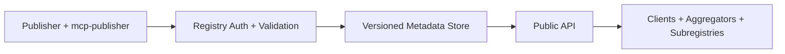

# MCP Registry Tutorial: Publishing, Discovery, and Governance for MCP Servers

> Learn how `modelcontextprotocol/registry` works end to end: publishing authenticated server metadata, consuming the API as an aggregator, and operating registry infrastructure safely.

## Why This Track Matters

The MCP Registry defines the shared metadata plane for MCP server discovery. It is where publishers prove ownership and where clients or subregistries fetch canonical server metadata.

This track focuses on:

- creating and publishing valid `server.json` artifacts
- applying namespace and package ownership verification correctly
- consuming registry APIs efficiently with pagination and incremental sync
- running admin, deployment, and governance operations with stronger discipline

## Current Snapshot (Verified February 12, 2026)

- repository: [`modelcontextprotocol/registry`](https://github.com/modelcontextprotocol/registry)
- stars: about **6.4k**
- latest release: [`v1.4.1`](https://github.com/modelcontextprotocol/registry/releases/tag/v1.4.1) (**February 10, 2026**)
- recent activity: updated on **February 12, 2026**
- implementation stack: Go API + PostgreSQL + deployment automation
- licensing note: MCP project transition from MIT to Apache-2.0 (docs under CC-BY-4.0)

## Mental Model

## Chapter Guide

| Chapter | Key Question | Outcome |
|:--------|:-------------|:--------|
| [01 - Getting Started and First Publish](01-getting-started-and-first-publish.md) | How do I publish a valid server for the first time? | Working publish baseline |
| [02 - Registry Architecture and Data Flow](02-registry-architecture-and-data-flow.md) | How is the registry system structured internally? | Clear system model |
| [03 - server.json Schema and Package Verification](03-server-json-schema-and-package-verification.md) | How do I build metadata that passes validation reliably? | Better publication quality |
| [04 - Authentication Models and Namespace Ownership](04-authentication-models-and-namespace-ownership.md) | Which auth path should I use for each namespace model? | Correct auth strategy |
| [05 - API Consumption, Subregistries, and Sync Strategies](05-api-consumption-subregistries-and-sync-strategies.md) | How do consumers ingest registry data at scale? | Reliable downstream sync |
| [06 - Versioning, Governance, and Moderation Lifecycle](06-versioning-governance-and-moderation-lifecycle.md) | How do metadata lifecycle and policy controls work? | Lower governance risk |
| [07 - Admin Operations, Deployment, and Observability](07-admin-operations-deployment-and-observability.md) | How do operators run the registry in production-like environments? | Stronger operations |
| [08 - Production Rollout, Automation, and Contribution](08-production-rollout-automation-and-contribution.md) | How do teams ship and evolve registry workflows over time? | Long-term execution playbook |

## What You Will Learn

- how to publish registry metadata with tighter schema and ownership guarantees
- how to consume registry APIs as an aggregator or subregistry with less drift
- how to reason about immutable versioning, status transitions, and moderation flows
- how to automate publication and operate registry infrastructure with safer defaults

## Source References

- [Registry README](https://github.com/modelcontextprotocol/registry/blob/main/README.md)
- [Registry Documentation Index](https://github.com/modelcontextprotocol/registry/blob/main/docs/README.md)
- [Tech Architecture](https://github.com/modelcontextprotocol/registry/blob/main/docs/design/tech-architecture.md)
- [Generic Registry API](https://github.com/modelcontextprotocol/registry/blob/main/docs/reference/api/generic-registry-api.md)
- [Official Registry API](https://github.com/modelcontextprotocol/registry/blob/main/docs/reference/api/official-registry-api.md)
- [server.json Specification](https://github.com/modelcontextprotocol/registry/blob/main/docs/reference/server-json/generic-server-json.md)
- [Publisher CLI Commands](https://github.com/modelcontextprotocol/registry/blob/main/docs/reference/cli/commands.md)
- [Authentication Guide](https://github.com/modelcontextprotocol/registry/blob/main/docs/modelcontextprotocol-io/authentication.mdx)
- [Admin Operations](https://github.com/modelcontextprotocol/registry/blob/main/docs/administration/admin-operations.md)

## Related Tutorials

- [MCP Inspector Tutorial](../mcp-inspector-tutorial/)
- [MCP Python SDK Tutorial](../mcp-python-sdk-tutorial/)
- [FastMCP Tutorial](../fastmcp-tutorial/)
- [awslabs/mcp Tutorial](../awslabs-mcp-tutorial/)

---

Start with [Chapter 1: Getting Started and First Publish](01-getting-started-and-first-publish.md).
