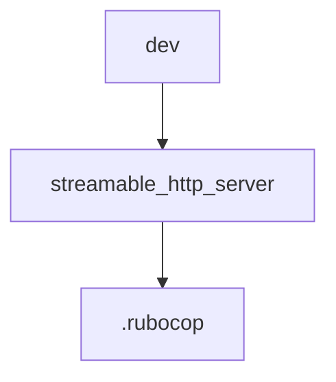

# Chapter 5: Transports: stdio, Streamable HTTP, and Session Modes

Welcome to **Chapter 5: Transports: stdio, Streamable HTTP, and Session Modes**. In this part of **MCP Ruby SDK Tutorial: Building MCP Servers and Clients in Ruby**, you will build an intuitive mental model first, then move into concrete implementation details and practical production tradeoffs.


This chapter maps transport options to local development and distributed runtime scenarios.

## Learning Goals

- choose between stdio and streamable HTTP deployment modes
- understand stateful vs stateless streamable HTTP behavior
- handle session headers and lifecycle flow correctly
- test SSE notification paths with realistic tooling

## Transport Decision Matrix

| Mode | Best Fit |
|:-----|:---------|
| stdio | local subprocess integrations and desktop tooling |
| streamable HTTP (stateful) | session-based services with SSE notifications |
| streamable HTTP (stateless) | horizontally scaled request/response-only deployments |

## Session Flow (HTTP)

1. client initializes and receives `Mcp-Session-Id`
2. optional SSE stream opens for notifications
3. client sends JSON-RPC POST requests with session context
4. client closes session when done

## Source References

- [Ruby SDK README - Transport Support](https://github.com/modelcontextprotocol/ruby-sdk/blob/main/README.md#transport-support)
- [Ruby SDK README - Stateless Streamable HTTP](https://github.com/modelcontextprotocol/ruby-sdk/blob/main/README.md#usage-example)
- [Ruby Examples - Streamable HTTP Details](https://github.com/modelcontextprotocol/ruby-sdk/blob/main/examples/README.md#streamable-http-transport-details)

## Summary

You now have a transport/session framework for Ruby MCP runtime planning.

Next: [Chapter 6: Client Workflows, HTTP Integration, and Auth Considerations](06-client-workflows-http-integration-and-auth-considerations.md)

## Depth Expansion Playbook

## Source Code Walkthrough

### `dev.yml`

The `dev` module in [`dev.yml`](https://github.com/modelcontextprotocol/ruby-sdk/blob/HEAD/dev.yml) handles a key part of this chapter's functionality:

```yml
name: mcp-ruby

type: ruby

up:
  - ruby
  - bundler

commands:
  console:
    desc: Open console with the gem loaded
    run: bin/console
  build:
    desc: Build the gem using rake build
    run: bin/rake build
  test:
    desc: Run tests
    syntax:
      argument: file
      optional: args...
    run:  |
      if [[ $# -eq 0 ]]; then
        bin/rake test
      else
        bin/rake -I test "$@"
      fi
  style:
    desc: Run rubocop
    aliases: [rubocop, lint]
    run: bin/rake rubocop

```

This module is important because it defines how MCP Ruby SDK Tutorial: Building MCP Servers and Clients in Ruby implements the patterns covered in this chapter.

### `examples/streamable_http_server.rb`

The `streamable_http_server` module in [`examples/streamable_http_server.rb`](https://github.com/modelcontextprotocol/ruby-sdk/blob/HEAD/examples/streamable_http_server.rb) handles a key part of this chapter's functionality:

```rb
# frozen_string_literal: true

$LOAD_PATH.unshift(File.expand_path("../lib", __dir__))
require "mcp"
require "rack/cors"
require "rackup"
require "json"
require "logger"

# Create a logger for SSE-specific logging
sse_logger = Logger.new($stdout)
sse_logger.formatter = proc do |severity, datetime, _progname, msg|
  "[SSE] #{severity} #{datetime.strftime("%H:%M:%S.%L")} - #{msg}\n"
end

# Tool that returns a response that will be sent via SSE if a stream is active
class NotificationTool < MCP::Tool
  tool_name "notification_tool"
  description "Returns a notification message that will be sent via SSE if stream is active"
  input_schema(
    properties: {
      message: { type: "string", description: "Message to send via SSE" },
      delay: { type: "number", description: "Delay in seconds before returning (optional)" },
    },
    required: ["message"],
  )

  class << self
    attr_accessor :logger

    def call(message:, delay: 0)
      sleep(delay) if delay > 0

      logger&.info("Returning notification message: #{message}")

```

This module is important because it defines how MCP Ruby SDK Tutorial: Building MCP Servers and Clients in Ruby implements the patterns covered in this chapter.

### `.rubocop.yml`

The `.rubocop` module in [`.rubocop.yml`](https://github.com/modelcontextprotocol/ruby-sdk/blob/HEAD/.rubocop.yml) handles a key part of this chapter's functionality:

```yml
inherit_gem:
  rubocop-shopify: rubocop.yml

plugins:
  - rubocop-minitest
  - rubocop-rake

AllCops:
  TargetRubyVersion: 2.7

Gemspec/DevelopmentDependencies:
  Enabled: true

Lint/IncompatibleIoSelectWithFiberScheduler:
  Enabled: true

Minitest/LiteralAsActualArgument:
  Enabled: true

```

This module is important because it defines how MCP Ruby SDK Tutorial: Building MCP Servers and Clients in Ruby implements the patterns covered in this chapter.


## How These Components Connect


