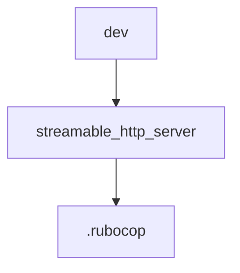

# Chapter 7: Quality, Security, and Release Workflows

Welcome to **Chapter 7: Quality, Security, and Release Workflows**. In this part of **MCP Ruby SDK Tutorial: Building MCP Servers and Clients in Ruby**, you will build an intuitive mental model first, then move into concrete implementation details and practical production tradeoffs.


This chapter focuses on governance controls for secure and stable Ruby MCP operations.

## Learning Goals

- read changelog signals for protocol and behavior changes
- enforce schema validation and stricter tool naming quality gates
- account for recent security and compatibility fixes in upgrade plans
- align release practices with maintainable SemVer discipline

## Release/Quality Checklist

| Control | Why It Matters |
|:--------|:---------------|
| changelog review per release | catches protocol and behavior deltas early |
| regression tests for tools/resources/prompts | prevents silent compatibility breaks |
| security review for transport and JSON handling | reduces exploit risk |
| version pin + staged rollout | limits blast radius during upgrades |

## Source References

- [Ruby SDK Changelog](https://github.com/modelcontextprotocol/ruby-sdk/blob/main/CHANGELOG.md)
- [Ruby SDK Release Process](https://github.com/modelcontextprotocol/ruby-sdk/blob/main/RELEASE.md)
- [Ruby SDK CI Workflow](https://github.com/modelcontextprotocol/ruby-sdk/actions/workflows/ci.yml)

## Summary

You now have a quality and release discipline model for Ruby MCP systems.

Next: [Chapter 8: Production Deployment and Upgrade Strategy](08-production-deployment-and-upgrade-strategy.md)

## Depth Expansion Playbook

## Source Code Walkthrough

### `dev.yml`

The `dev` module in [`dev.yml`](https://github.com/modelcontextprotocol/ruby-sdk/blob/HEAD/dev.yml) handles a key part of this chapter's functionality:

```yml
name: mcp-ruby

type: ruby

up:
  - ruby
  - bundler

commands:
  console:
    desc: Open console with the gem loaded
    run: bin/console
  build:
    desc: Build the gem using rake build
    run: bin/rake build
  test:
    desc: Run tests
    syntax:
      argument: file
      optional: args...
    run:  |
      if [[ $# -eq 0 ]]; then
        bin/rake test
      else
        bin/rake -I test "$@"
      fi
  style:
    desc: Run rubocop
    aliases: [rubocop, lint]
    run: bin/rake rubocop

```

This module is important because it defines how MCP Ruby SDK Tutorial: Building MCP Servers and Clients in Ruby implements the patterns covered in this chapter.

### `examples/streamable_http_server.rb`

The `streamable_http_server` module in [`examples/streamable_http_server.rb`](https://github.com/modelcontextprotocol/ruby-sdk/blob/HEAD/examples/streamable_http_server.rb) handles a key part of this chapter's functionality:

```rb
# frozen_string_literal: true

$LOAD_PATH.unshift(File.expand_path("../lib", __dir__))
require "mcp"
require "rack/cors"
require "rackup"
require "json"
require "logger"

# Create a logger for SSE-specific logging
sse_logger = Logger.new($stdout)
sse_logger.formatter = proc do |severity, datetime, _progname, msg|
  "[SSE] #{severity} #{datetime.strftime("%H:%M:%S.%L")} - #{msg}\n"
end

# Tool that returns a response that will be sent via SSE if a stream is active
class NotificationTool < MCP::Tool
  tool_name "notification_tool"
  description "Returns a notification message that will be sent via SSE if stream is active"
  input_schema(
    properties: {
      message: { type: "string", description: "Message to send via SSE" },
      delay: { type: "number", description: "Delay in seconds before returning (optional)" },
    },
    required: ["message"],
  )

  class << self
    attr_accessor :logger

    def call(message:, delay: 0)
      sleep(delay) if delay > 0

      logger&.info("Returning notification message: #{message}")

```

This module is important because it defines how MCP Ruby SDK Tutorial: Building MCP Servers and Clients in Ruby implements the patterns covered in this chapter.

### `.rubocop.yml`

The `.rubocop` module in [`.rubocop.yml`](https://github.com/modelcontextprotocol/ruby-sdk/blob/HEAD/.rubocop.yml) handles a key part of this chapter's functionality:

```yml
inherit_gem:
  rubocop-shopify: rubocop.yml

plugins:
  - rubocop-minitest
  - rubocop-rake

AllCops:
  TargetRubyVersion: 2.7

Gemspec/DevelopmentDependencies:
  Enabled: true

Lint/IncompatibleIoSelectWithFiberScheduler:
  Enabled: true

Minitest/LiteralAsActualArgument:
  Enabled: true

```

This module is important because it defines how MCP Ruby SDK Tutorial: Building MCP Servers and Clients in Ruby implements the patterns covered in this chapter.


## How These Components Connect


