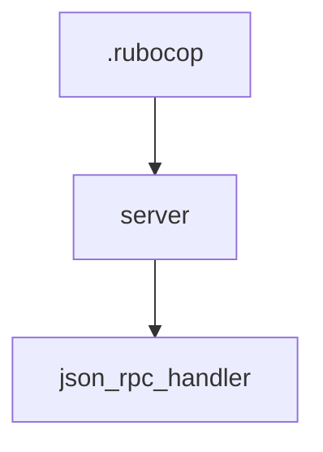

# Chapter 8: Production Deployment and Upgrade Strategy

Welcome to **Chapter 8: Production Deployment and Upgrade Strategy**. In this part of **MCP Ruby SDK Tutorial: Building MCP Servers and Clients in Ruby**, you will build an intuitive mental model first, then move into concrete implementation details and practical production tradeoffs.


This chapter defines practical production controls for Ruby MCP services and clients.

## Learning Goals

- choose deployment topology by transport/session requirements
- operate rolling upgrades with compatibility checks
- keep logging, notifications, and resource limits production-safe
- maintain protocol alignment across multi-service environments

## Production Controls

1. separate local stdio tooling from public HTTP deployment boundaries
2. set request/session timeouts and payload guardrails
3. monitor notification backlog and transport error rates
4. validate protocol compatibility before gem upgrades
5. run canary rollout steps before full fleet updates

## Source References

- [Ruby SDK README](https://github.com/modelcontextprotocol/ruby-sdk/blob/main/README.md)
- [Ruby Examples](https://github.com/modelcontextprotocol/ruby-sdk/blob/main/examples/README.md)
- [Ruby SDK Changelog](https://github.com/modelcontextprotocol/ruby-sdk/blob/main/CHANGELOG.md)
- [MCP Specification](https://modelcontextprotocol.io/specification/2025-11-25)

## Summary

You now have a production rollout and upgrade strategy for Ruby MCP implementations.

Return to the [MCP Ruby SDK Tutorial index](README.md).

## Source Code Walkthrough

### `.rubocop.yml`

The `.rubocop` module in [`.rubocop.yml`](https://github.com/modelcontextprotocol/ruby-sdk/blob/HEAD/.rubocop.yml) handles a key part of this chapter's functionality:

```yml
inherit_gem:
  rubocop-shopify: rubocop.yml

plugins:
  - rubocop-minitest
  - rubocop-rake

AllCops:
  TargetRubyVersion: 2.7

Gemspec/DevelopmentDependencies:
  Enabled: true

Lint/IncompatibleIoSelectWithFiberScheduler:
  Enabled: true

Minitest/LiteralAsActualArgument:
  Enabled: true

```

This module is important because it defines how MCP Ruby SDK Tutorial: Building MCP Servers and Clients in Ruby implements the patterns covered in this chapter.

### `conformance/server.rb`

The `server` module in [`conformance/server.rb`](https://github.com/modelcontextprotocol/ruby-sdk/blob/HEAD/conformance/server.rb) handles a key part of this chapter's functionality:

```rb
# frozen_string_literal: true

require "rackup"
require "json"
require "uri"
require_relative "../lib/mcp"

module Conformance
  # 1x1 red PNG pixel (matches TypeScript SDK and Python SDK)
  BASE64_1X1_PNG = "iVBORw0KGgoAAAANSUhEUgAAAAEAAAABCAYAAAAfFcSJAAAADUlEQVR42mP8z8DwHwAFBQIAX8jx0gAAAABJRU5ErkJggg=="

  # Minimal WAV file (matches TypeScript SDK and Python SDK)
  BASE64_MINIMAL_WAV = "UklGRiYAAABXQVZFZm10IBAAAAABAAEAQB8AAAB9AAACABAAZGF0YQIAAAA="

  module Tools
    class TestSimpleText < MCP::Tool
      tool_name "test_simple_text"
      description "A tool that returns simple text content"

      class << self
        def call(**_args)
          MCP::Tool::Response.new([MCP::Content::Text.new("This is a simple text response for testing.").to_h])
        end
      end
    end

    class TestImageContent < MCP::Tool
      tool_name "test_image_content"
      description "A tool that returns image content"

      class << self
        def call(**_args)
          MCP::Tool::Response.new([MCP::Content::Image.new(BASE64_1X1_PNG, "image/png").to_h])
        end
      end
```

This module is important because it defines how MCP Ruby SDK Tutorial: Building MCP Servers and Clients in Ruby implements the patterns covered in this chapter.

### `lib/json_rpc_handler.rb`

The `json_rpc_handler` module in [`lib/json_rpc_handler.rb`](https://github.com/modelcontextprotocol/ruby-sdk/blob/HEAD/lib/json_rpc_handler.rb) handles a key part of this chapter's functionality:

```rb
# frozen_string_literal: true

require "json"

module JsonRpcHandler
  class Version
    V1_0 = "1.0"
    V2_0 = "2.0"
  end

  class ErrorCode
    INVALID_REQUEST = -32600
    METHOD_NOT_FOUND = -32601
    INVALID_PARAMS = -32602
    INTERNAL_ERROR = -32603
    PARSE_ERROR = -32700
  end

  DEFAULT_ALLOWED_ID_CHARACTERS = /\A[a-zA-Z0-9_-]+\z/

  extend self

  def handle(request, id_validation_pattern: DEFAULT_ALLOWED_ID_CHARACTERS, &method_finder)
    if request.is_a?(Array)
      return error_response(id: :unknown_id, id_validation_pattern: id_validation_pattern, error: {
        code: ErrorCode::INVALID_REQUEST,
        message: "Invalid Request",
        data: "Request is an empty array",
      }) if request.empty?

      # Handle batch requests
      responses = request.map { |req| process_request(req, id_validation_pattern: id_validation_pattern, &method_finder) }.compact

      # A single item is hoisted out of the array
      return responses.first if responses.one?
```

This module is important because it defines how MCP Ruby SDK Tutorial: Building MCP Servers and Clients in Ruby implements the patterns covered in this chapter.


## How These Components Connect


