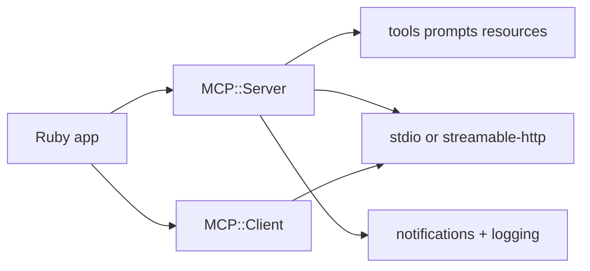

# MCP Ruby SDK Tutorial: Building MCP Servers and Clients in Ruby

> Learn how to implement MCP server/client workflows with `modelcontextprotocol/ruby-sdk`, including tool/prompt/resource registration, streamable HTTP sessions, structured logging, and release operations.

## Why This Track Matters

Ruby teams need a practical MCP SDK that can power local tools, Rails integrations, and HTTP-deployed services. The official Ruby SDK provides a concise server/client model with schema-aware tool handling, notifications, and streamable HTTP support.

This track focuses on:

- establishing a safe gem/runtime baseline and capability model
- implementing tools, prompts, and resources with schema discipline
- operating stdio and streamable HTTP transports (stateful and stateless)
- integrating release, security, and production readiness workflows

## Current Snapshot (auto-updated)

- repository: [`modelcontextprotocol/ruby-sdk`](https://github.com/modelcontextprotocol/ruby-sdk)
- stars: about **716**
- latest release: [`v0.6.0`](https://github.com/modelcontextprotocol/ruby-sdk/releases/tag/v0.6.0) (**January 16, 2026**)
- recent activity: updated on **February 11, 2026**
- runtime note: changelog documents support for Ruby 2.7-3.1 in recent releases
- feature note: README still lists resource subscriptions, completions, and elicitation as not yet implemented

## Mental Model

## Chapter Guide

| Chapter | Key Question | Outcome |
|:--------|:-------------|:--------|
| [01 - Getting Started and Gem Baseline](01-getting-started-and-gem-baseline.md) | What is the safest way to start an MCP Ruby project? | Clean runtime baseline |
| [02 - Server Architecture and Capability Negotiation](02-server-architecture-and-capability-negotiation.md) | How does `MCP::Server` negotiate and expose protocol capabilities? | Better server foundations |
| [03 - Tools, Prompts, Resources, and Schema Discipline](03-tools-prompts-resources-and-schema-discipline.md) | How should server primitives be modeled and validated? | Higher implementation quality |
| [04 - Notifications, Logging, and Observability](04-notifications-logging-and-observability.md) | How do I deliver list-change and logging events safely? | Better runtime visibility |
| [05 - Transports: stdio, Streamable HTTP, and Session Modes](05-transports-stdio-streamable-http-and-session-modes.md) | Which transport mode best fits local vs distributed deployments? | Clear transport strategy |
| [06 - Client Workflows, HTTP Integration, and Auth Considerations](06-client-workflows-http-integration-and-auth-considerations.md) | How do Ruby clients interact with MCP services over HTTP? | Stronger client integrations |
| [07 - Quality, Security, and Release Workflows](07-quality-security-and-release-workflows.md) | How do teams keep Ruby MCP deployments secure and stable? | Lower operational risk |
| [08 - Production Deployment and Upgrade Strategy](08-production-deployment-and-upgrade-strategy.md) | How do you operate and evolve Ruby MCP services in production? | Long-term maintainability |

## What You Will Learn

- how to model Ruby MCP server/client responsibilities with protocol-aware boundaries
- how to implement primitives and notifications without drifting from spec behavior
- how to choose and run transport/session modes by operational context
- how to use changelog and release automation signals for safer upgrades

## Source References

- [Ruby SDK README](https://github.com/modelcontextprotocol/ruby-sdk/blob/main/README.md)
- [Ruby SDK Examples](https://github.com/modelcontextprotocol/ruby-sdk/blob/main/examples/README.md)
- [Ruby SDK Changelog](https://github.com/modelcontextprotocol/ruby-sdk/blob/main/CHANGELOG.md)
- [Ruby SDK Release Process](https://github.com/modelcontextprotocol/ruby-sdk/blob/main/RELEASE.md)
- [RubyGems Package](https://rubygems.org/gems/mcp)

## Related Tutorials

- [MCP Specification Tutorial](../mcp-specification-tutorial/)
- [MCP TypeScript SDK Tutorial](../mcp-typescript-sdk-tutorial/)
- [MCP Python SDK Tutorial](../mcp-python-sdk-tutorial/)
- [MCP Swift SDK Tutorial](../mcp-swift-sdk-tutorial/)

---

Start with [Chapter 1: Getting Started and Gem Baseline](01-getting-started-and-gem-baseline.md).

## Navigation & Backlinks

- [Start Here: Chapter 1: Getting Started and Gem Baseline](01-getting-started-and-gem-baseline.md)
- [Back to Main Catalog](../../README.md#-tutorial-catalog)
- [Browse A-Z Tutorial Directory](../../discoverability/tutorial-directory.md)
- [Search by Intent](../../discoverability/query-hub.md)
- [Explore Category Hubs](../../README.md#category-hubs)

## Full Chapter Map

1. [Chapter 1: Getting Started and Gem Baseline](01-getting-started-and-gem-baseline.md)
2. [Chapter 2: Server Architecture and Capability Negotiation](02-server-architecture-and-capability-negotiation.md)
3. [Chapter 3: Tools, Prompts, Resources, and Schema Discipline](03-tools-prompts-resources-and-schema-discipline.md)
4. [Chapter 4: Notifications, Logging, and Observability](04-notifications-logging-and-observability.md)
5. [Chapter 5: Transports: stdio, Streamable HTTP, and Session Modes](05-transports-stdio-streamable-http-and-session-modes.md)
6. [Chapter 6: Client Workflows, HTTP Integration, and Auth Considerations](06-client-workflows-http-integration-and-auth-considerations.md)
7. [Chapter 7: Quality, Security, and Release Workflows](07-quality-security-and-release-workflows.md)
8. [Chapter 8: Production Deployment and Upgrade Strategy](08-production-deployment-and-upgrade-strategy.md)

*Generated by [AI Codebase Knowledge Builder](https://github.com/The-Pocket/Tutorial-Codebase-Knowledge)*
