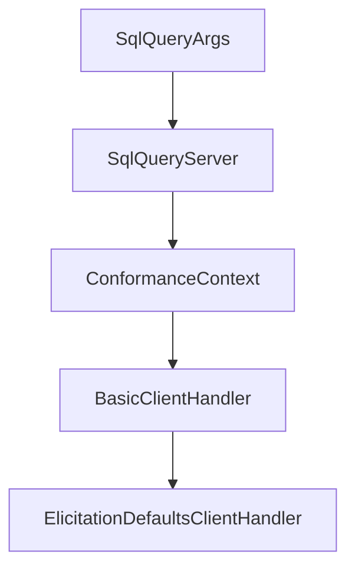

# Chapter 1: Getting Started and Crate Setup

Welcome to **Chapter 1: Getting Started and Crate Setup**. In this part of **MCP Rust SDK Tutorial: Building High-Performance MCP Services with RMCP**, you will build an intuitive mental model first, then move into concrete implementation details and practical production tradeoffs.


This chapter defines a clean onboarding baseline for rmcp projects.

## Learning Goals

- choose the right crate and feature set for your first implementation
- align runtime dependencies (`tokio`, `serde`, `schemars`) to SDK expectations
- bootstrap minimal client/server flows quickly
- avoid over-enabling transport/auth features before needed

## Baseline Setup

```toml
rmcp = { version = "0.15", features = ["server"] }
```

Start with one transport path and one capability surface, then add features incrementally.

## Source References

- [Rust SDK README Usage](https://github.com/modelcontextprotocol/rust-sdk/blob/main/README.md)
- [rmcp README Quick Start](https://github.com/modelcontextprotocol/rust-sdk/blob/main/crates/rmcp/README.md)

## Summary

You now have a dependency baseline that keeps early integrations predictable.

Next: [Chapter 2: Service Model and Macro-Based Tooling](02-service-model-and-macro-based-tooling.md)

## Depth Expansion Playbook

## Source Code Walkthrough

### `examples/servers/src/completion_stdio.rs`

The `SqlQueryArgs` interface in [`examples/servers/src/completion_stdio.rs`](https://github.com/modelcontextprotocol/rust-sdk/blob/HEAD/examples/servers/src/completion_stdio.rs) handles a key part of this chapter's functionality:

```rs
#[derive(Debug, Serialize, Deserialize, JsonSchema)]
#[schemars(description = "SQL query builder with progressive completion")]
pub struct SqlQueryArgs {
    #[schemars(description = "SQL operation type (SELECT, INSERT, UPDATE, DELETE)")]
    pub operation: String,
    #[schemars(description = "Database table name")]
    pub table: String,
    #[schemars(description = "Columns to select/update (only for SELECT/UPDATE)")]
    pub columns: Option<String>,
    #[schemars(description = "WHERE clause condition (optional for all operations)")]
    pub where_clause: Option<String>,
    #[schemars(description = "Values to insert (only for INSERT)")]
    pub values: Option<String>,
}

/// SQL query builder server with progressive completion
#[derive(Clone)]
pub struct SqlQueryServer {
    prompt_router: PromptRouter<SqlQueryServer>,
}

impl SqlQueryServer {
    pub fn new() -> Self {
        Self {
            prompt_router: Self::prompt_router(),
        }
    }
}

impl Default for SqlQueryServer {
    fn default() -> Self {
        Self::new()
```

This interface is important because it defines how MCP Rust SDK Tutorial: Building High-Performance MCP Services with RMCP implements the patterns covered in this chapter.

### `examples/servers/src/completion_stdio.rs`

The `SqlQueryServer` interface in [`examples/servers/src/completion_stdio.rs`](https://github.com/modelcontextprotocol/rust-sdk/blob/HEAD/examples/servers/src/completion_stdio.rs) handles a key part of this chapter's functionality:

```rs
/// SQL query builder server with progressive completion
#[derive(Clone)]
pub struct SqlQueryServer {
    prompt_router: PromptRouter<SqlQueryServer>,
}

impl SqlQueryServer {
    pub fn new() -> Self {
        Self {
            prompt_router: Self::prompt_router(),
        }
    }
}

impl Default for SqlQueryServer {
    fn default() -> Self {
        Self::new()
    }
}

impl SqlQueryServer {
    /// Fuzzy matching with scoring for completion suggestions
    fn fuzzy_match(&self, query: &str, candidates: &[&str]) -> Vec<String> {
        if query.is_empty() {
            return candidates.iter().take(10).map(|s| s.to_string()).collect();
        }

        let query_lower = query.to_lowercase();
        let mut scored_matches = Vec::new();

        for candidate in candidates {
            let candidate_lower = candidate.to_lowercase();
```

This interface is important because it defines how MCP Rust SDK Tutorial: Building High-Performance MCP Services with RMCP implements the patterns covered in this chapter.

### `conformance/src/bin/client.rs`

The `ConformanceContext` interface in [`conformance/src/bin/client.rs`](https://github.com/modelcontextprotocol/rust-sdk/blob/HEAD/conformance/src/bin/client.rs) handles a key part of this chapter's functionality:

```rs

#[derive(Debug, Default, serde::Deserialize)]
struct ConformanceContext {
    #[serde(default)]
    client_id: Option<String>,
    #[serde(default)]
    client_secret: Option<String>,
    // client-credentials-jwt
    #[serde(default)]
    private_key_pem: Option<String>,
    #[serde(default)]
    signing_algorithm: Option<String>,
}

fn load_context() -> ConformanceContext {
    std::env::var("MCP_CONFORMANCE_CONTEXT")
        .ok()
        .and_then(|s| serde_json::from_str(&s).ok())
        .unwrap_or_default()
}

// ─── Client handlers ────────────────────────────────────────────────────────

/// A basic client handler that does nothing special
struct BasicClientHandler;
impl ClientHandler for BasicClientHandler {}

/// A client handler that handles elicitation requests by applying schema defaults.
struct ElicitationDefaultsClientHandler;

impl ClientHandler for ElicitationDefaultsClientHandler {
    fn get_info(&self) -> ClientInfo {
```

This interface is important because it defines how MCP Rust SDK Tutorial: Building High-Performance MCP Services with RMCP implements the patterns covered in this chapter.

### `conformance/src/bin/client.rs`

The `BasicClientHandler` interface in [`conformance/src/bin/client.rs`](https://github.com/modelcontextprotocol/rust-sdk/blob/HEAD/conformance/src/bin/client.rs) handles a key part of this chapter's functionality:

```rs

/// A basic client handler that does nothing special
struct BasicClientHandler;
impl ClientHandler for BasicClientHandler {}

/// A client handler that handles elicitation requests by applying schema defaults.
struct ElicitationDefaultsClientHandler;

impl ClientHandler for ElicitationDefaultsClientHandler {
    fn get_info(&self) -> ClientInfo {
        let mut info = ClientInfo::default();
        info.capabilities.elicitation = Some(ElicitationCapability {
            form: Some(FormElicitationCapability {
                schema_validation: Some(true),
            }),
            url: None,
        });
        info
    }

    async fn create_elicitation(
        &self,
        request: CreateElicitationRequestParams,
        _cx: RequestContext<RoleClient>,
    ) -> Result<CreateElicitationResult, ErrorData> {
        let content = match &request {
            CreateElicitationRequestParams::FormElicitationParams {
                requested_schema, ..
            } => {
                let mut defaults = serde_json::Map::new();
                for (name, prop) in &requested_schema.properties {
                    match prop {
```

This interface is important because it defines how MCP Rust SDK Tutorial: Building High-Performance MCP Services with RMCP implements the patterns covered in this chapter.


## How These Components Connect


