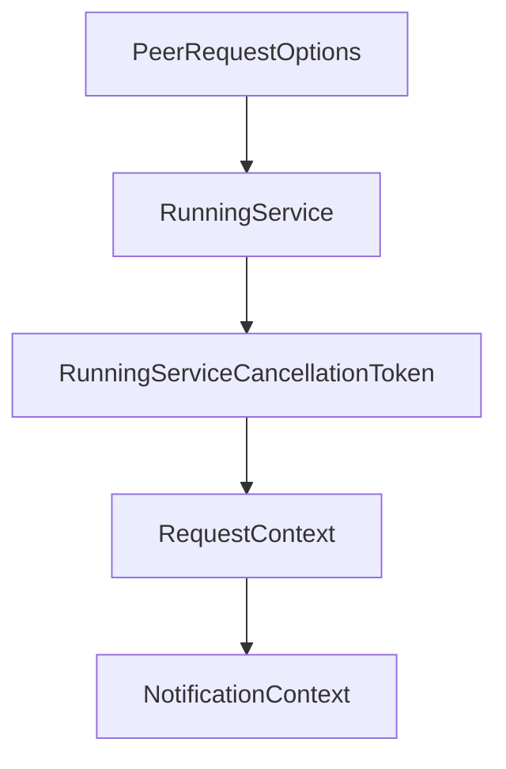

# Chapter 2: Service Model and Macro-Based Tooling

Welcome to **Chapter 2: Service Model and Macro-Based Tooling**. In this part of **MCP Rust SDK Tutorial: Building High-Performance MCP Services with RMCP**, you will build an intuitive mental model first, then move into concrete implementation details and practical production tradeoffs.


rmcp macros and handler traits shape how maintainable your server code becomes.

## Learning Goals

- use `#[tool]`, `#[tool_router]`, and `#[tool_handler]` effectively
- keep service state and handler boundaries explicit
- generate schemas and typed interfaces with less manual boilerplate
- avoid macro-heavy patterns that hide critical protocol behavior

## Design Rules

- keep tools cohesive around one service domain
- use routers for explicit capability discovery boundaries
- validate generated schema output for complex input/output types
- document macro-generated behavior for team maintainability

## Source References

- [rmcp-macros README](https://github.com/modelcontextprotocol/rust-sdk/blob/main/crates/rmcp-macros/README.md)
- [rmcp README - Server Implementation](https://github.com/modelcontextprotocol/rust-sdk/blob/main/crates/rmcp/README.md#server-implementation)

## Summary

You now have a practical model for macro-driven capability design in Rust.

Next: [Chapter 3: Transports: stdio, Streamable HTTP, and Custom Channels](03-transports-stdio-streamable-http-and-custom-channels.md)

## Source Code Walkthrough

### `crates/rmcp/src/service.rs`

The `PeerRequestOptions` interface in [`crates/rmcp/src/service.rs`](https://github.com/modelcontextprotocol/rust-sdk/blob/HEAD/crates/rmcp/src/service.rs) handles a key part of this chapter's functionality:

```rs
pub struct RequestHandle<R: ServiceRole> {
    pub rx: tokio::sync::oneshot::Receiver<Result<R::PeerResp, ServiceError>>,
    pub options: PeerRequestOptions,
    pub peer: Peer<R>,
    pub id: RequestId,
    pub progress_token: ProgressToken,
}

impl<R: ServiceRole> RequestHandle<R> {
    pub const REQUEST_TIMEOUT_REASON: &str = "request timeout";
    pub async fn await_response(self) -> Result<R::PeerResp, ServiceError> {
        if let Some(timeout) = self.options.timeout {
            let timeout_result = tokio::time::timeout(timeout, async move {
                self.rx.await.map_err(|_e| ServiceError::TransportClosed)?
            })
            .await;
            match timeout_result {
                Ok(response) => response,
                Err(_) => {
                    let error = Err(ServiceError::Timeout { timeout });
                    // cancel this request
                    let notification = CancelledNotification {
                        params: CancelledNotificationParam {
                            request_id: self.id,
                            reason: Some(Self::REQUEST_TIMEOUT_REASON.to_owned()),
                        },
                        method: crate::model::CancelledNotificationMethod,
                        extensions: Default::default(),
                    };
                    let _ = self.peer.send_notification(notification.into()).await;
                    error
                }
```

This interface is important because it defines how MCP Rust SDK Tutorial: Building High-Performance MCP Services with RMCP implements the patterns covered in this chapter.

### `crates/rmcp/src/service.rs`

The `RunningService` interface in [`crates/rmcp/src/service.rs`](https://github.com/modelcontextprotocol/rust-sdk/blob/HEAD/crates/rmcp/src/service.rs) handles a key part of this chapter's functionality:

```rs
        self,
        transport: T,
    ) -> impl Future<Output = Result<RunningService<R, Self>, R::InitializeError>> + MaybeSendFuture
    where
        T: IntoTransport<R, E, A>,
        E: std::error::Error + Send + Sync + 'static,
        Self: Sized,
    {
        Self::serve_with_ct(self, transport, Default::default())
    }
    fn serve_with_ct<T, E, A>(
        self,
        transport: T,
        ct: CancellationToken,
    ) -> impl Future<Output = Result<RunningService<R, Self>, R::InitializeError>> + MaybeSendFuture
    where
        T: IntoTransport<R, E, A>,
        E: std::error::Error + Send + Sync + 'static,
        Self: Sized;
}

impl<R: ServiceRole> Service<R> for Box<dyn DynService<R>> {
    fn handle_request(
        &self,
        request: R::PeerReq,
        context: RequestContext<R>,
    ) -> impl Future<Output = Result<R::Resp, McpError>> + MaybeSendFuture + '_ {
        DynService::handle_request(self.as_ref(), request, context)
    }

    fn handle_notification(
        &self,
```

This interface is important because it defines how MCP Rust SDK Tutorial: Building High-Performance MCP Services with RMCP implements the patterns covered in this chapter.

### `crates/rmcp/src/service.rs`

The `RunningServiceCancellationToken` interface in [`crates/rmcp/src/service.rs`](https://github.com/modelcontextprotocol/rust-sdk/blob/HEAD/crates/rmcp/src/service.rs) handles a key part of this chapter's functionality:

```rs
    }
    #[inline]
    pub fn cancellation_token(&self) -> RunningServiceCancellationToken {
        RunningServiceCancellationToken(self.cancellation_token.clone())
    }

    /// Returns true if the service has been closed or cancelled.
    #[inline]
    pub fn is_closed(&self) -> bool {
        self.handle.is_none() || self.cancellation_token.is_cancelled()
    }

    /// Wait for the service to complete.
    ///
    /// This will block until the service loop terminates (either due to
    /// cancellation, transport closure, or an error).
    #[inline]
    pub async fn waiting(mut self) -> Result<QuitReason, tokio::task::JoinError> {
        match self.handle.take() {
            Some(handle) => handle.await,
            None => Ok(QuitReason::Closed),
        }
    }

    /// Gracefully close the connection and wait for cleanup to complete.
    ///
    /// This method cancels the service, waits for the background task to finish
    /// (which includes calling `transport.close()`), and ensures all cleanup
    /// operations complete before returning.
    ///
    /// Unlike [`cancel`](Self::cancel), this method takes `&mut self` and can be
    /// called without consuming the `RunningService`. After calling this method,
```

This interface is important because it defines how MCP Rust SDK Tutorial: Building High-Performance MCP Services with RMCP implements the patterns covered in this chapter.

### `crates/rmcp/src/service.rs`

The `RequestContext` interface in [`crates/rmcp/src/service.rs`](https://github.com/modelcontextprotocol/rust-sdk/blob/HEAD/crates/rmcp/src/service.rs) handles a key part of this chapter's functionality:

```rs
        &self,
        request: R::PeerReq,
        context: RequestContext<R>,
    ) -> impl Future<Output = Result<R::Resp, McpError>> + MaybeSendFuture + '_;
    fn handle_notification(
        &self,
        notification: R::PeerNot,
        context: NotificationContext<R>,
    ) -> impl Future<Output = Result<(), McpError>> + MaybeSendFuture + '_;
    fn get_info(&self) -> R::Info;
}

#[cfg(feature = "local")]
pub trait Service<R: ServiceRole>: 'static {
    fn handle_request(
        &self,
        request: R::PeerReq,
        context: RequestContext<R>,
    ) -> impl Future<Output = Result<R::Resp, McpError>> + MaybeSendFuture + '_;
    fn handle_notification(
        &self,
        notification: R::PeerNot,
        context: NotificationContext<R>,
    ) -> impl Future<Output = Result<(), McpError>> + MaybeSendFuture + '_;
    fn get_info(&self) -> R::Info;
}

pub trait ServiceExt<R: ServiceRole>: Service<R> + Sized {
    /// Convert this service to a dynamic boxed service
    ///
    /// This could be very helpful when you want to store the services in a collection
    fn into_dyn(self) -> Box<dyn DynService<R>> {
```

This interface is important because it defines how MCP Rust SDK Tutorial: Building High-Performance MCP Services with RMCP implements the patterns covered in this chapter.


## How These Components Connect


