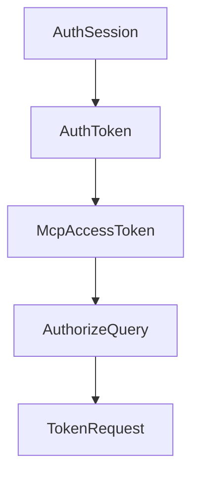

# Chapter 2: Service Model and Macro-Based Tooling

Welcome to **Chapter 2: Service Model and Macro-Based Tooling**. In this part of **MCP Rust SDK Tutorial: Building High-Performance MCP Services with RMCP**, you will build an intuitive mental model first, then move into concrete implementation details and practical production tradeoffs.


rmcp macros and handler traits shape how maintainable your server code becomes.

## Learning Goals

- use `#[tool]`, `#[tool_router]`, and `#[tool_handler]` effectively
- keep service state and handler boundaries explicit
- generate schemas and typed interfaces with less manual boilerplate
- avoid macro-heavy patterns that hide critical protocol behavior

## Design Rules

- keep tools cohesive around one service domain
- use routers for explicit capability discovery boundaries
- validate generated schema output for complex input/output types
- document macro-generated behavior for team maintainability

## Source References

- [rmcp-macros README](https://github.com/modelcontextprotocol/rust-sdk/blob/main/crates/rmcp-macros/README.md)
- [rmcp README - Server Implementation](https://github.com/modelcontextprotocol/rust-sdk/blob/main/crates/rmcp/README.md#server-implementation)

## Summary

You now have a practical model for macro-driven capability design in Rust.

Next: [Chapter 3: Transports: stdio, Streamable HTTP, and Custom Channels](03-transports-stdio-streamable-http-and-custom-channels.md)

## Depth Expansion Playbook

## Source Code Walkthrough

### `examples/servers/src/complex_auth_streamhttp.rs`

The `AuthSession` interface in [`examples/servers/src/complex_auth_streamhttp.rs`](https://github.com/modelcontextprotocol/rust-sdk/blob/HEAD/examples/servers/src/complex_auth_streamhttp.rs) handles a key part of this chapter's functionality:

```rs
struct McpOAuthStore {
    clients: Arc<RwLock<HashMap<String, OAuthClientConfig>>>,
    auth_sessions: Arc<RwLock<HashMap<String, AuthSession>>>,
    access_tokens: Arc<RwLock<HashMap<String, McpAccessToken>>>,
}

impl McpOAuthStore {
    fn new() -> Self {
        let mut clients = HashMap::new();
        clients.insert(
            "mcp-client".to_string(),
            OAuthClientConfig {
                client_id: "mcp-client".to_string(),
                client_secret: Some("mcp-client-secret".to_string()),
                scopes: vec!["profile".to_string(), "email".to_string()],
                redirect_uri: "http://localhost:8080/callback".to_string(),
            },
        );

        Self {
            clients: Arc::new(RwLock::new(clients)),
            auth_sessions: Arc::new(RwLock::new(HashMap::new())),
            access_tokens: Arc::new(RwLock::new(HashMap::new())),
        }
    }

    async fn validate_client(
        &self,
        client_id: &str,
        redirect_uri: &str,
    ) -> Option<OAuthClientConfig> {
        let clients = self.clients.read().await;
```

This interface is important because it defines how MCP Rust SDK Tutorial: Building High-Performance MCP Services with RMCP implements the patterns covered in this chapter.

### `examples/servers/src/complex_auth_streamhttp.rs`

The `AuthToken` interface in [`examples/servers/src/complex_auth_streamhttp.rs`](https://github.com/modelcontextprotocol/rust-sdk/blob/HEAD/examples/servers/src/complex_auth_streamhttp.rs) handles a key part of this chapter's functionality:

```rs
        &self,
        session_id: &str,
        token: AuthToken,
    ) -> Result<(), String> {
        let mut sessions = self.auth_sessions.write().await;
        if let Some(session) = sessions.get_mut(session_id) {
            session.auth_token = Some(token);
            Ok(())
        } else {
            Err("Session not found".to_string())
        }
    }

    async fn create_mcp_token(&self, session_id: &str) -> Result<McpAccessToken, String> {
        let sessions = self.auth_sessions.read().await;
        if let Some(session) = sessions.get(session_id) {
            if let Some(auth_token) = &session.auth_token {
                let access_token = format!("mcp-token-{}", Uuid::new_v4());
                let token = McpAccessToken {
                    access_token: access_token.clone(),
                    token_type: "Bearer".to_string(),
                    expires_in: 3600,
                    refresh_token: format!("mcp-refresh-{}", Uuid::new_v4()),
                    scope: session.scope.clone(),
                    auth_token: auth_token.clone(),
                    client_id: session.client_id.clone(),
                };

                self.access_tokens
                    .write()
                    .await
                    .insert(access_token.clone(), token.clone());
```

This interface is important because it defines how MCP Rust SDK Tutorial: Building High-Performance MCP Services with RMCP implements the patterns covered in this chapter.

### `examples/servers/src/complex_auth_streamhttp.rs`

The `McpAccessToken` interface in [`examples/servers/src/complex_auth_streamhttp.rs`](https://github.com/modelcontextprotocol/rust-sdk/blob/HEAD/examples/servers/src/complex_auth_streamhttp.rs) handles a key part of this chapter's functionality:

```rs
    clients: Arc<RwLock<HashMap<String, OAuthClientConfig>>>,
    auth_sessions: Arc<RwLock<HashMap<String, AuthSession>>>,
    access_tokens: Arc<RwLock<HashMap<String, McpAccessToken>>>,
}

impl McpOAuthStore {
    fn new() -> Self {
        let mut clients = HashMap::new();
        clients.insert(
            "mcp-client".to_string(),
            OAuthClientConfig {
                client_id: "mcp-client".to_string(),
                client_secret: Some("mcp-client-secret".to_string()),
                scopes: vec!["profile".to_string(), "email".to_string()],
                redirect_uri: "http://localhost:8080/callback".to_string(),
            },
        );

        Self {
            clients: Arc::new(RwLock::new(clients)),
            auth_sessions: Arc::new(RwLock::new(HashMap::new())),
            access_tokens: Arc::new(RwLock::new(HashMap::new())),
        }
    }

    async fn validate_client(
        &self,
        client_id: &str,
        redirect_uri: &str,
    ) -> Option<OAuthClientConfig> {
        let clients = self.clients.read().await;
        if let Some(client) = clients.get(client_id) {
```

This interface is important because it defines how MCP Rust SDK Tutorial: Building High-Performance MCP Services with RMCP implements the patterns covered in this chapter.

### `examples/servers/src/complex_auth_streamhttp.rs`

The `AuthorizeQuery` interface in [`examples/servers/src/complex_auth_streamhttp.rs`](https://github.com/modelcontextprotocol/rust-sdk/blob/HEAD/examples/servers/src/complex_auth_streamhttp.rs) handles a key part of this chapter's functionality:

```rs

#[derive(Debug, Deserialize)]
struct AuthorizeQuery {
    #[allow(dead_code)]
    response_type: String,
    client_id: String,
    redirect_uri: String,
    scope: Option<String>,
    state: Option<String>,
}

#[derive(Debug, Deserialize, Serialize)]
struct TokenRequest {
    grant_type: String,
    #[serde(default)]
    code: String,
    #[serde(default)]
    client_id: String,
    #[serde(default)]
    client_secret: String,
    #[serde(default)]
    redirect_uri: String,
    #[serde(default)]
    code_verifier: Option<String>,
    #[serde(default)]
    refresh_token: String,
}

fn generate_random_string(length: usize) -> String {
    rand::rng()
        .sample_iter(&Alphanumeric)
        .take(length)
```

This interface is important because it defines how MCP Rust SDK Tutorial: Building High-Performance MCP Services with RMCP implements the patterns covered in this chapter.


## How These Components Connect


