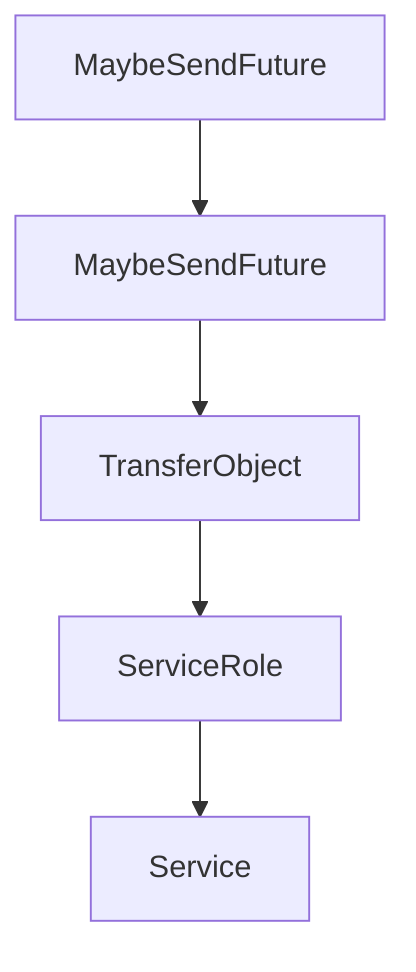

# Chapter 3: Transports: stdio, Streamable HTTP, and Custom Channels

Welcome to **Chapter 3: Transports: stdio, Streamable HTTP, and Custom Channels**. In this part of **MCP Rust SDK Tutorial: Building High-Performance MCP Services with RMCP**, you will build an intuitive mental model first, then move into concrete implementation details and practical production tradeoffs.


Transport strategy should be deliberate, especially in async-heavy Rust services.

## Learning Goals

- choose transport features that match deployment topology
- reason about stdio subprocess vs streamable HTTP operational tradeoffs
- implement custom transport adapters safely
- preserve protocol guarantees while scaling concurrency

## Transport Feature Highlights

- `transport-io`: server stdio transport
- `transport-child-process`: client stdio transport
- streamable HTTP server/client features for networked deployments
- custom transport pathways for specialized channels

## Source References

- [rmcp README - Transport Options](https://github.com/modelcontextprotocol/rust-sdk/blob/main/crates/rmcp/README.md#transport-options)
- [Examples Transport Index](https://github.com/modelcontextprotocol/rust-sdk/blob/main/examples/README.md)
- [Client Examples - Streamable HTTP](https://github.com/modelcontextprotocol/rust-sdk/blob/main/examples/clients/README.md)

## Summary

You now have a transport planning framework for matching capability requirements to runtime constraints.

Next: [Chapter 4: Client Patterns, Sampling, and Batching Flows](04-client-patterns-sampling-and-batching-flows.md)

## Source Code Walkthrough

### `crates/rmcp/src/service.rs`

The `MaybeSendFuture` interface in [`crates/rmcp/src/service.rs`](https://github.com/modelcontextprotocol/rust-sdk/blob/HEAD/crates/rmcp/src/service.rs) handles a key part of this chapter's functionality:

```rs
//
// `MaybeSend`       – supertrait alias: `Send + Sync` without `local`, empty with `local`
// `MaybeSendFuture` – future bound alias: `Send` without `local`, empty with `local`
// `MaybeBoxFuture`  – boxed future type: `BoxFuture` without `local`, `LocalBoxFuture` with `local`
// ---------------------------------------------------------------------------

#[cfg(not(feature = "local"))]
#[doc(hidden)]
pub trait MaybeSend: Send + Sync {}
#[cfg(not(feature = "local"))]
impl<T: Send + Sync> MaybeSend for T {}

#[cfg(feature = "local")]
#[doc(hidden)]
pub trait MaybeSend {}
#[cfg(feature = "local")]
impl<T> MaybeSend for T {}

#[cfg(not(feature = "local"))]
#[doc(hidden)]
pub trait MaybeSendFuture: Send {}
#[cfg(not(feature = "local"))]
impl<T: Send> MaybeSendFuture for T {}

#[cfg(feature = "local")]
#[doc(hidden)]
pub trait MaybeSendFuture {}
#[cfg(feature = "local")]
impl<T> MaybeSendFuture for T {}

#[cfg(not(feature = "local"))]
pub(crate) type MaybeBoxFuture<'a, T> = BoxFuture<'a, T>;
```

This interface is important because it defines how MCP Rust SDK Tutorial: Building High-Performance MCP Services with RMCP implements the patterns covered in this chapter.

### `crates/rmcp/src/service.rs`

The `MaybeSendFuture` interface in [`crates/rmcp/src/service.rs`](https://github.com/modelcontextprotocol/rust-sdk/blob/HEAD/crates/rmcp/src/service.rs) handles a key part of this chapter's functionality:

```rs
//
// `MaybeSend`       – supertrait alias: `Send + Sync` without `local`, empty with `local`
// `MaybeSendFuture` – future bound alias: `Send` without `local`, empty with `local`
// `MaybeBoxFuture`  – boxed future type: `BoxFuture` without `local`, `LocalBoxFuture` with `local`
// ---------------------------------------------------------------------------

#[cfg(not(feature = "local"))]
#[doc(hidden)]
pub trait MaybeSend: Send + Sync {}
#[cfg(not(feature = "local"))]
impl<T: Send + Sync> MaybeSend for T {}

#[cfg(feature = "local")]
#[doc(hidden)]
pub trait MaybeSend {}
#[cfg(feature = "local")]
impl<T> MaybeSend for T {}

#[cfg(not(feature = "local"))]
#[doc(hidden)]
pub trait MaybeSendFuture: Send {}
#[cfg(not(feature = "local"))]
impl<T: Send> MaybeSendFuture for T {}

#[cfg(feature = "local")]
#[doc(hidden)]
pub trait MaybeSendFuture {}
#[cfg(feature = "local")]
impl<T> MaybeSendFuture for T {}

#[cfg(not(feature = "local"))]
pub(crate) type MaybeBoxFuture<'a, T> = BoxFuture<'a, T>;
```

This interface is important because it defines how MCP Rust SDK Tutorial: Building High-Performance MCP Services with RMCP implements the patterns covered in this chapter.

### `crates/rmcp/src/service.rs`

The `TransferObject` interface in [`crates/rmcp/src/service.rs`](https://github.com/modelcontextprotocol/rust-sdk/blob/HEAD/crates/rmcp/src/service.rs) handles a key part of this chapter's functionality:

```rs
}

trait TransferObject:
    std::fmt::Debug + Clone + serde::Serialize + serde::de::DeserializeOwned + Send + Sync + 'static
{
}

impl<T> TransferObject for T where
    T: std::fmt::Debug
        + serde::Serialize
        + serde::de::DeserializeOwned
        + Send
        + Sync
        + 'static
        + Clone
{
}

#[allow(private_bounds, reason = "there's no the third implementation")]
pub trait ServiceRole: std::fmt::Debug + Send + Sync + 'static + Copy + Clone {
    type Req: TransferObject + GetMeta + GetExtensions;
    type Resp: TransferObject;
    type Not: TryInto<CancelledNotification, Error = Self::Not>
        + From<CancelledNotification>
        + TransferObject;
    type PeerReq: TransferObject + GetMeta + GetExtensions;
    type PeerResp: TransferObject;
    type PeerNot: TryInto<CancelledNotification, Error = Self::PeerNot>
        + From<CancelledNotification>
        + TransferObject
        + GetMeta
        + GetExtensions;
```

This interface is important because it defines how MCP Rust SDK Tutorial: Building High-Performance MCP Services with RMCP implements the patterns covered in this chapter.

### `crates/rmcp/src/service.rs`

The `ServiceRole` interface in [`crates/rmcp/src/service.rs`](https://github.com/modelcontextprotocol/rust-sdk/blob/HEAD/crates/rmcp/src/service.rs) handles a key part of this chapter's functionality:

```rs

#[allow(private_bounds, reason = "there's no the third implementation")]
pub trait ServiceRole: std::fmt::Debug + Send + Sync + 'static + Copy + Clone {
    type Req: TransferObject + GetMeta + GetExtensions;
    type Resp: TransferObject;
    type Not: TryInto<CancelledNotification, Error = Self::Not>
        + From<CancelledNotification>
        + TransferObject;
    type PeerReq: TransferObject + GetMeta + GetExtensions;
    type PeerResp: TransferObject;
    type PeerNot: TryInto<CancelledNotification, Error = Self::PeerNot>
        + From<CancelledNotification>
        + TransferObject
        + GetMeta
        + GetExtensions;
    type InitializeError;
    const IS_CLIENT: bool;
    type Info: TransferObject;
    type PeerInfo: TransferObject;
}

pub type TxJsonRpcMessage<R> =
    JsonRpcMessage<<R as ServiceRole>::Req, <R as ServiceRole>::Resp, <R as ServiceRole>::Not>;
pub type RxJsonRpcMessage<R> = JsonRpcMessage<
    <R as ServiceRole>::PeerReq,
    <R as ServiceRole>::PeerResp,
    <R as ServiceRole>::PeerNot,
>;

#[cfg(not(feature = "local"))]
pub trait Service<R: ServiceRole>: Send + Sync + 'static {
    fn handle_request(
```

This interface is important because it defines how MCP Rust SDK Tutorial: Building High-Performance MCP Services with RMCP implements the patterns covered in this chapter.


## How These Components Connect


