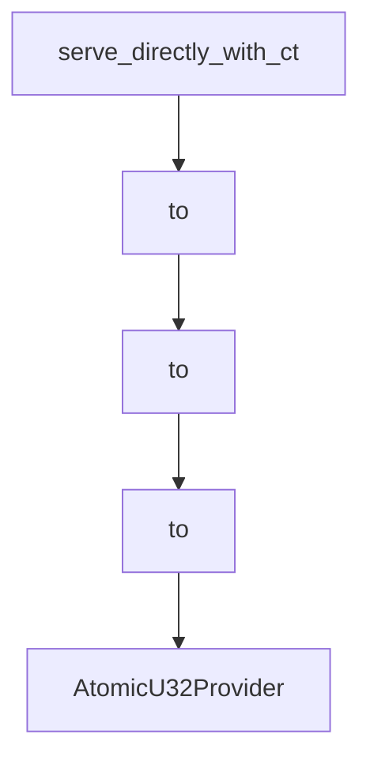

# Chapter 3: Transports: stdio, Streamable HTTP, and Custom Channels

Welcome to **Chapter 3: Transports: stdio, Streamable HTTP, and Custom Channels**. In this part of **MCP Rust SDK Tutorial: Building High-Performance MCP Services with RMCP**, you will build an intuitive mental model first, then move into concrete implementation details and practical production tradeoffs.


Transport strategy should be deliberate, especially in async-heavy Rust services.

## Learning Goals

- choose transport features that match deployment topology
- reason about stdio subprocess vs streamable HTTP operational tradeoffs
- implement custom transport adapters safely
- preserve protocol guarantees while scaling concurrency

## Transport Feature Highlights

- `transport-io`: server stdio transport
- `transport-child-process`: client stdio transport
- streamable HTTP server/client features for networked deployments
- custom transport pathways for specialized channels

## Source References

- [rmcp README - Transport Options](https://github.com/modelcontextprotocol/rust-sdk/blob/main/crates/rmcp/README.md#transport-options)
- [Examples Transport Index](https://github.com/modelcontextprotocol/rust-sdk/blob/main/examples/README.md)
- [Client Examples - Streamable HTTP](https://github.com/modelcontextprotocol/rust-sdk/blob/main/examples/clients/README.md)

## Summary

You now have a transport planning framework for matching capability requirements to runtime constraints.

Next: [Chapter 4: Client Patterns, Sampling, and Batching Flows](04-client-patterns-sampling-and-batching-flows.md)

## Depth Expansion Playbook

## Source Code Walkthrough

### `crates/rmcp/src/service.rs`

The `serve_directly_with_ct` function in [`crates/rmcp/src/service.rs`](https://github.com/modelcontextprotocol/rust-sdk/blob/HEAD/crates/rmcp/src/service.rs) handles a key part of this chapter's functionality:

```rs
    E: std::error::Error + Send + Sync + 'static,
{
    serve_directly_with_ct(service, transport, peer_info, Default::default())
}

/// Use this function to skip initialization process
pub fn serve_directly_with_ct<R, S, T, E, A>(
    service: S,
    transport: T,
    peer_info: Option<R::PeerInfo>,
    ct: CancellationToken,
) -> RunningService<R, S>
where
    R: ServiceRole,
    S: Service<R>,
    T: IntoTransport<R, E, A>,
    E: std::error::Error + Send + Sync + 'static,
{
    let (peer, peer_rx) = Peer::new(Arc::new(AtomicU32RequestIdProvider::default()), peer_info);
    serve_inner(service, transport.into_transport(), peer, peer_rx, ct)
}

/// Spawn a task that may hold `!Send` state when the `local` feature is active.
///
/// Without the `local` feature this is `tokio::spawn` (requires `Future: Send + 'static`).
/// With `local` it uses `tokio::task::spawn_local` (requires only `Future: 'static`).
#[cfg(not(feature = "local"))]
fn spawn_service_task<F>(future: F) -> tokio::task::JoinHandle<F::Output>
where
    F: Future + Send + 'static,
    F::Output: Send + 'static,
{
```

This function is important because it defines how MCP Rust SDK Tutorial: Building High-Performance MCP Services with RMCP implements the patterns covered in this chapter.

### `crates/rmcp/src/service.rs`

The `to` interface in [`crates/rmcp/src/service.rs`](https://github.com/modelcontextprotocol/rust-sdk/blob/HEAD/crates/rmcp/src/service.rs) handles a key part of this chapter's functionality:

```rs
        NumberOrString, ProgressToken, RequestId,
    },
    transport::{DynamicTransportError, IntoTransport, Transport},
};
#[cfg(feature = "client")]
mod client;
#[cfg(feature = "client")]
pub use client::*;
#[cfg(feature = "server")]
mod server;
#[cfg(feature = "server")]
pub use server::*;
#[cfg(feature = "tower")]
mod tower;
use tokio_util::sync::{CancellationToken, DropGuard};
#[cfg(feature = "tower")]
pub use tower::*;
use tracing::{Instrument as _, instrument};
#[derive(Error, Debug)]
#[non_exhaustive]
pub enum ServiceError {
    #[error("Mcp error: {0}")]
    McpError(McpError),
    #[error("Transport send error: {0}")]
    TransportSend(DynamicTransportError),
    #[error("Transport closed")]
    TransportClosed,
    #[error("Unexpected response type")]
    UnexpectedResponse,
    #[error("task cancelled for reason {}", reason.as_deref().unwrap_or("<unknown>"))]
    Cancelled { reason: Option<String> },
    #[error("request timeout after {}", chrono::Duration::from_std(*timeout).unwrap_or_default())]
```

This interface is important because it defines how MCP Rust SDK Tutorial: Building High-Performance MCP Services with RMCP implements the patterns covered in this chapter.

### `crates/rmcp/src/service.rs`

The `to` interface in [`crates/rmcp/src/service.rs`](https://github.com/modelcontextprotocol/rust-sdk/blob/HEAD/crates/rmcp/src/service.rs) handles a key part of this chapter's functionality:

```rs
        NumberOrString, ProgressToken, RequestId,
    },
    transport::{DynamicTransportError, IntoTransport, Transport},
};
#[cfg(feature = "client")]
mod client;
#[cfg(feature = "client")]
pub use client::*;
#[cfg(feature = "server")]
mod server;
#[cfg(feature = "server")]
pub use server::*;
#[cfg(feature = "tower")]
mod tower;
use tokio_util::sync::{CancellationToken, DropGuard};
#[cfg(feature = "tower")]
pub use tower::*;
use tracing::{Instrument as _, instrument};
#[derive(Error, Debug)]
#[non_exhaustive]
pub enum ServiceError {
    #[error("Mcp error: {0}")]
    McpError(McpError),
    #[error("Transport send error: {0}")]
    TransportSend(DynamicTransportError),
    #[error("Transport closed")]
    TransportClosed,
    #[error("Unexpected response type")]
    UnexpectedResponse,
    #[error("task cancelled for reason {}", reason.as_deref().unwrap_or("<unknown>"))]
    Cancelled { reason: Option<String> },
    #[error("request timeout after {}", chrono::Duration::from_std(*timeout).unwrap_or_default())]
```

This interface is important because it defines how MCP Rust SDK Tutorial: Building High-Performance MCP Services with RMCP implements the patterns covered in this chapter.

### `crates/rmcp/src/service.rs`

The `to` interface in [`crates/rmcp/src/service.rs`](https://github.com/modelcontextprotocol/rust-sdk/blob/HEAD/crates/rmcp/src/service.rs) handles a key part of this chapter's functionality:

```rs
        NumberOrString, ProgressToken, RequestId,
    },
    transport::{DynamicTransportError, IntoTransport, Transport},
};
#[cfg(feature = "client")]
mod client;
#[cfg(feature = "client")]
pub use client::*;
#[cfg(feature = "server")]
mod server;
#[cfg(feature = "server")]
pub use server::*;
#[cfg(feature = "tower")]
mod tower;
use tokio_util::sync::{CancellationToken, DropGuard};
#[cfg(feature = "tower")]
pub use tower::*;
use tracing::{Instrument as _, instrument};
#[derive(Error, Debug)]
#[non_exhaustive]
pub enum ServiceError {
    #[error("Mcp error: {0}")]
    McpError(McpError),
    #[error("Transport send error: {0}")]
    TransportSend(DynamicTransportError),
    #[error("Transport closed")]
    TransportClosed,
    #[error("Unexpected response type")]
    UnexpectedResponse,
    #[error("task cancelled for reason {}", reason.as_deref().unwrap_or("<unknown>"))]
    Cancelled { reason: Option<String> },
    #[error("request timeout after {}", chrono::Duration::from_std(*timeout).unwrap_or_default())]
```

This interface is important because it defines how MCP Rust SDK Tutorial: Building High-Performance MCP Services with RMCP implements the patterns covered in this chapter.


## How These Components Connect


