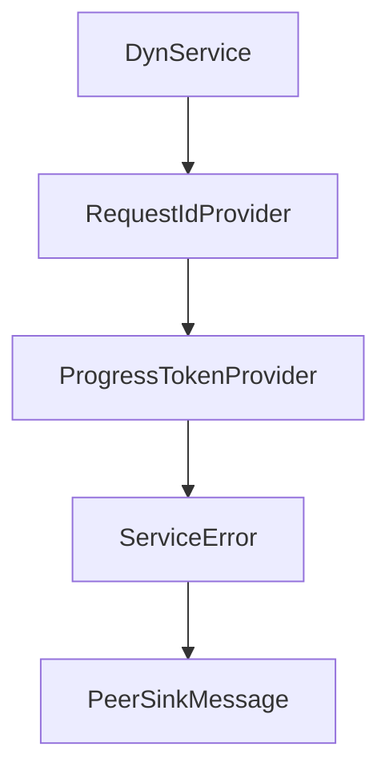

# Chapter 4: Client Patterns, Sampling, and Batching Flows

Welcome to **Chapter 4: Client Patterns, Sampling, and Batching Flows**. In this part of **MCP Rust SDK Tutorial: Building High-Performance MCP Services with RMCP**, you will build an intuitive mental model first, then move into concrete implementation details and practical production tradeoffs.


Client reliability depends on disciplined async flow control and capability usage.

## Learning Goals

- structure client lifecycle and tool invocation loops cleanly
- handle sampling and progress flows without blocking the event loop
- use batching/multi-client patterns where they improve throughput
- keep error propagation explicit across async boundaries

## Client Strategy

- start from simple stdio or streamable client examples
- layer OAuth-enabled clients only when needed
- separate request orchestration from business logic
- test concurrent request patterns under realistic load

## Source References

- [Client Examples README](https://github.com/modelcontextprotocol/rust-sdk/blob/main/examples/clients/README.md)
- [Simple Chat Client README](https://github.com/modelcontextprotocol/rust-sdk/blob/main/examples/simple-chat-client/README.md)
- [rmcp README - Client Implementation](https://github.com/modelcontextprotocol/rust-sdk/blob/main/crates/rmcp/README.md#client-implementation)

## Summary

You now have a client execution model for handling advanced capability flows under async load.

Next: [Chapter 5: Server Patterns: Tools, Resources, Prompts, and Tasks](05-server-patterns-tools-resources-prompts-and-tasks.md)

## Source Code Walkthrough

### `crates/rmcp/src/service.rs`

The `DynService` interface in [`crates/rmcp/src/service.rs`](https://github.com/modelcontextprotocol/rust-sdk/blob/HEAD/crates/rmcp/src/service.rs) handles a key part of this chapter's functionality:

```rs
    ///
    /// This could be very helpful when you want to store the services in a collection
    fn into_dyn(self) -> Box<dyn DynService<R>> {
        Box::new(self)
    }
    fn serve<T, E, A>(
        self,
        transport: T,
    ) -> impl Future<Output = Result<RunningService<R, Self>, R::InitializeError>> + MaybeSendFuture
    where
        T: IntoTransport<R, E, A>,
        E: std::error::Error + Send + Sync + 'static,
        Self: Sized,
    {
        Self::serve_with_ct(self, transport, Default::default())
    }
    fn serve_with_ct<T, E, A>(
        self,
        transport: T,
        ct: CancellationToken,
    ) -> impl Future<Output = Result<RunningService<R, Self>, R::InitializeError>> + MaybeSendFuture
    where
        T: IntoTransport<R, E, A>,
        E: std::error::Error + Send + Sync + 'static,
        Self: Sized;
}

impl<R: ServiceRole> Service<R> for Box<dyn DynService<R>> {
    fn handle_request(
        &self,
        request: R::PeerReq,
        context: RequestContext<R>,
```

This interface is important because it defines how MCP Rust SDK Tutorial: Building High-Performance MCP Services with RMCP implements the patterns covered in this chapter.

### `crates/rmcp/src/service.rs`

The `RequestIdProvider` interface in [`crates/rmcp/src/service.rs`](https://github.com/modelcontextprotocol/rust-sdk/blob/HEAD/crates/rmcp/src/service.rs) handles a key part of this chapter's functionality:

```rs
use tokio::sync::mpsc;

pub trait RequestIdProvider: Send + Sync + 'static {
    fn next_request_id(&self) -> RequestId;
}

pub trait ProgressTokenProvider: Send + Sync + 'static {
    fn next_progress_token(&self) -> ProgressToken;
}

pub type AtomicU32RequestIdProvider = AtomicU32Provider;
pub type AtomicU32ProgressTokenProvider = AtomicU32Provider;

#[derive(Debug, Default)]
pub struct AtomicU32Provider {
    id: AtomicU64,
}

impl RequestIdProvider for AtomicU32Provider {
    fn next_request_id(&self) -> RequestId {
        let id = self.id.fetch_add(1, std::sync::atomic::Ordering::SeqCst);
        // Safe conversion: we start at 0 and increment by 1, so we won't overflow i64::MAX in practice
        RequestId::Number(id as i64)
    }
}

impl ProgressTokenProvider for AtomicU32Provider {
    fn next_progress_token(&self) -> ProgressToken {
        let id = self.id.fetch_add(1, std::sync::atomic::Ordering::SeqCst);
        ProgressToken(NumberOrString::Number(id as i64))
    }
}
```

This interface is important because it defines how MCP Rust SDK Tutorial: Building High-Performance MCP Services with RMCP implements the patterns covered in this chapter.

### `crates/rmcp/src/service.rs`

The `ProgressTokenProvider` interface in [`crates/rmcp/src/service.rs`](https://github.com/modelcontextprotocol/rust-sdk/blob/HEAD/crates/rmcp/src/service.rs) handles a key part of this chapter's functionality:

```rs
}

pub trait ProgressTokenProvider: Send + Sync + 'static {
    fn next_progress_token(&self) -> ProgressToken;
}

pub type AtomicU32RequestIdProvider = AtomicU32Provider;
pub type AtomicU32ProgressTokenProvider = AtomicU32Provider;

#[derive(Debug, Default)]
pub struct AtomicU32Provider {
    id: AtomicU64,
}

impl RequestIdProvider for AtomicU32Provider {
    fn next_request_id(&self) -> RequestId {
        let id = self.id.fetch_add(1, std::sync::atomic::Ordering::SeqCst);
        // Safe conversion: we start at 0 and increment by 1, so we won't overflow i64::MAX in practice
        RequestId::Number(id as i64)
    }
}

impl ProgressTokenProvider for AtomicU32Provider {
    fn next_progress_token(&self) -> ProgressToken {
        let id = self.id.fetch_add(1, std::sync::atomic::Ordering::SeqCst);
        ProgressToken(NumberOrString::Number(id as i64))
    }
}

type Responder<T> = tokio::sync::oneshot::Sender<T>;

/// A handle to a remote request
```

This interface is important because it defines how MCP Rust SDK Tutorial: Building High-Performance MCP Services with RMCP implements the patterns covered in this chapter.

### `crates/rmcp/src/service.rs`

The `ServiceError` interface in [`crates/rmcp/src/service.rs`](https://github.com/modelcontextprotocol/rust-sdk/blob/HEAD/crates/rmcp/src/service.rs) handles a key part of this chapter's functionality:

```rs
#[derive(Error, Debug)]
#[non_exhaustive]
pub enum ServiceError {
    #[error("Mcp error: {0}")]
    McpError(McpError),
    #[error("Transport send error: {0}")]
    TransportSend(DynamicTransportError),
    #[error("Transport closed")]
    TransportClosed,
    #[error("Unexpected response type")]
    UnexpectedResponse,
    #[error("task cancelled for reason {}", reason.as_deref().unwrap_or("<unknown>"))]
    Cancelled { reason: Option<String> },
    #[error("request timeout after {}", chrono::Duration::from_std(*timeout).unwrap_or_default())]
    Timeout { timeout: Duration },
}

trait TransferObject:
    std::fmt::Debug + Clone + serde::Serialize + serde::de::DeserializeOwned + Send + Sync + 'static
{
}

impl<T> TransferObject for T where
    T: std::fmt::Debug
        + serde::Serialize
        + serde::de::DeserializeOwned
        + Send
        + Sync
        + 'static
        + Clone
{
}
```

This interface is important because it defines how MCP Rust SDK Tutorial: Building High-Performance MCP Services with RMCP implements the patterns covered in this chapter.


## How These Components Connect


