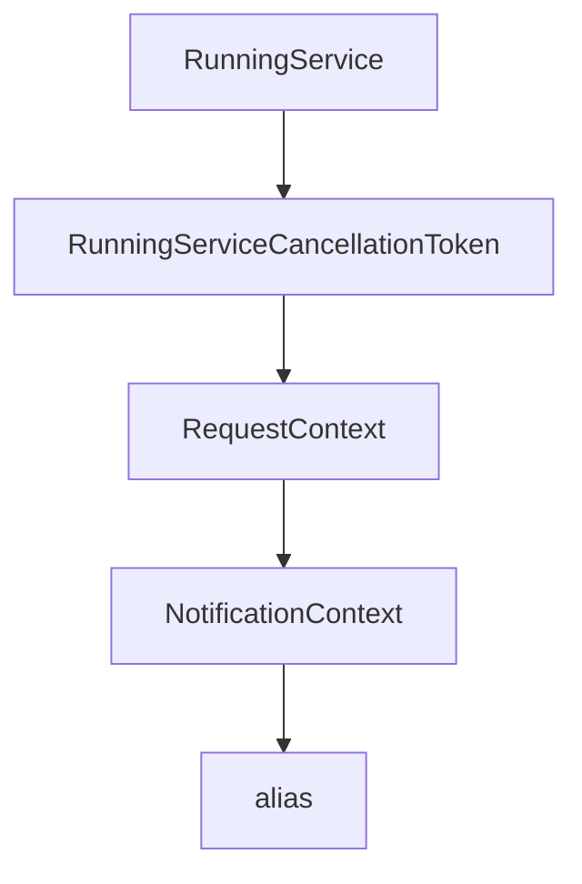

# Chapter 4: Client Patterns, Sampling, and Batching Flows

Welcome to **Chapter 4: Client Patterns, Sampling, and Batching Flows**. In this part of **MCP Rust SDK Tutorial: Building High-Performance MCP Services with RMCP**, you will build an intuitive mental model first, then move into concrete implementation details and practical production tradeoffs.


Client reliability depends on disciplined async flow control and capability usage.

## Learning Goals

- structure client lifecycle and tool invocation loops cleanly
- handle sampling and progress flows without blocking the event loop
- use batching/multi-client patterns where they improve throughput
- keep error propagation explicit across async boundaries

## Client Strategy

- start from simple stdio or streamable client examples
- layer OAuth-enabled clients only when needed
- separate request orchestration from business logic
- test concurrent request patterns under realistic load

## Source References

- [Client Examples README](https://github.com/modelcontextprotocol/rust-sdk/blob/main/examples/clients/README.md)
- [Simple Chat Client README](https://github.com/modelcontextprotocol/rust-sdk/blob/main/examples/simple-chat-client/README.md)
- [rmcp README - Client Implementation](https://github.com/modelcontextprotocol/rust-sdk/blob/main/crates/rmcp/README.md#client-implementation)

## Summary

You now have a client execution model for handling advanced capability flows under async load.

Next: [Chapter 5: Server Patterns: Tools, Resources, Prompts, and Tasks](05-server-patterns-tools-resources-prompts-and-tasks.md)

## Depth Expansion Playbook

## Source Code Walkthrough

### `crates/rmcp/src/service.rs`

The `RunningService` interface in [`crates/rmcp/src/service.rs`](https://github.com/modelcontextprotocol/rust-sdk/blob/HEAD/crates/rmcp/src/service.rs) handles a key part of this chapter's functionality:

```rs
        self,
        transport: T,
    ) -> impl Future<Output = Result<RunningService<R, Self>, R::InitializeError>> + MaybeSendFuture
    where
        T: IntoTransport<R, E, A>,
        E: std::error::Error + Send + Sync + 'static,
        Self: Sized,
    {
        Self::serve_with_ct(self, transport, Default::default())
    }
    fn serve_with_ct<T, E, A>(
        self,
        transport: T,
        ct: CancellationToken,
    ) -> impl Future<Output = Result<RunningService<R, Self>, R::InitializeError>> + MaybeSendFuture
    where
        T: IntoTransport<R, E, A>,
        E: std::error::Error + Send + Sync + 'static,
        Self: Sized;
}

impl<R: ServiceRole> Service<R> for Box<dyn DynService<R>> {
    fn handle_request(
        &self,
        request: R::PeerReq,
        context: RequestContext<R>,
    ) -> impl Future<Output = Result<R::Resp, McpError>> + MaybeSendFuture + '_ {
        DynService::handle_request(self.as_ref(), request, context)
    }

    fn handle_notification(
        &self,
```

This interface is important because it defines how MCP Rust SDK Tutorial: Building High-Performance MCP Services with RMCP implements the patterns covered in this chapter.

### `crates/rmcp/src/service.rs`

The `RunningServiceCancellationToken` interface in [`crates/rmcp/src/service.rs`](https://github.com/modelcontextprotocol/rust-sdk/blob/HEAD/crates/rmcp/src/service.rs) handles a key part of this chapter's functionality:

```rs
    }
    #[inline]
    pub fn cancellation_token(&self) -> RunningServiceCancellationToken {
        RunningServiceCancellationToken(self.cancellation_token.clone())
    }

    /// Returns true if the service has been closed or cancelled.
    #[inline]
    pub fn is_closed(&self) -> bool {
        self.handle.is_none() || self.cancellation_token.is_cancelled()
    }

    /// Wait for the service to complete.
    ///
    /// This will block until the service loop terminates (either due to
    /// cancellation, transport closure, or an error).
    #[inline]
    pub async fn waiting(mut self) -> Result<QuitReason, tokio::task::JoinError> {
        match self.handle.take() {
            Some(handle) => handle.await,
            None => Ok(QuitReason::Closed),
        }
    }

    /// Gracefully close the connection and wait for cleanup to complete.
    ///
    /// This method cancels the service, waits for the background task to finish
    /// (which includes calling `transport.close()`), and ensures all cleanup
    /// operations complete before returning.
    ///
    /// Unlike [`cancel`](Self::cancel), this method takes `&mut self` and can be
    /// called without consuming the `RunningService`. After calling this method,
```

This interface is important because it defines how MCP Rust SDK Tutorial: Building High-Performance MCP Services with RMCP implements the patterns covered in this chapter.

### `crates/rmcp/src/service.rs`

The `RequestContext` interface in [`crates/rmcp/src/service.rs`](https://github.com/modelcontextprotocol/rust-sdk/blob/HEAD/crates/rmcp/src/service.rs) handles a key part of this chapter's functionality:

```rs
        &self,
        request: R::PeerReq,
        context: RequestContext<R>,
    ) -> impl Future<Output = Result<R::Resp, McpError>> + MaybeSendFuture + '_;
    fn handle_notification(
        &self,
        notification: R::PeerNot,
        context: NotificationContext<R>,
    ) -> impl Future<Output = Result<(), McpError>> + MaybeSendFuture + '_;
    fn get_info(&self) -> R::Info;
}

#[cfg(feature = "local")]
pub trait Service<R: ServiceRole>: 'static {
    fn handle_request(
        &self,
        request: R::PeerReq,
        context: RequestContext<R>,
    ) -> impl Future<Output = Result<R::Resp, McpError>> + MaybeSendFuture + '_;
    fn handle_notification(
        &self,
        notification: R::PeerNot,
        context: NotificationContext<R>,
    ) -> impl Future<Output = Result<(), McpError>> + MaybeSendFuture + '_;
    fn get_info(&self) -> R::Info;
}

pub trait ServiceExt<R: ServiceRole>: Service<R> + Sized {
    /// Convert this service to a dynamic boxed service
    ///
    /// This could be very helpful when you want to store the services in a collection
    fn into_dyn(self) -> Box<dyn DynService<R>> {
```

This interface is important because it defines how MCP Rust SDK Tutorial: Building High-Performance MCP Services with RMCP implements the patterns covered in this chapter.

### `crates/rmcp/src/service.rs`

The `NotificationContext` interface in [`crates/rmcp/src/service.rs`](https://github.com/modelcontextprotocol/rust-sdk/blob/HEAD/crates/rmcp/src/service.rs) handles a key part of this chapter's functionality:

```rs
        &self,
        notification: R::PeerNot,
        context: NotificationContext<R>,
    ) -> impl Future<Output = Result<(), McpError>> + MaybeSendFuture + '_;
    fn get_info(&self) -> R::Info;
}

#[cfg(feature = "local")]
pub trait Service<R: ServiceRole>: 'static {
    fn handle_request(
        &self,
        request: R::PeerReq,
        context: RequestContext<R>,
    ) -> impl Future<Output = Result<R::Resp, McpError>> + MaybeSendFuture + '_;
    fn handle_notification(
        &self,
        notification: R::PeerNot,
        context: NotificationContext<R>,
    ) -> impl Future<Output = Result<(), McpError>> + MaybeSendFuture + '_;
    fn get_info(&self) -> R::Info;
}

pub trait ServiceExt<R: ServiceRole>: Service<R> + Sized {
    /// Convert this service to a dynamic boxed service
    ///
    /// This could be very helpful when you want to store the services in a collection
    fn into_dyn(self) -> Box<dyn DynService<R>> {
        Box::new(self)
    }
    fn serve<T, E, A>(
        self,
        transport: T,
```

This interface is important because it defines how MCP Rust SDK Tutorial: Building High-Performance MCP Services with RMCP implements the patterns covered in this chapter.


## How These Components Connect


