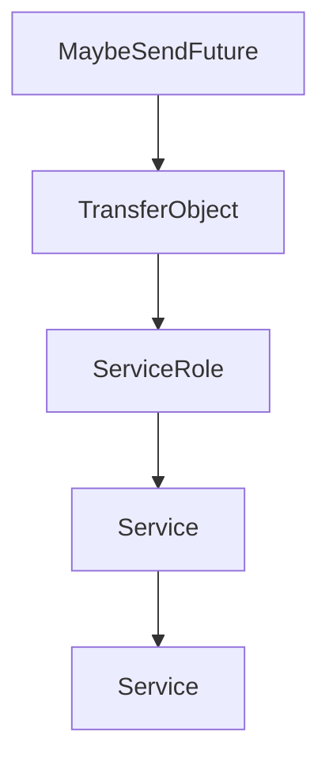

# Chapter 5: Server Patterns: Tools, Resources, Prompts, and Tasks

Welcome to **Chapter 5: Server Patterns: Tools, Resources, Prompts, and Tasks**. In this part of **MCP Rust SDK Tutorial: Building High-Performance MCP Services with RMCP**, you will build an intuitive mental model first, then move into concrete implementation details and practical production tradeoffs.


rmcp supports a wide capability surface; quality comes from selective, coherent implementation.

## Learning Goals

- design tools/resources/prompts with clear contracts
- use task augmentation and task lifecycle APIs safely
- support progress and long-running workflows with predictable semantics
- avoid capability sprawl in one server binary

## Capability Build Order

1. tool/resource/prompt baseline with strict schema contracts
2. progress and logging for observability
3. task support only where long-running execution is required
4. sampling/elicitation for human-in-the-loop workflows

## Source References

- [rmcp README - Tasks](https://github.com/modelcontextprotocol/rust-sdk/blob/main/crates/rmcp/README.md#tasks)
- [Server Examples README](https://github.com/modelcontextprotocol/rust-sdk/blob/main/examples/servers/README.md)
- [rmcp Changelog - Task Updates](https://github.com/modelcontextprotocol/rust-sdk/blob/main/crates/rmcp/CHANGELOG.md)

## Summary

You now have a staged capability approach for building robust Rust MCP servers.

Next: [Chapter 6: OAuth, Security, and Auth Workflows](06-oauth-security-and-auth-workflows.md)

## Depth Expansion Playbook

## Source Code Walkthrough

### `crates/rmcp/src/service.rs`

The `MaybeSendFuture` interface in [`crates/rmcp/src/service.rs`](https://github.com/modelcontextprotocol/rust-sdk/blob/HEAD/crates/rmcp/src/service.rs) handles a key part of this chapter's functionality:

```rs
//
// `MaybeSend`       – supertrait alias: `Send + Sync` without `local`, empty with `local`
// `MaybeSendFuture` – future bound alias: `Send` without `local`, empty with `local`
// `MaybeBoxFuture`  – boxed future type: `BoxFuture` without `local`, `LocalBoxFuture` with `local`
// ---------------------------------------------------------------------------

#[cfg(not(feature = "local"))]
#[doc(hidden)]
pub trait MaybeSend: Send + Sync {}
#[cfg(not(feature = "local"))]
impl<T: Send + Sync> MaybeSend for T {}

#[cfg(feature = "local")]
#[doc(hidden)]
pub trait MaybeSend {}
#[cfg(feature = "local")]
impl<T> MaybeSend for T {}

#[cfg(not(feature = "local"))]
#[doc(hidden)]
pub trait MaybeSendFuture: Send {}
#[cfg(not(feature = "local"))]
impl<T: Send> MaybeSendFuture for T {}

#[cfg(feature = "local")]
#[doc(hidden)]
pub trait MaybeSendFuture {}
#[cfg(feature = "local")]
impl<T> MaybeSendFuture for T {}

#[cfg(not(feature = "local"))]
pub(crate) type MaybeBoxFuture<'a, T> = BoxFuture<'a, T>;
```

This interface is important because it defines how MCP Rust SDK Tutorial: Building High-Performance MCP Services with RMCP implements the patterns covered in this chapter.

### `crates/rmcp/src/service.rs`

The `TransferObject` interface in [`crates/rmcp/src/service.rs`](https://github.com/modelcontextprotocol/rust-sdk/blob/HEAD/crates/rmcp/src/service.rs) handles a key part of this chapter's functionality:

```rs
}

trait TransferObject:
    std::fmt::Debug + Clone + serde::Serialize + serde::de::DeserializeOwned + Send + Sync + 'static
{
}

impl<T> TransferObject for T where
    T: std::fmt::Debug
        + serde::Serialize
        + serde::de::DeserializeOwned
        + Send
        + Sync
        + 'static
        + Clone
{
}

#[allow(private_bounds, reason = "there's no the third implementation")]
pub trait ServiceRole: std::fmt::Debug + Send + Sync + 'static + Copy + Clone {
    type Req: TransferObject + GetMeta + GetExtensions;
    type Resp: TransferObject;
    type Not: TryInto<CancelledNotification, Error = Self::Not>
        + From<CancelledNotification>
        + TransferObject;
    type PeerReq: TransferObject + GetMeta + GetExtensions;
    type PeerResp: TransferObject;
    type PeerNot: TryInto<CancelledNotification, Error = Self::PeerNot>
        + From<CancelledNotification>
        + TransferObject
        + GetMeta
        + GetExtensions;
```

This interface is important because it defines how MCP Rust SDK Tutorial: Building High-Performance MCP Services with RMCP implements the patterns covered in this chapter.

### `crates/rmcp/src/service.rs`

The `ServiceRole` interface in [`crates/rmcp/src/service.rs`](https://github.com/modelcontextprotocol/rust-sdk/blob/HEAD/crates/rmcp/src/service.rs) handles a key part of this chapter's functionality:

```rs

#[allow(private_bounds, reason = "there's no the third implementation")]
pub trait ServiceRole: std::fmt::Debug + Send + Sync + 'static + Copy + Clone {
    type Req: TransferObject + GetMeta + GetExtensions;
    type Resp: TransferObject;
    type Not: TryInto<CancelledNotification, Error = Self::Not>
        + From<CancelledNotification>
        + TransferObject;
    type PeerReq: TransferObject + GetMeta + GetExtensions;
    type PeerResp: TransferObject;
    type PeerNot: TryInto<CancelledNotification, Error = Self::PeerNot>
        + From<CancelledNotification>
        + TransferObject
        + GetMeta
        + GetExtensions;
    type InitializeError;
    const IS_CLIENT: bool;
    type Info: TransferObject;
    type PeerInfo: TransferObject;
}

pub type TxJsonRpcMessage<R> =
    JsonRpcMessage<<R as ServiceRole>::Req, <R as ServiceRole>::Resp, <R as ServiceRole>::Not>;
pub type RxJsonRpcMessage<R> = JsonRpcMessage<
    <R as ServiceRole>::PeerReq,
    <R as ServiceRole>::PeerResp,
    <R as ServiceRole>::PeerNot,
>;

#[cfg(not(feature = "local"))]
pub trait Service<R: ServiceRole>: Send + Sync + 'static {
    fn handle_request(
```

This interface is important because it defines how MCP Rust SDK Tutorial: Building High-Performance MCP Services with RMCP implements the patterns covered in this chapter.

### `crates/rmcp/src/service.rs`

The `Service` interface in [`crates/rmcp/src/service.rs`](https://github.com/modelcontextprotocol/rust-sdk/blob/HEAD/crates/rmcp/src/service.rs) handles a key part of this chapter's functionality:

```rs
#[derive(Error, Debug)]
#[non_exhaustive]
pub enum ServiceError {
    #[error("Mcp error: {0}")]
    McpError(McpError),
    #[error("Transport send error: {0}")]
    TransportSend(DynamicTransportError),
    #[error("Transport closed")]
    TransportClosed,
    #[error("Unexpected response type")]
    UnexpectedResponse,
    #[error("task cancelled for reason {}", reason.as_deref().unwrap_or("<unknown>"))]
    Cancelled { reason: Option<String> },
    #[error("request timeout after {}", chrono::Duration::from_std(*timeout).unwrap_or_default())]
    Timeout { timeout: Duration },
}

trait TransferObject:
    std::fmt::Debug + Clone + serde::Serialize + serde::de::DeserializeOwned + Send + Sync + 'static
{
}

impl<T> TransferObject for T where
    T: std::fmt::Debug
        + serde::Serialize
        + serde::de::DeserializeOwned
        + Send
        + Sync
        + 'static
        + Clone
{
}
```

This interface is important because it defines how MCP Rust SDK Tutorial: Building High-Performance MCP Services with RMCP implements the patterns covered in this chapter.


## How These Components Connect


