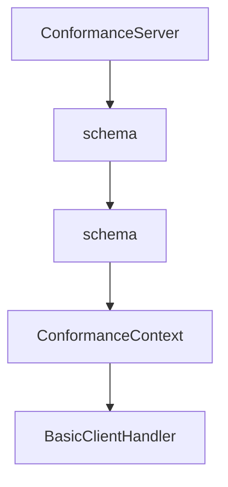

# Chapter 5: Server Patterns: Tools, Resources, Prompts, and Tasks

Welcome to **Chapter 5: Server Patterns: Tools, Resources, Prompts, and Tasks**. In this part of **MCP Rust SDK Tutorial: Building High-Performance MCP Services with RMCP**, you will build an intuitive mental model first, then move into concrete implementation details and practical production tradeoffs.


rmcp supports a wide capability surface; quality comes from selective, coherent implementation.

## Learning Goals

- design tools/resources/prompts with clear contracts
- use task augmentation and task lifecycle APIs safely
- support progress and long-running workflows with predictable semantics
- avoid capability sprawl in one server binary

## Capability Build Order

1. tool/resource/prompt baseline with strict schema contracts
2. progress and logging for observability
3. task support only where long-running execution is required
4. sampling/elicitation for human-in-the-loop workflows

## Source References

- [rmcp README - Tasks](https://github.com/modelcontextprotocol/rust-sdk/blob/main/crates/rmcp/README.md#tasks)
- [Server Examples README](https://github.com/modelcontextprotocol/rust-sdk/blob/main/examples/servers/README.md)
- [rmcp Changelog - Task Updates](https://github.com/modelcontextprotocol/rust-sdk/blob/main/crates/rmcp/CHANGELOG.md)

## Summary

You now have a staged capability approach for building robust Rust MCP servers.

Next: [Chapter 6: OAuth, Security, and Auth Workflows](06-oauth-security-and-auth-workflows.md)

## Source Code Walkthrough

### `conformance/src/bin/server.rs`

The `ConformanceServer` interface in [`conformance/src/bin/server.rs`](https://github.com/modelcontextprotocol/rust-sdk/blob/HEAD/conformance/src/bin/server.rs) handles a key part of this chapter's functionality:

```rs

#[derive(Clone)]
struct ConformanceServer {
    subscriptions: Arc<Mutex<HashSet<String>>>,
    log_level: Arc<Mutex<LoggingLevel>>,
}

impl ConformanceServer {
    fn new() -> Self {
        Self {
            subscriptions: Arc::new(Mutex::new(HashSet::new())),
            log_level: Arc::new(Mutex::new(LoggingLevel::Debug)),
        }
    }
}

impl ServerHandler for ConformanceServer {
    async fn initialize(
        &self,
        _request: InitializeRequestParams,
        _cx: RequestContext<RoleServer>,
    ) -> Result<InitializeResult, ErrorData> {
        Ok(InitializeResult::new(
            ServerCapabilities::builder()
                .enable_prompts()
                .enable_resources()
                .enable_tools()
                .enable_logging()
                .build(),
        )
        .with_server_info(Implementation::new("rust-conformance-server", "0.1.0"))
        .with_instructions("Rust MCP conformance test server"))
```

This interface is important because it defines how MCP Rust SDK Tutorial: Building High-Performance MCP Services with RMCP implements the patterns covered in this chapter.

### `conformance/src/bin/server.rs`

The `schema` interface in [`conformance/src/bin/server.rs`](https://github.com/modelcontextprotocol/rust-sdk/blob/HEAD/conformance/src/bin/server.rs) handles a key part of this chapter's functionality:

```rs
            Tool::new(
                "test_elicitation_sep1330_enums",
                "Tests enum schema improvements (SEP-1330)",
                json_object(json!({
                    "type": "object",
                    "properties": {}
                })),
            ),
            Tool::new(
                "json_schema_2020_12_tool",
                "Tool with JSON Schema 2020-12 features",
                json_object(json!({
                    "$schema": "https://json-schema.org/draft/2020-12/schema",
                    "type": "object",
                    "$defs": {
                        "address": {
                            "type": "object",
                            "properties": {
                                "street": { "type": "string" },
                                "city": { "type": "string" }
                            }
                        }
                    },
                    "properties": {
                        "name": { "type": "string" },
                        "address": { "$ref": "#/$defs/address" }
                    },
                    "additionalProperties": false
                })),
            ),
            Tool::new(
                "test_reconnection",
```

This interface is important because it defines how MCP Rust SDK Tutorial: Building High-Performance MCP Services with RMCP implements the patterns covered in this chapter.

### `conformance/src/bin/server.rs`

The `schema` interface in [`conformance/src/bin/server.rs`](https://github.com/modelcontextprotocol/rust-sdk/blob/HEAD/conformance/src/bin/server.rs) handles a key part of this chapter's functionality:

```rs
            Tool::new(
                "test_elicitation_sep1330_enums",
                "Tests enum schema improvements (SEP-1330)",
                json_object(json!({
                    "type": "object",
                    "properties": {}
                })),
            ),
            Tool::new(
                "json_schema_2020_12_tool",
                "Tool with JSON Schema 2020-12 features",
                json_object(json!({
                    "$schema": "https://json-schema.org/draft/2020-12/schema",
                    "type": "object",
                    "$defs": {
                        "address": {
                            "type": "object",
                            "properties": {
                                "street": { "type": "string" },
                                "city": { "type": "string" }
                            }
                        }
                    },
                    "properties": {
                        "name": { "type": "string" },
                        "address": { "$ref": "#/$defs/address" }
                    },
                    "additionalProperties": false
                })),
            ),
            Tool::new(
                "test_reconnection",
```

This interface is important because it defines how MCP Rust SDK Tutorial: Building High-Performance MCP Services with RMCP implements the patterns covered in this chapter.

### `conformance/src/bin/client.rs`

The `ConformanceContext` interface in [`conformance/src/bin/client.rs`](https://github.com/modelcontextprotocol/rust-sdk/blob/HEAD/conformance/src/bin/client.rs) handles a key part of this chapter's functionality:

```rs

#[derive(Debug, Default, serde::Deserialize)]
struct ConformanceContext {
    #[serde(default)]
    client_id: Option<String>,
    #[serde(default)]
    client_secret: Option<String>,
    // client-credentials-jwt
    #[serde(default)]
    private_key_pem: Option<String>,
    #[serde(default)]
    signing_algorithm: Option<String>,
}

fn load_context() -> ConformanceContext {
    std::env::var("MCP_CONFORMANCE_CONTEXT")
        .ok()
        .and_then(|s| serde_json::from_str(&s).ok())
        .unwrap_or_default()
}

// ─── Client handlers ────────────────────────────────────────────────────────

/// A basic client handler that does nothing special
struct BasicClientHandler;
impl ClientHandler for BasicClientHandler {}

/// A client handler that handles elicitation requests by applying schema defaults.
struct ElicitationDefaultsClientHandler;

impl ClientHandler for ElicitationDefaultsClientHandler {
    fn get_info(&self) -> ClientInfo {
```

This interface is important because it defines how MCP Rust SDK Tutorial: Building High-Performance MCP Services with RMCP implements the patterns covered in this chapter.


## How These Components Connect


