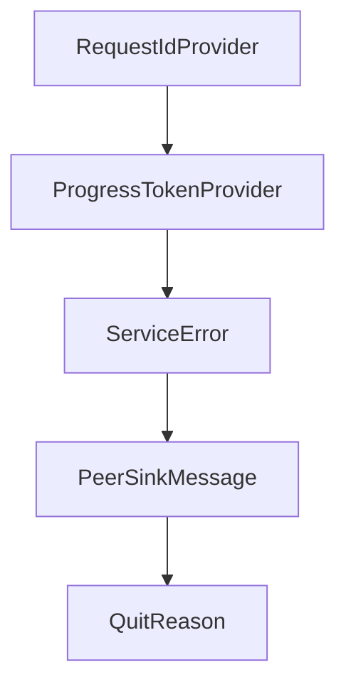

# Chapter 6: OAuth, Security, and Auth Workflows

Welcome to **Chapter 6: OAuth, Security, and Auth Workflows**. In this part of **MCP Rust SDK Tutorial: Building High-Performance MCP Services with RMCP**, you will build an intuitive mental model first, then move into concrete implementation details and practical production tradeoffs.


Auth complexity rises quickly in remote MCP deployments; rmcp provides explicit OAuth pathways.

## Learning Goals

- enable OAuth features correctly in build/runtime config
- implement authorization-code flow handling with safer state management
- protect streamable HTTP endpoints and client callbacks
- troubleshoot common OAuth discovery and token-refresh failures

## Security Checklist

- enforce PKCE and secure callback handling
- validate authorization server metadata and discovery fallbacks
- avoid token leakage in logs or panic paths
- test refresh and expiry paths before production rollout

## Source References

- [OAuth Support Guide](https://github.com/modelcontextprotocol/rust-sdk/blob/main/docs/OAUTH_SUPPORT.md)
- [Server Examples - Auth](https://github.com/modelcontextprotocol/rust-sdk/blob/main/examples/servers/README.md)
- [rmcp Changelog - OAuth Fixes](https://github.com/modelcontextprotocol/rust-sdk/blob/main/crates/rmcp/CHANGELOG.md)

## Summary

You now have an OAuth implementation baseline for Rust MCP services and clients.

Next: [Chapter 7: Conformance, Changelog, and Release Discipline](07-conformance-changelog-and-release-discipline.md)

## Depth Expansion Playbook

## Source Code Walkthrough

### `crates/rmcp/src/service.rs`

The `RequestIdProvider` interface in [`crates/rmcp/src/service.rs`](https://github.com/modelcontextprotocol/rust-sdk/blob/HEAD/crates/rmcp/src/service.rs) handles a key part of this chapter's functionality:

```rs
use tokio::sync::mpsc;

pub trait RequestIdProvider: Send + Sync + 'static {
    fn next_request_id(&self) -> RequestId;
}

pub trait ProgressTokenProvider: Send + Sync + 'static {
    fn next_progress_token(&self) -> ProgressToken;
}

pub type AtomicU32RequestIdProvider = AtomicU32Provider;
pub type AtomicU32ProgressTokenProvider = AtomicU32Provider;

#[derive(Debug, Default)]
pub struct AtomicU32Provider {
    id: AtomicU64,
}

impl RequestIdProvider for AtomicU32Provider {
    fn next_request_id(&self) -> RequestId {
        let id = self.id.fetch_add(1, std::sync::atomic::Ordering::SeqCst);
        // Safe conversion: we start at 0 and increment by 1, so we won't overflow i64::MAX in practice
        RequestId::Number(id as i64)
    }
}

impl ProgressTokenProvider for AtomicU32Provider {
    fn next_progress_token(&self) -> ProgressToken {
        let id = self.id.fetch_add(1, std::sync::atomic::Ordering::SeqCst);
        ProgressToken(NumberOrString::Number(id as i64))
    }
}
```

This interface is important because it defines how MCP Rust SDK Tutorial: Building High-Performance MCP Services with RMCP implements the patterns covered in this chapter.

### `crates/rmcp/src/service.rs`

The `ProgressTokenProvider` interface in [`crates/rmcp/src/service.rs`](https://github.com/modelcontextprotocol/rust-sdk/blob/HEAD/crates/rmcp/src/service.rs) handles a key part of this chapter's functionality:

```rs
}

pub trait ProgressTokenProvider: Send + Sync + 'static {
    fn next_progress_token(&self) -> ProgressToken;
}

pub type AtomicU32RequestIdProvider = AtomicU32Provider;
pub type AtomicU32ProgressTokenProvider = AtomicU32Provider;

#[derive(Debug, Default)]
pub struct AtomicU32Provider {
    id: AtomicU64,
}

impl RequestIdProvider for AtomicU32Provider {
    fn next_request_id(&self) -> RequestId {
        let id = self.id.fetch_add(1, std::sync::atomic::Ordering::SeqCst);
        // Safe conversion: we start at 0 and increment by 1, so we won't overflow i64::MAX in practice
        RequestId::Number(id as i64)
    }
}

impl ProgressTokenProvider for AtomicU32Provider {
    fn next_progress_token(&self) -> ProgressToken {
        let id = self.id.fetch_add(1, std::sync::atomic::Ordering::SeqCst);
        ProgressToken(NumberOrString::Number(id as i64))
    }
}

type Responder<T> = tokio::sync::oneshot::Sender<T>;

/// A handle to a remote request
```

This interface is important because it defines how MCP Rust SDK Tutorial: Building High-Performance MCP Services with RMCP implements the patterns covered in this chapter.

### `crates/rmcp/src/service.rs`

The `ServiceError` interface in [`crates/rmcp/src/service.rs`](https://github.com/modelcontextprotocol/rust-sdk/blob/HEAD/crates/rmcp/src/service.rs) handles a key part of this chapter's functionality:

```rs
#[derive(Error, Debug)]
#[non_exhaustive]
pub enum ServiceError {
    #[error("Mcp error: {0}")]
    McpError(McpError),
    #[error("Transport send error: {0}")]
    TransportSend(DynamicTransportError),
    #[error("Transport closed")]
    TransportClosed,
    #[error("Unexpected response type")]
    UnexpectedResponse,
    #[error("task cancelled for reason {}", reason.as_deref().unwrap_or("<unknown>"))]
    Cancelled { reason: Option<String> },
    #[error("request timeout after {}", chrono::Duration::from_std(*timeout).unwrap_or_default())]
    Timeout { timeout: Duration },
}

trait TransferObject:
    std::fmt::Debug + Clone + serde::Serialize + serde::de::DeserializeOwned + Send + Sync + 'static
{
}

impl<T> TransferObject for T where
    T: std::fmt::Debug
        + serde::Serialize
        + serde::de::DeserializeOwned
        + Send
        + Sync
        + 'static
        + Clone
{
}
```

This interface is important because it defines how MCP Rust SDK Tutorial: Building High-Performance MCP Services with RMCP implements the patterns covered in this chapter.

### `crates/rmcp/src/service.rs`

The `PeerSinkMessage` interface in [`crates/rmcp/src/service.rs`](https://github.com/modelcontextprotocol/rust-sdk/blob/HEAD/crates/rmcp/src/service.rs) handles a key part of this chapter's functionality:

```rs

#[derive(Debug)]
pub(crate) enum PeerSinkMessage<R: ServiceRole> {
    Request {
        request: R::Req,
        id: RequestId,
        responder: Responder<Result<R::PeerResp, ServiceError>>,
    },
    Notification {
        notification: R::Not,
        responder: Responder<Result<(), ServiceError>>,
    },
}

/// An interface to fetch the remote client or server
///
/// For general purpose, call [`Peer::send_request`] or [`Peer::send_notification`] to send message to remote peer.
///
/// To create a cancellable request, call [`Peer::send_request_with_option`].
#[derive(Clone)]
pub struct Peer<R: ServiceRole> {
    tx: mpsc::Sender<PeerSinkMessage<R>>,
    request_id_provider: Arc<dyn RequestIdProvider>,
    progress_token_provider: Arc<dyn ProgressTokenProvider>,
    info: Arc<tokio::sync::OnceCell<R::PeerInfo>>,
}

impl<R: ServiceRole> std::fmt::Debug for Peer<R> {
    fn fmt(&self, f: &mut std::fmt::Formatter<'_>) -> std::fmt::Result {
        f.debug_struct("PeerSink")
            .field("tx", &self.tx)
            .field("is_client", &R::IS_CLIENT)
```

This interface is important because it defines how MCP Rust SDK Tutorial: Building High-Performance MCP Services with RMCP implements the patterns covered in this chapter.


## How These Components Connect


