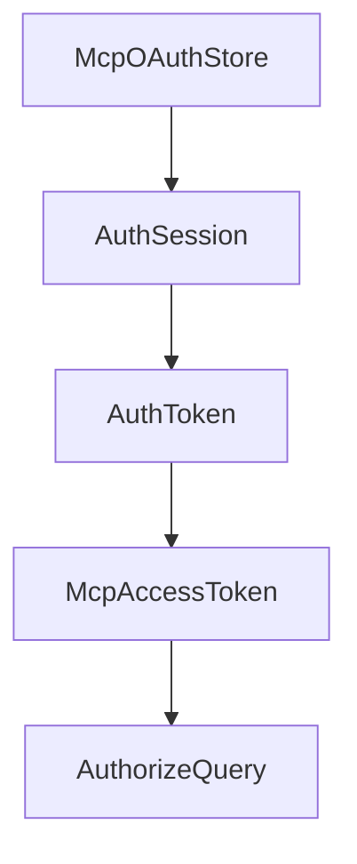

# Chapter 6: OAuth, Security, and Auth Workflows

Welcome to **Chapter 6: OAuth, Security, and Auth Workflows**. In this part of **MCP Rust SDK Tutorial: Building High-Performance MCP Services with RMCP**, you will build an intuitive mental model first, then move into concrete implementation details and practical production tradeoffs.


Auth complexity rises quickly in remote MCP deployments; rmcp provides explicit OAuth pathways.

## Learning Goals

- enable OAuth features correctly in build/runtime config
- implement authorization-code flow handling with safer state management
- protect streamable HTTP endpoints and client callbacks
- troubleshoot common OAuth discovery and token-refresh failures

## Security Checklist

- enforce PKCE and secure callback handling
- validate authorization server metadata and discovery fallbacks
- avoid token leakage in logs or panic paths
- test refresh and expiry paths before production rollout

## Source References

- [OAuth Support Guide](https://github.com/modelcontextprotocol/rust-sdk/blob/main/docs/OAUTH_SUPPORT.md)
- [Server Examples - Auth](https://github.com/modelcontextprotocol/rust-sdk/blob/main/examples/servers/README.md)
- [rmcp Changelog - OAuth Fixes](https://github.com/modelcontextprotocol/rust-sdk/blob/main/crates/rmcp/CHANGELOG.md)

## Summary

You now have an OAuth implementation baseline for Rust MCP services and clients.

Next: [Chapter 7: Conformance, Changelog, and Release Discipline](07-conformance-changelog-and-release-discipline.md)

## Source Code Walkthrough

### `examples/servers/src/complex_auth_streamhttp.rs`

The `McpOAuthStore` interface in [`examples/servers/src/complex_auth_streamhttp.rs`](https://github.com/modelcontextprotocol/rust-sdk/blob/HEAD/examples/servers/src/complex_auth_streamhttp.rs) handles a key part of this chapter's functionality:

```rs
// A easy way to manage MCP OAuth Store for managing tokens and sessions
#[derive(Clone, Debug)]
struct McpOAuthStore {
    clients: Arc<RwLock<HashMap<String, OAuthClientConfig>>>,
    auth_sessions: Arc<RwLock<HashMap<String, AuthSession>>>,
    access_tokens: Arc<RwLock<HashMap<String, McpAccessToken>>>,
}

impl McpOAuthStore {
    fn new() -> Self {
        let mut clients = HashMap::new();
        clients.insert(
            "mcp-client".to_string(),
            OAuthClientConfig::new("mcp-client", "http://localhost:8080/callback")
                .with_client_secret("mcp-client-secret")
                .with_scopes(vec!["profile".to_string(), "email".to_string()]),
        );

        Self {
            clients: Arc::new(RwLock::new(clients)),
            auth_sessions: Arc::new(RwLock::new(HashMap::new())),
            access_tokens: Arc::new(RwLock::new(HashMap::new())),
        }
    }

    async fn validate_client(
        &self,
        client_id: &str,
        redirect_uri: &str,
    ) -> Option<OAuthClientConfig> {
        let clients = self.clients.read().await;
        if let Some(client) = clients.get(client_id) {
```

This interface is important because it defines how MCP Rust SDK Tutorial: Building High-Performance MCP Services with RMCP implements the patterns covered in this chapter.

### `examples/servers/src/complex_auth_streamhttp.rs`

The `AuthSession` interface in [`examples/servers/src/complex_auth_streamhttp.rs`](https://github.com/modelcontextprotocol/rust-sdk/blob/HEAD/examples/servers/src/complex_auth_streamhttp.rs) handles a key part of this chapter's functionality:

```rs
struct McpOAuthStore {
    clients: Arc<RwLock<HashMap<String, OAuthClientConfig>>>,
    auth_sessions: Arc<RwLock<HashMap<String, AuthSession>>>,
    access_tokens: Arc<RwLock<HashMap<String, McpAccessToken>>>,
}

impl McpOAuthStore {
    fn new() -> Self {
        let mut clients = HashMap::new();
        clients.insert(
            "mcp-client".to_string(),
            OAuthClientConfig::new("mcp-client", "http://localhost:8080/callback")
                .with_client_secret("mcp-client-secret")
                .with_scopes(vec!["profile".to_string(), "email".to_string()]),
        );

        Self {
            clients: Arc::new(RwLock::new(clients)),
            auth_sessions: Arc::new(RwLock::new(HashMap::new())),
            access_tokens: Arc::new(RwLock::new(HashMap::new())),
        }
    }

    async fn validate_client(
        &self,
        client_id: &str,
        redirect_uri: &str,
    ) -> Option<OAuthClientConfig> {
        let clients = self.clients.read().await;
        if let Some(client) = clients.get(client_id) {
            if client.redirect_uri.contains(&redirect_uri.to_string()) {
                return Some(client.clone());
```

This interface is important because it defines how MCP Rust SDK Tutorial: Building High-Performance MCP Services with RMCP implements the patterns covered in this chapter.

### `examples/servers/src/complex_auth_streamhttp.rs`

The `AuthToken` interface in [`examples/servers/src/complex_auth_streamhttp.rs`](https://github.com/modelcontextprotocol/rust-sdk/blob/HEAD/examples/servers/src/complex_auth_streamhttp.rs) handles a key part of this chapter's functionality:

```rs
        &self,
        session_id: &str,
        token: AuthToken,
    ) -> Result<(), String> {
        let mut sessions = self.auth_sessions.write().await;
        if let Some(session) = sessions.get_mut(session_id) {
            session.auth_token = Some(token);
            Ok(())
        } else {
            Err("Session not found".to_string())
        }
    }

    async fn create_mcp_token(&self, session_id: &str) -> Result<McpAccessToken, String> {
        let sessions = self.auth_sessions.read().await;
        if let Some(session) = sessions.get(session_id) {
            if let Some(auth_token) = &session.auth_token {
                let access_token = format!("mcp-token-{}", Uuid::new_v4());
                let token = McpAccessToken {
                    access_token: access_token.clone(),
                    token_type: "Bearer".to_string(),
                    expires_in: 3600,
                    refresh_token: format!("mcp-refresh-{}", Uuid::new_v4()),
                    scope: session.scope.clone(),
                    auth_token: auth_token.clone(),
                    client_id: session.client_id.clone(),
                };

                self.access_tokens
                    .write()
                    .await
                    .insert(access_token.clone(), token.clone());
```

This interface is important because it defines how MCP Rust SDK Tutorial: Building High-Performance MCP Services with RMCP implements the patterns covered in this chapter.

### `examples/servers/src/complex_auth_streamhttp.rs`

The `McpAccessToken` interface in [`examples/servers/src/complex_auth_streamhttp.rs`](https://github.com/modelcontextprotocol/rust-sdk/blob/HEAD/examples/servers/src/complex_auth_streamhttp.rs) handles a key part of this chapter's functionality:

```rs
    clients: Arc<RwLock<HashMap<String, OAuthClientConfig>>>,
    auth_sessions: Arc<RwLock<HashMap<String, AuthSession>>>,
    access_tokens: Arc<RwLock<HashMap<String, McpAccessToken>>>,
}

impl McpOAuthStore {
    fn new() -> Self {
        let mut clients = HashMap::new();
        clients.insert(
            "mcp-client".to_string(),
            OAuthClientConfig::new("mcp-client", "http://localhost:8080/callback")
                .with_client_secret("mcp-client-secret")
                .with_scopes(vec!["profile".to_string(), "email".to_string()]),
        );

        Self {
            clients: Arc::new(RwLock::new(clients)),
            auth_sessions: Arc::new(RwLock::new(HashMap::new())),
            access_tokens: Arc::new(RwLock::new(HashMap::new())),
        }
    }

    async fn validate_client(
        &self,
        client_id: &str,
        redirect_uri: &str,
    ) -> Option<OAuthClientConfig> {
        let clients = self.clients.read().await;
        if let Some(client) = clients.get(client_id) {
            if client.redirect_uri.contains(&redirect_uri.to_string()) {
                return Some(client.clone());
            }
```

This interface is important because it defines how MCP Rust SDK Tutorial: Building High-Performance MCP Services with RMCP implements the patterns covered in this chapter.


## How These Components Connect


