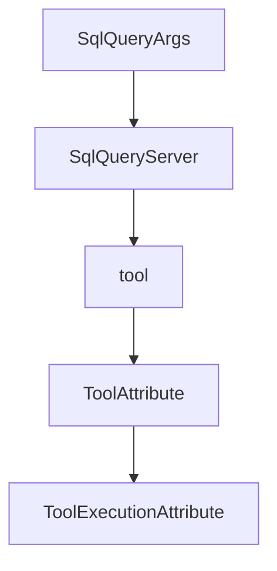

# Chapter 7: Conformance, Changelog, and Release Discipline

Welcome to **Chapter 7: Conformance, Changelog, and Release Discipline**. In this part of **MCP Rust SDK Tutorial: Building High-Performance MCP Services with RMCP**, you will build an intuitive mental model first, then move into concrete implementation details and practical production tradeoffs.


Fast release cadence requires tight change-management loops.

## Learning Goals

- use changelog signals to drive upgrade planning
- map SEP-related changes to service impact quickly
- create repeatable pre-upgrade and post-upgrade test gates
- avoid shipping protocol regressions during routine version bumps

## Release Discipline Loop

1. scan changelog for breaking or behavior-shifting entries
2. run targeted compatibility tests for impacted capabilities
3. validate transport/auth/task behavior in staging
4. publish internal upgrade notes before production rollout

## Source References

- [rmcp Changelog](https://github.com/modelcontextprotocol/rust-sdk/blob/main/crates/rmcp/CHANGELOG.md)
- [Rust SDK Releases](https://github.com/modelcontextprotocol/rust-sdk/releases)
- [MCP Specification Changelog](https://github.com/modelcontextprotocol/modelcontextprotocol/blob/main/docs/specification/2025-11-25/changelog.mdx)

## Summary

You now have a release process aligned with the pace and risk profile of rmcp development.

Next: [Chapter 8: Ecosystem Integration and Production Operations](08-ecosystem-integration-and-production-operations.md)

## Source Code Walkthrough

### `examples/servers/src/completion_stdio.rs`

The `SqlQueryArgs` interface in [`examples/servers/src/completion_stdio.rs`](https://github.com/modelcontextprotocol/rust-sdk/blob/HEAD/examples/servers/src/completion_stdio.rs) handles a key part of this chapter's functionality:

```rs
#[derive(Debug, Serialize, Deserialize, JsonSchema)]
#[schemars(description = "SQL query builder with progressive completion")]
pub struct SqlQueryArgs {
    #[schemars(description = "SQL operation type (SELECT, INSERT, UPDATE, DELETE)")]
    pub operation: String,
    #[schemars(description = "Database table name")]
    pub table: String,
    #[schemars(description = "Columns to select/update (only for SELECT/UPDATE)")]
    pub columns: Option<String>,
    #[schemars(description = "WHERE clause condition (optional for all operations)")]
    pub where_clause: Option<String>,
    #[schemars(description = "Values to insert (only for INSERT)")]
    pub values: Option<String>,
}

/// SQL query builder server with progressive completion
#[derive(Clone)]
pub struct SqlQueryServer {
    prompt_router: PromptRouter<SqlQueryServer>,
}

impl SqlQueryServer {
    pub fn new() -> Self {
        Self {
            prompt_router: Self::prompt_router(),
        }
    }
}

impl Default for SqlQueryServer {
    fn default() -> Self {
        Self::new()
```

This interface is important because it defines how MCP Rust SDK Tutorial: Building High-Performance MCP Services with RMCP implements the patterns covered in this chapter.

### `examples/servers/src/completion_stdio.rs`

The `SqlQueryServer` interface in [`examples/servers/src/completion_stdio.rs`](https://github.com/modelcontextprotocol/rust-sdk/blob/HEAD/examples/servers/src/completion_stdio.rs) handles a key part of this chapter's functionality:

```rs
/// SQL query builder server with progressive completion
#[derive(Clone)]
pub struct SqlQueryServer {
    prompt_router: PromptRouter<SqlQueryServer>,
}

impl SqlQueryServer {
    pub fn new() -> Self {
        Self {
            prompt_router: Self::prompt_router(),
        }
    }
}

impl Default for SqlQueryServer {
    fn default() -> Self {
        Self::new()
    }
}

impl SqlQueryServer {
    /// Fuzzy matching with scoring for completion suggestions
    fn fuzzy_match(&self, query: &str, candidates: &[&str]) -> Vec<String> {
        if query.is_empty() {
            return candidates.iter().take(10).map(|s| s.to_string()).collect();
        }

        let query_lower = query.to_lowercase();
        let mut scored_matches = Vec::new();

        for candidate in candidates {
            let candidate_lower = candidate.to_lowercase();
```

This interface is important because it defines how MCP Rust SDK Tutorial: Building High-Performance MCP Services with RMCP implements the patterns covered in this chapter.

### `crates/rmcp-macros/src/tool.rs`

The `tool` function in [`crates/rmcp-macros/src/tool.rs`](https://github.com/modelcontextprotocol/rust-sdk/blob/HEAD/crates/rmcp-macros/src/tool.rs) handles a key part of this chapter's functionality:

```rs
    if let Some(inner_type) = extract_json_inner_type(ret_type) {
        return syn::parse2::<Expr>(quote! {
            rmcp::handler::server::tool::schema_for_output::<#inner_type>()
                .unwrap_or_else(|e| {
                    panic!(
                        "Invalid output schema for Json<{}>: {}",
                        std::any::type_name::<#inner_type>(),
                        e
                    )
                })
        })
        .ok();
    }

    // Then, try Result<Json<T>, E>
    let type_path = match ret_type {
        syn::Type::Path(path) => path,
        _ => return None,
    };

    let last_segment = type_path.path.segments.last()?;

    if last_segment.ident != "Result" {
        return None;
    }

    let args = match &last_segment.arguments {
        syn::PathArguments::AngleBracketed(args) => args,
        _ => return None,
    };

    let ok_type = match args.args.first()? {
```

This function is important because it defines how MCP Rust SDK Tutorial: Building High-Performance MCP Services with RMCP implements the patterns covered in this chapter.

### `crates/rmcp-macros/src/tool.rs`

The `ToolAttribute` interface in [`crates/rmcp-macros/src/tool.rs`](https://github.com/modelcontextprotocol/rust-sdk/blob/HEAD/crates/rmcp-macros/src/tool.rs) handles a key part of this chapter's functionality:

```rs
#[derive(FromMeta, Default, Debug)]
#[darling(default)]
pub struct ToolAttribute {
    /// The name of the tool
    pub name: Option<String>,
    /// Human readable title of tool
    pub title: Option<String>,
    pub description: Option<String>,
    /// A JSON Schema object defining the expected parameters for the tool
    pub input_schema: Option<Expr>,
    /// An optional JSON Schema object defining the structure of the tool's output
    pub output_schema: Option<Expr>,
    /// Optional additional tool information.
    pub annotations: Option<ToolAnnotationsAttribute>,
    /// Execution-related configuration including task support.
    pub execution: Option<ToolExecutionAttribute>,
    /// Optional icons for the tool
    pub icons: Option<Expr>,
    /// Optional metadata for the tool
    pub meta: Option<Expr>,
    /// When true, the generated future will not require `Send`. Useful for `!Send` handlers
    /// (e.g. single-threaded database connections). Also enabled globally by the `local` crate feature.
    pub local: bool,
}

#[derive(FromMeta, Debug, Default)]
#[darling(default)]
pub struct ToolExecutionAttribute {
    /// Task support mode: "forbidden", "optional", or "required"
    pub task_support: Option<String>,
}

```

This interface is important because it defines how MCP Rust SDK Tutorial: Building High-Performance MCP Services with RMCP implements the patterns covered in this chapter.


## How These Components Connect


