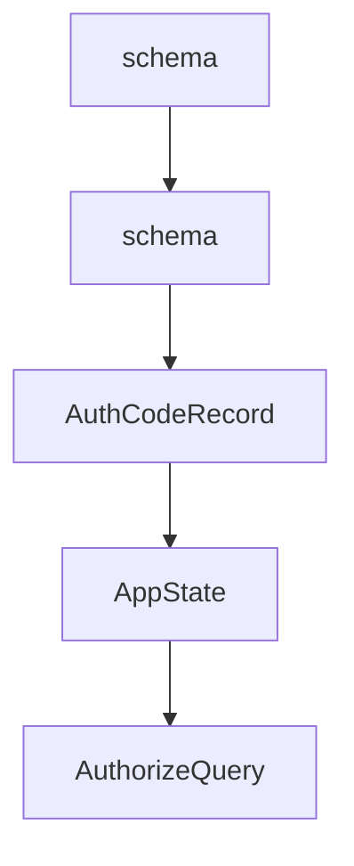

# Chapter 7: Conformance, Changelog, and Release Discipline

Welcome to **Chapter 7: Conformance, Changelog, and Release Discipline**. In this part of **MCP Rust SDK Tutorial: Building High-Performance MCP Services with RMCP**, you will build an intuitive mental model first, then move into concrete implementation details and practical production tradeoffs.


Fast release cadence requires tight change-management loops.

## Learning Goals

- use changelog signals to drive upgrade planning
- map SEP-related changes to service impact quickly
- create repeatable pre-upgrade and post-upgrade test gates
- avoid shipping protocol regressions during routine version bumps

## Release Discipline Loop

1. scan changelog for breaking or behavior-shifting entries
2. run targeted compatibility tests for impacted capabilities
3. validate transport/auth/task behavior in staging
4. publish internal upgrade notes before production rollout

## Source References

- [rmcp Changelog](https://github.com/modelcontextprotocol/rust-sdk/blob/main/crates/rmcp/CHANGELOG.md)
- [Rust SDK Releases](https://github.com/modelcontextprotocol/rust-sdk/releases)
- [MCP Specification Changelog](https://github.com/modelcontextprotocol/modelcontextprotocol/blob/main/docs/specification/2025-11-25/changelog.mdx)

## Summary

You now have a release process aligned with the pace and risk profile of rmcp development.

Next: [Chapter 8: Ecosystem Integration and Production Operations](08-ecosystem-integration-and-production-operations.md)

## Depth Expansion Playbook

## Source Code Walkthrough

### `conformance/src/bin/server.rs`

The `schema` interface in [`conformance/src/bin/server.rs`](https://github.com/modelcontextprotocol/rust-sdk/blob/HEAD/conformance/src/bin/server.rs) handles a key part of this chapter's functionality:

```rs
            Tool::new(
                "test_elicitation_sep1330_enums",
                "Tests enum schema improvements (SEP-1330)",
                json_object(json!({
                    "type": "object",
                    "properties": {}
                })),
            ),
            Tool::new(
                "json_schema_2020_12_tool",
                "Tool with JSON Schema 2020-12 features",
                json_object(json!({
                    "$schema": "https://json-schema.org/draft/2020-12/schema",
                    "type": "object",
                    "$defs": {
                        "address": {
                            "type": "object",
                            "properties": {
                                "street": { "type": "string" },
                                "city": { "type": "string" }
                            }
                        }
                    },
                    "properties": {
                        "name": { "type": "string" },
                        "address": { "$ref": "#/$defs/address" }
                    },
                    "additionalProperties": false
                })),
            ),
            Tool::new(
                "test_reconnection",
```

This interface is important because it defines how MCP Rust SDK Tutorial: Building High-Performance MCP Services with RMCP implements the patterns covered in this chapter.

### `conformance/src/bin/server.rs`

The `schema` interface in [`conformance/src/bin/server.rs`](https://github.com/modelcontextprotocol/rust-sdk/blob/HEAD/conformance/src/bin/server.rs) handles a key part of this chapter's functionality:

```rs
            Tool::new(
                "test_elicitation_sep1330_enums",
                "Tests enum schema improvements (SEP-1330)",
                json_object(json!({
                    "type": "object",
                    "properties": {}
                })),
            ),
            Tool::new(
                "json_schema_2020_12_tool",
                "Tool with JSON Schema 2020-12 features",
                json_object(json!({
                    "$schema": "https://json-schema.org/draft/2020-12/schema",
                    "type": "object",
                    "$defs": {
                        "address": {
                            "type": "object",
                            "properties": {
                                "street": { "type": "string" },
                                "city": { "type": "string" }
                            }
                        }
                    },
                    "properties": {
                        "name": { "type": "string" },
                        "address": { "$ref": "#/$defs/address" }
                    },
                    "additionalProperties": false
                })),
            ),
            Tool::new(
                "test_reconnection",
```

This interface is important because it defines how MCP Rust SDK Tutorial: Building High-Performance MCP Services with RMCP implements the patterns covered in this chapter.

### `examples/servers/src/cimd_auth_streamhttp.rs`

The `AuthCodeRecord` interface in [`examples/servers/src/cimd_auth_streamhttp.rs`](https://github.com/modelcontextprotocol/rust-sdk/blob/HEAD/examples/servers/src/cimd_auth_streamhttp.rs) handles a key part of this chapter's functionality:

```rs
/// In-memory authorization code record
#[derive(Clone, Debug)]
struct AuthCodeRecord {
    _client_id: String,
    _redirect_uri: String,
    expires_at: SystemTime,
}

#[derive(Clone)]
struct AppState {
    auth_codes: Arc<RwLock<HashMap<String, AuthCodeRecord>>>,
}

impl AppState {
    fn new() -> Self {
        Self {
            auth_codes: Arc::new(RwLock::new(HashMap::new())),
        }
    }
}

fn generate_authorization_code() -> String {
    rand::rng()
        .sample_iter(&Alphanumeric)
        .take(32)
        .map(char::from)
        .collect()
}

fn generate_access_token() -> String {
    rand::rng()
        .sample_iter(&Alphanumeric)
```

This interface is important because it defines how MCP Rust SDK Tutorial: Building High-Performance MCP Services with RMCP implements the patterns covered in this chapter.

### `examples/servers/src/cimd_auth_streamhttp.rs`

The `AppState` interface in [`examples/servers/src/cimd_auth_streamhttp.rs`](https://github.com/modelcontextprotocol/rust-sdk/blob/HEAD/examples/servers/src/cimd_auth_streamhttp.rs) handles a key part of this chapter's functionality:

```rs

#[derive(Clone)]
struct AppState {
    auth_codes: Arc<RwLock<HashMap<String, AuthCodeRecord>>>,
}

impl AppState {
    fn new() -> Self {
        Self {
            auth_codes: Arc::new(RwLock::new(HashMap::new())),
        }
    }
}

fn generate_authorization_code() -> String {
    rand::rng()
        .sample_iter(&Alphanumeric)
        .take(32)
        .map(char::from)
        .collect()
}

fn generate_access_token() -> String {
    rand::rng()
        .sample_iter(&Alphanumeric)
        .take(32)
        .map(char::from)
        .collect()
}

/// Validate that the client_id is a URL that meets CIMD mandatory requirements.
/// Mirrors the JS validateClientIdUrl helper.
```

This interface is important because it defines how MCP Rust SDK Tutorial: Building High-Performance MCP Services with RMCP implements the patterns covered in this chapter.


## How These Components Connect


