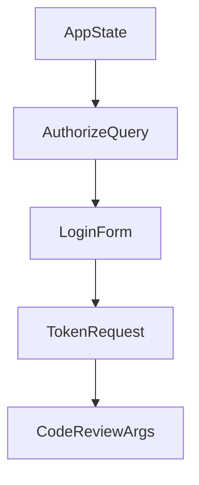

# Chapter 8: Ecosystem Integration and Production Operations

Welcome to **Chapter 8: Ecosystem Integration and Production Operations**. In this part of **MCP Rust SDK Tutorial: Building High-Performance MCP Services with RMCP**, you will build an intuitive mental model first, then move into concrete implementation details and practical production tradeoffs.


Production success depends on integration discipline across your broader Rust and MCP stack.

## Learning Goals

- integrate rmcp services with external ecosystems and runtime policies
- operationalize logging, monitoring, and incident response loops
- coordinate multi-service MCP deployments with clear ownership boundaries
- contribute back safely when you hit SDK gaps

## Operational Guidance

- isolate high-risk capabilities behind explicit policy controls
- standardize transport/auth configuration templates across teams
- monitor async queue depth and task latency for early incident signals
- upstream minimal reproducible issues with protocol-context details

## Source References

- [Rust SDK README - Related Projects](https://github.com/modelcontextprotocol/rust-sdk/blob/main/README.md)
- [Examples Index](https://github.com/modelcontextprotocol/rust-sdk/blob/main/examples/README.md)
- [rmcp Crate Documentation](https://github.com/modelcontextprotocol/rust-sdk/blob/main/crates/rmcp/README.md)

## Summary

You now have a full operations and integration model for Rust MCP deployments.

Next: Continue with [MCP Swift SDK Tutorial](../mcp-swift-sdk-tutorial/)

## Source Code Walkthrough

### `examples/servers/src/cimd_auth_streamhttp.rs`

The `AppState` interface in [`examples/servers/src/cimd_auth_streamhttp.rs`](https://github.com/modelcontextprotocol/rust-sdk/blob/HEAD/examples/servers/src/cimd_auth_streamhttp.rs) handles a key part of this chapter's functionality:

```rs

#[derive(Clone)]
struct AppState {
    auth_codes: Arc<RwLock<HashMap<String, AuthCodeRecord>>>,
}

impl AppState {
    fn new() -> Self {
        Self {
            auth_codes: Arc::new(RwLock::new(HashMap::new())),
        }
    }
}

fn generate_authorization_code() -> String {
    rand::rng()
        .sample_iter(&Alphanumeric)
        .take(32)
        .map(char::from)
        .collect()
}

fn generate_access_token() -> String {
    rand::rng()
        .sample_iter(&Alphanumeric)
        .take(32)
        .map(char::from)
        .collect()
}

/// Validate that the client_id is a URL that meets CIMD mandatory requirements.
/// Mirrors the JS validateClientIdUrl helper.
```

This interface is important because it defines how MCP Rust SDK Tutorial: Building High-Performance MCP Services with RMCP implements the patterns covered in this chapter.

### `examples/servers/src/cimd_auth_streamhttp.rs`

The `AuthorizeQuery` interface in [`examples/servers/src/cimd_auth_streamhttp.rs`](https://github.com/modelcontextprotocol/rust-sdk/blob/HEAD/examples/servers/src/cimd_auth_streamhttp.rs) handles a key part of this chapter's functionality:

```rs

#[derive(Debug, Deserialize)]
struct AuthorizeQuery {
    client_id: Option<String>,
    redirect_uri: Option<String>,
    response_type: Option<String>,
    state: Option<String>,
    scope: Option<String>,
}

#[derive(Debug, Deserialize)]
struct LoginForm {
    username: Option<String>,
    password: Option<String>,
    // OAuth params come from hidden form fields
    client_id: Option<String>,
    redirect_uri: Option<String>,
    response_type: Option<String>,
    state: Option<String>,
    scope: Option<String>,
}

fn render_login_form(params: &AuthorizeQuery, error: Option<&str>) -> Html<String> {
    let hidden_fields = [
        ("client_id", params.client_id.as_deref().unwrap_or_default()),
        (
            "redirect_uri",
            params.redirect_uri.as_deref().unwrap_or_default(),
        ),
        (
            "response_type",
            params.response_type.as_deref().unwrap_or_default(),
```

This interface is important because it defines how MCP Rust SDK Tutorial: Building High-Performance MCP Services with RMCP implements the patterns covered in this chapter.

### `examples/servers/src/cimd_auth_streamhttp.rs`

The `LoginForm` interface in [`examples/servers/src/cimd_auth_streamhttp.rs`](https://github.com/modelcontextprotocol/rust-sdk/blob/HEAD/examples/servers/src/cimd_auth_streamhttp.rs) handles a key part of this chapter's functionality:

```rs

#[derive(Debug, Deserialize)]
struct LoginForm {
    username: Option<String>,
    password: Option<String>,
    // OAuth params come from hidden form fields
    client_id: Option<String>,
    redirect_uri: Option<String>,
    response_type: Option<String>,
    state: Option<String>,
    scope: Option<String>,
}

fn render_login_form(params: &AuthorizeQuery, error: Option<&str>) -> Html<String> {
    let hidden_fields = [
        ("client_id", params.client_id.as_deref().unwrap_or_default()),
        (
            "redirect_uri",
            params.redirect_uri.as_deref().unwrap_or_default(),
        ),
        (
            "response_type",
            params.response_type.as_deref().unwrap_or_default(),
        ),
        ("state", params.state.as_deref().unwrap_or_default()),
        ("scope", params.scope.as_deref().unwrap_or_default()),
    ]
    .iter()
    .map(|(k, v)| format!(r#"<input type="hidden" name="{k}" value="{v}">"#))
    .collect::<Vec<_>>()
    .join("\n      ");

```

This interface is important because it defines how MCP Rust SDK Tutorial: Building High-Performance MCP Services with RMCP implements the patterns covered in this chapter.

### `examples/servers/src/cimd_auth_streamhttp.rs`

The `TokenRequest` interface in [`examples/servers/src/cimd_auth_streamhttp.rs`](https://github.com/modelcontextprotocol/rust-sdk/blob/HEAD/examples/servers/src/cimd_auth_streamhttp.rs) handles a key part of this chapter's functionality:

```rs

#[derive(Debug, Deserialize)]
struct TokenRequest {
    grant_type: Option<String>,
    code: Option<String>,
}

async fn token(State(state): State<AppState>, Form(form): Form<TokenRequest>) -> impl IntoResponse {
    if form.grant_type.as_deref() != Some("authorization_code") {
        let body = serde_json::json!({
            "error": "unsupported_grant_type",
            "error_description": "Only authorization_code is supported in this demo",
        });
        return (StatusCode::BAD_REQUEST, Json(body)).into_response();
    }

    let code = match &form.code {
        Some(c) => c.clone(),
        None => {
            let body = serde_json::json!({
                "error": "invalid_request",
                "error_description": "Authorization code is required",
            });
            return (StatusCode::BAD_REQUEST, Json(body)).into_response();
        }
    };

    let record_opt = {
        let mut codes = state.auth_codes.write().await;
        codes.remove(&code)
    };

```

This interface is important because it defines how MCP Rust SDK Tutorial: Building High-Performance MCP Services with RMCP implements the patterns covered in this chapter.


## How These Components Connect


