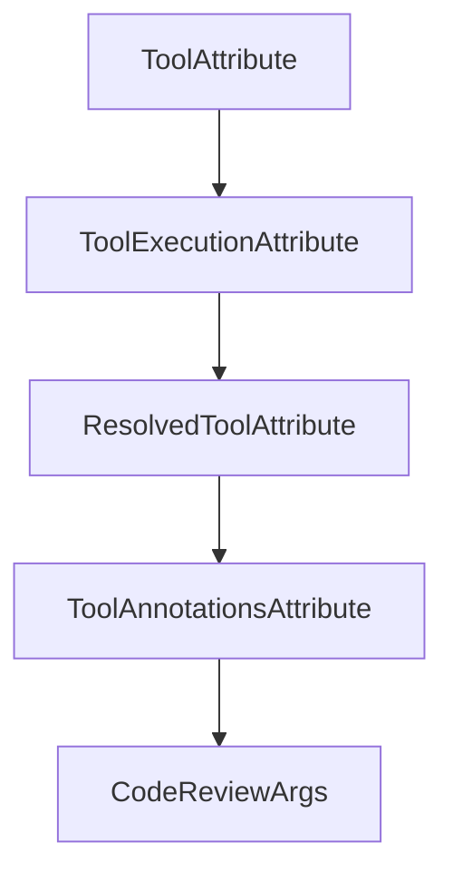

# Chapter 8: Ecosystem Integration and Production Operations

Welcome to **Chapter 8: Ecosystem Integration and Production Operations**. In this part of **MCP Rust SDK Tutorial: Building High-Performance MCP Services with RMCP**, you will build an intuitive mental model first, then move into concrete implementation details and practical production tradeoffs.


Production success depends on integration discipline across your broader Rust and MCP stack.

## Learning Goals

- integrate rmcp services with external ecosystems and runtime policies
- operationalize logging, monitoring, and incident response loops
- coordinate multi-service MCP deployments with clear ownership boundaries
- contribute back safely when you hit SDK gaps

## Operational Guidance

- isolate high-risk capabilities behind explicit policy controls
- standardize transport/auth configuration templates across teams
- monitor async queue depth and task latency for early incident signals
- upstream minimal reproducible issues with protocol-context details

## Source References

- [Rust SDK README - Related Projects](https://github.com/modelcontextprotocol/rust-sdk/blob/main/README.md)
- [Examples Index](https://github.com/modelcontextprotocol/rust-sdk/blob/main/examples/README.md)
- [rmcp Crate Documentation](https://github.com/modelcontextprotocol/rust-sdk/blob/main/crates/rmcp/README.md)

## Summary

You now have a full operations and integration model for Rust MCP deployments.

Next: Continue with [MCP Swift SDK Tutorial](../mcp-swift-sdk-tutorial/)

## Depth Expansion Playbook

## Source Code Walkthrough

### `crates/rmcp-macros/src/tool.rs`

The `ToolAttribute` interface in [`crates/rmcp-macros/src/tool.rs`](https://github.com/modelcontextprotocol/rust-sdk/blob/HEAD/crates/rmcp-macros/src/tool.rs) handles a key part of this chapter's functionality:

```rs
#[derive(FromMeta, Default, Debug)]
#[darling(default)]
pub struct ToolAttribute {
    /// The name of the tool
    pub name: Option<String>,
    /// Human readable title of tool
    pub title: Option<String>,
    pub description: Option<String>,
    /// A JSON Schema object defining the expected parameters for the tool
    pub input_schema: Option<Expr>,
    /// An optional JSON Schema object defining the structure of the tool's output
    pub output_schema: Option<Expr>,
    /// Optional additional tool information.
    pub annotations: Option<ToolAnnotationsAttribute>,
    /// Execution-related configuration including task support.
    pub execution: Option<ToolExecutionAttribute>,
    /// Optional icons for the tool
    pub icons: Option<Expr>,
    /// Optional metadata for the tool
    pub meta: Option<Expr>,
    /// When true, the generated future will not require `Send`. Useful for `!Send` handlers
    /// (e.g. single-threaded database connections). Also enabled globally by the `local` crate feature.
    pub local: bool,
}

#[derive(FromMeta, Debug, Default)]
#[darling(default)]
pub struct ToolExecutionAttribute {
    /// Task support mode: "forbidden", "optional", or "required"
    pub task_support: Option<String>,
}

```

This interface is important because it defines how MCP Rust SDK Tutorial: Building High-Performance MCP Services with RMCP implements the patterns covered in this chapter.

### `crates/rmcp-macros/src/tool.rs`

The `ToolExecutionAttribute` interface in [`crates/rmcp-macros/src/tool.rs`](https://github.com/modelcontextprotocol/rust-sdk/blob/HEAD/crates/rmcp-macros/src/tool.rs) handles a key part of this chapter's functionality:

```rs
    pub annotations: Option<ToolAnnotationsAttribute>,
    /// Execution-related configuration including task support.
    pub execution: Option<ToolExecutionAttribute>,
    /// Optional icons for the tool
    pub icons: Option<Expr>,
    /// Optional metadata for the tool
    pub meta: Option<Expr>,
    /// When true, the generated future will not require `Send`. Useful for `!Send` handlers
    /// (e.g. single-threaded database connections). Also enabled globally by the `local` crate feature.
    pub local: bool,
}

#[derive(FromMeta, Debug, Default)]
#[darling(default)]
pub struct ToolExecutionAttribute {
    /// Task support mode: "forbidden", "optional", or "required"
    pub task_support: Option<String>,
}

pub struct ResolvedToolAttribute {
    pub name: String,
    pub title: Option<String>,
    pub description: Option<Expr>,
    pub input_schema: Expr,
    pub output_schema: Option<Expr>,
    pub annotations: Option<Expr>,
    pub execution: Option<Expr>,
    pub icons: Option<Expr>,
    pub meta: Option<Expr>,
}

impl ResolvedToolAttribute {
```

This interface is important because it defines how MCP Rust SDK Tutorial: Building High-Performance MCP Services with RMCP implements the patterns covered in this chapter.

### `crates/rmcp-macros/src/tool.rs`

The `ResolvedToolAttribute` interface in [`crates/rmcp-macros/src/tool.rs`](https://github.com/modelcontextprotocol/rust-sdk/blob/HEAD/crates/rmcp-macros/src/tool.rs) handles a key part of this chapter's functionality:

```rs
}

pub struct ResolvedToolAttribute {
    pub name: String,
    pub title: Option<String>,
    pub description: Option<Expr>,
    pub input_schema: Expr,
    pub output_schema: Option<Expr>,
    pub annotations: Option<Expr>,
    pub execution: Option<Expr>,
    pub icons: Option<Expr>,
    pub meta: Option<Expr>,
}

impl ResolvedToolAttribute {
    pub fn into_fn(self, fn_ident: Ident) -> syn::Result<ImplItemFn> {
        let Self {
            name,
            description,
            title,
            input_schema,
            output_schema,
            annotations,
            execution,
            icons,
            meta,
        } = self;
        let description = if let Some(description) = description {
            quote! { Some(#description.into()) }
        } else {
            quote! { None }
        };
```

This interface is important because it defines how MCP Rust SDK Tutorial: Building High-Performance MCP Services with RMCP implements the patterns covered in this chapter.

### `crates/rmcp-macros/src/tool.rs`

The `ToolAnnotationsAttribute` interface in [`crates/rmcp-macros/src/tool.rs`](https://github.com/modelcontextprotocol/rust-sdk/blob/HEAD/crates/rmcp-macros/src/tool.rs) handles a key part of this chapter's functionality:

```rs
    pub output_schema: Option<Expr>,
    /// Optional additional tool information.
    pub annotations: Option<ToolAnnotationsAttribute>,
    /// Execution-related configuration including task support.
    pub execution: Option<ToolExecutionAttribute>,
    /// Optional icons for the tool
    pub icons: Option<Expr>,
    /// Optional metadata for the tool
    pub meta: Option<Expr>,
    /// When true, the generated future will not require `Send`. Useful for `!Send` handlers
    /// (e.g. single-threaded database connections). Also enabled globally by the `local` crate feature.
    pub local: bool,
}

#[derive(FromMeta, Debug, Default)]
#[darling(default)]
pub struct ToolExecutionAttribute {
    /// Task support mode: "forbidden", "optional", or "required"
    pub task_support: Option<String>,
}

pub struct ResolvedToolAttribute {
    pub name: String,
    pub title: Option<String>,
    pub description: Option<Expr>,
    pub input_schema: Expr,
    pub output_schema: Option<Expr>,
    pub annotations: Option<Expr>,
    pub execution: Option<Expr>,
    pub icons: Option<Expr>,
    pub meta: Option<Expr>,
}
```

This interface is important because it defines how MCP Rust SDK Tutorial: Building High-Performance MCP Services with RMCP implements the patterns covered in this chapter.


## How These Components Connect


