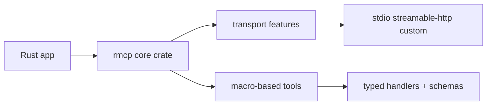

# MCP Rust SDK Tutorial: Building High-Performance MCP Services with RMCP

> Learn how to use `modelcontextprotocol/rust-sdk` (`rmcp`) for production MCP clients and servers with strong transport control, macro-driven tooling, OAuth, and async task workflows.

## Why This Track Matters

The Rust SDK is one of the fastest-moving official MCP implementations and is heavily focused on transport fidelity, schema correctness, and async execution discipline.

This track focuses on:

- selecting crate features and transport backends for your runtime
- implementing tools/resources/prompts/tasks with strong typing and macros
- applying OAuth and security patterns for streamable HTTP deployments
- building test and release workflows around the fast-moving rmcp changelog

## Current Snapshot (auto-updated)

- repository: [`modelcontextprotocol/rust-sdk`](https://github.com/modelcontextprotocol/rust-sdk)
- stars: about **3.0k**
- latest release: [`rmcp-v0.15.0`](https://github.com/modelcontextprotocol/rust-sdk/releases/tag/rmcp-v0.15.0) (**February 10, 2026**)
- recent activity: updated on **February 12, 2026**
- runtime posture: tokio async runtime, feature-gated transports/capabilities
- licensing note: license metadata is transitioning; see repository license file for current terms

## Mental Model

## Chapter Guide

| Chapter | Key Question | Outcome |
|:--------|:-------------|:--------|
| [01 - Getting Started and Crate Setup](01-getting-started-and-crate-setup.md) | Which crates and feature flags should I start with? | Stable dependency baseline |
| [02 - Service Model and Macro-Based Tooling](02-service-model-and-macro-based-tooling.md) | How do `#[tool]`, routers, and handlers shape server design? | Better code organization |
| [03 - Transports: stdio, Streamable HTTP, and Custom Channels](03-transports-stdio-streamable-http-and-custom-channels.md) | How should I pick and configure transport layers? | More reliable runtime behavior |
| [04 - Client Patterns, Sampling, and Batching Flows](04-client-patterns-sampling-and-batching-flows.md) | How do clients manage concurrency and advanced capabilities? | Stronger client discipline |
| [05 - Server Patterns: Tools, Resources, Prompts, and Tasks](05-server-patterns-tools-resources-prompts-and-tasks.md) | How do I build durable, feature-rich servers? | Higher capability quality |
| [06 - OAuth, Security, and Auth Workflows](06-oauth-security-and-auth-workflows.md) | How do I secure streamable HTTP deployments? | Lower auth/security risk |
| [07 - Conformance, Changelog, and Release Discipline](07-conformance-changelog-and-release-discipline.md) | How do I keep pace with protocol changes safely? | Safer upgrade cycles |
| [08 - Ecosystem Integration and Production Operations](08-ecosystem-integration-and-production-operations.md) | How do teams run rmcp in real production systems? | Long-term maintainability |

## What You Will Learn

- how to map rmcp feature flags to capability and transport requirements
- how to implement typed tools and async tasks without losing protocol clarity
- how to apply OAuth support and streamable HTTP controls safely
- how to run release and operations workflows for a fast-evolving SDK

## Source References

- [Rust SDK README](https://github.com/modelcontextprotocol/rust-sdk/blob/main/README.md)
- [rmcp Crate README](https://github.com/modelcontextprotocol/rust-sdk/blob/main/crates/rmcp/README.md)
- [rmcp-macros README](https://github.com/modelcontextprotocol/rust-sdk/blob/main/crates/rmcp-macros/README.md)
- [OAuth Support Guide](https://github.com/modelcontextprotocol/rust-sdk/blob/main/docs/OAUTH_SUPPORT.md)
- [Examples Index](https://github.com/modelcontextprotocol/rust-sdk/blob/main/examples/README.md)
- [Client Examples](https://github.com/modelcontextprotocol/rust-sdk/blob/main/examples/clients/README.md)
- [Server Examples](https://github.com/modelcontextprotocol/rust-sdk/blob/main/examples/servers/README.md)
- [rmcp Changelog](https://github.com/modelcontextprotocol/rust-sdk/blob/main/crates/rmcp/CHANGELOG.md)

## Related Tutorials

- [MCP Specification Tutorial](../mcp-specification-tutorial/)
- [MCP Go SDK Tutorial](../mcp-go-sdk-tutorial/)
- [MCP Java SDK Tutorial](../mcp-java-sdk-tutorial/)
- [MCP Swift SDK Tutorial](../mcp-swift-sdk-tutorial/)

---

Start with [Chapter 1: Getting Started and Crate Setup](01-getting-started-and-crate-setup.md).

## Navigation & Backlinks

- [Start Here: Chapter 1: Getting Started and Crate Setup](01-getting-started-and-crate-setup.md)
- [Back to Main Catalog](../../README.md#-tutorial-catalog)
- [Browse A-Z Tutorial Directory](../../discoverability/tutorial-directory.md)
- [Search by Intent](../../discoverability/query-hub.md)
- [Explore Category Hubs](../../README.md#category-hubs)

## Full Chapter Map

1. [Chapter 1: Getting Started and Crate Setup](01-getting-started-and-crate-setup.md)
2. [Chapter 2: Service Model and Macro-Based Tooling](02-service-model-and-macro-based-tooling.md)
3. [Chapter 3: Transports: stdio, Streamable HTTP, and Custom Channels](03-transports-stdio-streamable-http-and-custom-channels.md)
4. [Chapter 4: Client Patterns, Sampling, and Batching Flows](04-client-patterns-sampling-and-batching-flows.md)
5. [Chapter 5: Server Patterns: Tools, Resources, Prompts, and Tasks](05-server-patterns-tools-resources-prompts-and-tasks.md)
6. [Chapter 6: OAuth, Security, and Auth Workflows](06-oauth-security-and-auth-workflows.md)
7. [Chapter 7: Conformance, Changelog, and Release Discipline](07-conformance-changelog-and-release-discipline.md)
8. [Chapter 8: Ecosystem Integration and Production Operations](08-ecosystem-integration-and-production-operations.md)

*Generated by [AI Codebase Knowledge Builder](https://github.com/The-Pocket/Tutorial-Codebase-Knowledge)*
