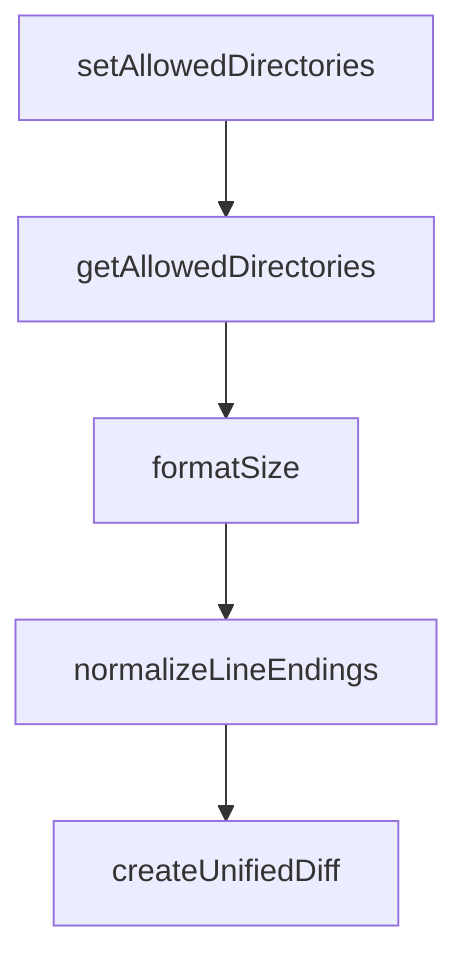

# Chapter 1: Getting Started

Welcome to **Chapter 1: Getting Started**. In this part of **MCP Servers Tutorial: Reference Implementations and Patterns**, you will build an intuitive mental model first, then move into concrete implementation details and practical production tradeoffs.


This chapter sets up a clean evaluation workflow for MCP reference servers.

## Clone and Inspect the Repository

```bash
git clone https://github.com/modelcontextprotocol/servers.git
cd servers
ls src
```

The `src/` directory contains each reference server implementation.

## Choose a Runtime Path

Most reference servers support multiple ways to run:

- package manager invocation (`npx`, `uvx`, or `pip`/`python -m` depending on server)
- Docker image execution
- editor/client-level MCP configuration

Use package-manager mode for local iteration and Docker mode when testing isolation and deploy parity.

## Recommended First Server

Start with `filesystem` or `time` because they are easy to validate and have clear I/O behavior.

Initial validation loop:

1. Register server in your MCP client config.
2. Ask the client to list tools.
3. Execute one read-only tool.
4. Execute one mutation tool in a safe sandbox.
5. Record behavior and error messages.

## Understand the Contract

Reference servers teach three things:

- request/response shapes for tools
- guardrail and safety patterns
- transport/runtime integration options

They are not optimized for your domain, data volume, or threat model out of the box.

## Baseline Evaluation Checklist

- What operations are read-only vs mutating?
- Which inputs can trigger side effects?
- How are paths/resources access-controlled?
- What metadata do you need for audit and traceability?
- Which parts must be replaced for production?

## Summary

You now have a repeatable method to evaluate each reference server safely.

Next: [Chapter 2: Filesystem Server](02-filesystem-server.md)

## What Problem Does This Solve?

Most teams struggle here because the hard part is not writing more code, but deciding clear boundaries for `servers`, `clone`, `https` so behavior stays predictable as complexity grows.

In practical terms, this chapter helps you avoid three common failures:

- coupling core logic too tightly to one implementation path
- missing the handoff boundaries between setup, execution, and validation
- shipping changes without clear rollback or observability strategy

After working through this chapter, you should be able to reason about `Chapter 1: Getting Started` as an operating subsystem inside **MCP Servers Tutorial: Reference Implementations and Patterns**, with explicit contracts for inputs, state transitions, and outputs.

Use the implementation notes around `github`, `modelcontextprotocol` as your checklist when adapting these patterns to your own repository.

## How it Works Under the Hood

Under the hood, `Chapter 1: Getting Started` usually follows a repeatable control path:

1. **Context bootstrap**: initialize runtime config and prerequisites for `servers`.
2. **Input normalization**: shape incoming data so `clone` receives stable contracts.
3. **Core execution**: run the main logic branch and propagate intermediate state through `https`.
4. **Policy and safety checks**: enforce limits, auth scopes, and failure boundaries.
5. **Output composition**: return canonical result payloads for downstream consumers.
6. **Operational telemetry**: emit logs/metrics needed for debugging and performance tuning.

When debugging, walk this sequence in order and confirm each stage has explicit success/failure conditions.

## Source Walkthrough

Use the following upstream sources to verify implementation details while reading this chapter:

- [MCP servers repository](https://github.com/modelcontextprotocol/servers)
  Why it matters: authoritative reference on `MCP servers repository` (github.com).

Suggested trace strategy:
- search upstream code for `servers` and `clone` to map concrete implementation paths
- compare docs claims against actual runtime/config code before reusing patterns in production

## Chapter Connections

- [Tutorial Index](README.md)
- [Next Chapter: Chapter 2: Filesystem Server](02-filesystem-server.md)
- [Main Catalog](../../README.md#-tutorial-catalog)
- [A-Z Tutorial Directory](../../discoverability/tutorial-directory.md)

## Source Code Walkthrough

### `src/filesystem/lib.ts`

The `setAllowedDirectories` function in [`src/filesystem/lib.ts`](https://github.com/modelcontextprotocol/servers/blob/HEAD/src/filesystem/lib.ts) handles a key part of this chapter's functionality:

```ts

// Function to set allowed directories from the main module
export function setAllowedDirectories(directories: string[]): void {
  allowedDirectories = [...directories];
}

// Function to get current allowed directories
export function getAllowedDirectories(): string[] {
  return [...allowedDirectories];
}

// Type definitions
interface FileInfo {
  size: number;
  created: Date;
  modified: Date;
  accessed: Date;
  isDirectory: boolean;
  isFile: boolean;
  permissions: string;
}

export interface SearchOptions {
  excludePatterns?: string[];
}

export interface SearchResult {
  path: string;
  isDirectory: boolean;
}

// Pure Utility Functions
```

This function is important because it defines how MCP Servers Tutorial: Reference Implementations and Patterns implements the patterns covered in this chapter.

### `src/filesystem/lib.ts`

The `getAllowedDirectories` function in [`src/filesystem/lib.ts`](https://github.com/modelcontextprotocol/servers/blob/HEAD/src/filesystem/lib.ts) handles a key part of this chapter's functionality:

```ts

// Function to get current allowed directories
export function getAllowedDirectories(): string[] {
  return [...allowedDirectories];
}

// Type definitions
interface FileInfo {
  size: number;
  created: Date;
  modified: Date;
  accessed: Date;
  isDirectory: boolean;
  isFile: boolean;
  permissions: string;
}

export interface SearchOptions {
  excludePatterns?: string[];
}

export interface SearchResult {
  path: string;
  isDirectory: boolean;
}

// Pure Utility Functions
export function formatSize(bytes: number): string {
  const units = ['B', 'KB', 'MB', 'GB', 'TB'];
  if (bytes === 0) return '0 B';
  
  const i = Math.floor(Math.log(bytes) / Math.log(1024));
```

This function is important because it defines how MCP Servers Tutorial: Reference Implementations and Patterns implements the patterns covered in this chapter.

### `src/filesystem/lib.ts`

The `formatSize` function in [`src/filesystem/lib.ts`](https://github.com/modelcontextprotocol/servers/blob/HEAD/src/filesystem/lib.ts) handles a key part of this chapter's functionality:

```ts

// Pure Utility Functions
export function formatSize(bytes: number): string {
  const units = ['B', 'KB', 'MB', 'GB', 'TB'];
  if (bytes === 0) return '0 B';
  
  const i = Math.floor(Math.log(bytes) / Math.log(1024));
  
  if (i < 0 || i === 0) return `${bytes} ${units[0]}`;
  
  const unitIndex = Math.min(i, units.length - 1);
  return `${(bytes / Math.pow(1024, unitIndex)).toFixed(2)} ${units[unitIndex]}`;
}

export function normalizeLineEndings(text: string): string {
  return text.replace(/\r\n/g, '\n');
}

export function createUnifiedDiff(originalContent: string, newContent: string, filepath: string = 'file'): string {
  // Ensure consistent line endings for diff
  const normalizedOriginal = normalizeLineEndings(originalContent);
  const normalizedNew = normalizeLineEndings(newContent);

  return createTwoFilesPatch(
    filepath,
    filepath,
    normalizedOriginal,
    normalizedNew,
    'original',
    'modified'
  );
}
```

This function is important because it defines how MCP Servers Tutorial: Reference Implementations and Patterns implements the patterns covered in this chapter.

### `src/filesystem/lib.ts`

The `normalizeLineEndings` function in [`src/filesystem/lib.ts`](https://github.com/modelcontextprotocol/servers/blob/HEAD/src/filesystem/lib.ts) handles a key part of this chapter's functionality:

```ts
}

export function normalizeLineEndings(text: string): string {
  return text.replace(/\r\n/g, '\n');
}

export function createUnifiedDiff(originalContent: string, newContent: string, filepath: string = 'file'): string {
  // Ensure consistent line endings for diff
  const normalizedOriginal = normalizeLineEndings(originalContent);
  const normalizedNew = normalizeLineEndings(newContent);

  return createTwoFilesPatch(
    filepath,
    filepath,
    normalizedOriginal,
    normalizedNew,
    'original',
    'modified'
  );
}

// Helper function to resolve relative paths against allowed directories
function resolveRelativePathAgainstAllowedDirectories(relativePath: string): string {
  if (allowedDirectories.length === 0) {
    // Fallback to process.cwd() if no allowed directories are set
    return path.resolve(process.cwd(), relativePath);
  }

  // Try to resolve relative path against each allowed directory
  for (const allowedDir of allowedDirectories) {
    const candidate = path.resolve(allowedDir, relativePath);
    const normalizedCandidate = normalizePath(candidate);
```

This function is important because it defines how MCP Servers Tutorial: Reference Implementations and Patterns implements the patterns covered in this chapter.


## How These Components Connect


