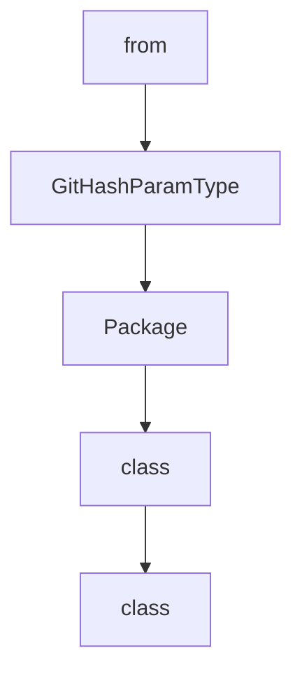

# Chapter 1: Getting Started

Welcome to **Chapter 1: Getting Started**. In this part of **MCP Servers Tutorial: Reference Implementations and Patterns**, you will build an intuitive mental model first, then move into concrete implementation details and practical production tradeoffs.


This chapter sets up a clean evaluation workflow for MCP reference servers.

## Clone and Inspect the Repository

```bash
git clone https://github.com/modelcontextprotocol/servers.git
cd servers
ls src
```

The `src/` directory contains each reference server implementation.

## Choose a Runtime Path

Most reference servers support multiple ways to run:

- package manager invocation (`npx`, `uvx`, or `pip`/`python -m` depending on server)
- Docker image execution
- editor/client-level MCP configuration

Use package-manager mode for local iteration and Docker mode when testing isolation and deploy parity.

## Recommended First Server

Start with `filesystem` or `time` because they are easy to validate and have clear I/O behavior.

Initial validation loop:

1. Register server in your MCP client config.
2. Ask the client to list tools.
3. Execute one read-only tool.
4. Execute one mutation tool in a safe sandbox.
5. Record behavior and error messages.

## Understand the Contract

Reference servers teach three things:

- request/response shapes for tools
- guardrail and safety patterns
- transport/runtime integration options

They are not optimized for your domain, data volume, or threat model out of the box.

## Baseline Evaluation Checklist

- What operations are read-only vs mutating?
- Which inputs can trigger side effects?
- How are paths/resources access-controlled?
- What metadata do you need for audit and traceability?
- Which parts must be replaced for production?

## Summary

You now have a repeatable method to evaluate each reference server safely.

Next: [Chapter 2: Filesystem Server](02-filesystem-server.md)

## What Problem Does This Solve?

Most teams struggle here because the hard part is not writing more code, but deciding clear boundaries for `servers`, `clone`, `https` so behavior stays predictable as complexity grows.

In practical terms, this chapter helps you avoid three common failures:

- coupling core logic too tightly to one implementation path
- missing the handoff boundaries between setup, execution, and validation
- shipping changes without clear rollback or observability strategy

After working through this chapter, you should be able to reason about `Chapter 1: Getting Started` as an operating subsystem inside **MCP Servers Tutorial: Reference Implementations and Patterns**, with explicit contracts for inputs, state transitions, and outputs.

Use the implementation notes around `github`, `modelcontextprotocol` as your checklist when adapting these patterns to your own repository.

## How it Works Under the Hood

Under the hood, `Chapter 1: Getting Started` usually follows a repeatable control path:

1. **Context bootstrap**: initialize runtime config and prerequisites for `servers`.
2. **Input normalization**: shape incoming data so `clone` receives stable contracts.
3. **Core execution**: run the main logic branch and propagate intermediate state through `https`.
4. **Policy and safety checks**: enforce limits, auth scopes, and failure boundaries.
5. **Output composition**: return canonical result payloads for downstream consumers.
6. **Operational telemetry**: emit logs/metrics needed for debugging and performance tuning.

When debugging, walk this sequence in order and confirm each stage has explicit success/failure conditions.

## Source Walkthrough

Use the following upstream sources to verify implementation details while reading this chapter:

- [MCP servers repository](https://github.com/modelcontextprotocol/servers)
  Why it matters: authoritative reference on `MCP servers repository` (github.com).

Suggested trace strategy:
- search upstream code for `servers` and `clone` to map concrete implementation paths
- compare docs claims against actual runtime/config code before reusing patterns in production

## Chapter Connections

- [Tutorial Index](README.md)
- [Next Chapter: Chapter 2: Filesystem Server](02-filesystem-server.md)
- [Main Catalog](../../README.md#-tutorial-catalog)
- [A-Z Tutorial Directory](../../discoverability/tutorial-directory.md)

## Depth Expansion Playbook

## Source Code Walkthrough

### `scripts/release.py`

The `from` class in [`scripts/release.py`](https://github.com/modelcontextprotocol/servers/blob/HEAD/scripts/release.py) handles a key part of this chapter's functionality:

```py
import re
import click
from pathlib import Path
import json
import tomlkit
import datetime
import subprocess
from dataclasses import dataclass
from typing import Any, Iterator, NewType, Protocol


Version = NewType("Version", str)
GitHash = NewType("GitHash", str)


class GitHashParamType(click.ParamType):
    name = "git_hash"

    def convert(
        self, value: Any, param: click.Parameter | None, ctx: click.Context | None
    ) -> GitHash | None:
        if value is None:
            return None

        if not (8 <= len(value) <= 40):
            self.fail(f"Git hash must be between 8 and 40 characters, got {len(value)}")

        if not re.match(r"^[0-9a-fA-F]+$", value):
            self.fail("Git hash must contain only hex digits (0-9, a-f)")

        try:
            # Verify hash exists in repo
```

This class is important because it defines how MCP Servers Tutorial: Reference Implementations and Patterns implements the patterns covered in this chapter.

### `scripts/release.py`

The `GitHashParamType` class in [`scripts/release.py`](https://github.com/modelcontextprotocol/servers/blob/HEAD/scripts/release.py) handles a key part of this chapter's functionality:

```py


class GitHashParamType(click.ParamType):
    name = "git_hash"

    def convert(
        self, value: Any, param: click.Parameter | None, ctx: click.Context | None
    ) -> GitHash | None:
        if value is None:
            return None

        if not (8 <= len(value) <= 40):
            self.fail(f"Git hash must be between 8 and 40 characters, got {len(value)}")

        if not re.match(r"^[0-9a-fA-F]+$", value):
            self.fail("Git hash must contain only hex digits (0-9, a-f)")

        try:
            # Verify hash exists in repo
            subprocess.run(
                ["git", "rev-parse", "--verify", value], check=True, capture_output=True
            )
        except subprocess.CalledProcessError:
            self.fail(f"Git hash {value} not found in repository")

        return GitHash(value.lower())


GIT_HASH = GitHashParamType()


class Package(Protocol):
```

This class is important because it defines how MCP Servers Tutorial: Reference Implementations and Patterns implements the patterns covered in this chapter.

### `scripts/release.py`

The `Package` class in [`scripts/release.py`](https://github.com/modelcontextprotocol/servers/blob/HEAD/scripts/release.py) handles a key part of this chapter's functionality:

```py


class Package(Protocol):
    path: Path

    def package_name(self) -> str: ...

    def update_version(self, version: Version) -> None: ...


@dataclass
class NpmPackage:
    path: Path

    def package_name(self) -> str:
        with open(self.path / "package.json", "r") as f:
            return json.load(f)["name"]

    def update_version(self, version: Version):
        with open(self.path / "package.json", "r+") as f:
            data = json.load(f)
            data["version"] = version
            f.seek(0)
            json.dump(data, f, indent=2)
            f.truncate()


@dataclass
class PyPiPackage:
    path: Path

    def package_name(self) -> str:
```

This class is important because it defines how MCP Servers Tutorial: Reference Implementations and Patterns implements the patterns covered in this chapter.

### `scripts/release.py`

The `class` class in [`scripts/release.py`](https://github.com/modelcontextprotocol/servers/blob/HEAD/scripts/release.py) handles a key part of this chapter's functionality:

```py
import datetime
import subprocess
from dataclasses import dataclass
from typing import Any, Iterator, NewType, Protocol


Version = NewType("Version", str)
GitHash = NewType("GitHash", str)


class GitHashParamType(click.ParamType):
    name = "git_hash"

    def convert(
        self, value: Any, param: click.Parameter | None, ctx: click.Context | None
    ) -> GitHash | None:
        if value is None:
            return None

        if not (8 <= len(value) <= 40):
            self.fail(f"Git hash must be between 8 and 40 characters, got {len(value)}")

        if not re.match(r"^[0-9a-fA-F]+$", value):
            self.fail("Git hash must contain only hex digits (0-9, a-f)")

        try:
            # Verify hash exists in repo
            subprocess.run(
                ["git", "rev-parse", "--verify", value], check=True, capture_output=True
            )
        except subprocess.CalledProcessError:
            self.fail(f"Git hash {value} not found in repository")
```

This class is important because it defines how MCP Servers Tutorial: Reference Implementations and Patterns implements the patterns covered in this chapter.


## How These Components Connect


