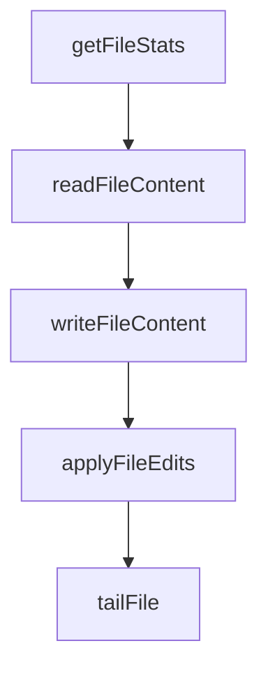

# Chapter 2: Filesystem Server

Welcome to **Chapter 2: Filesystem Server**. In this part of **MCP Servers Tutorial: Reference Implementations and Patterns**, you will build an intuitive mental model first, then move into concrete implementation details and practical production tradeoffs.


The filesystem server is the canonical example of capability scoping and safe tool design.

## What It Provides

The official filesystem server exposes tools for:

- reading text and media files
- writing/editing/moving files
- listing/searching directories
- querying file metadata
- enumerating currently allowed directories

## Access Control Model

The key design is **allowlisted directory boundaries**.

Two configuration methods are supported:

1. command-line allowed roots
2. dynamic roots from clients that support the MCP roots protocol

When roots are provided by the client, they replace static startup roots.

## Why Roots Matter

Dynamic roots allow clients to adjust accessible scope at runtime without restarting the server. This is convenient, but it increases the need for:

- explicit trust boundaries
- event logging for root changes
- policy checks before privileged operations

## Tool Annotation Pattern

The server marks tools with hints (read-only, idempotent, destructive). These hints are valuable for client UX and safety policies.

Example policy usage:

- auto-run read-only tools
- require confirmation for destructive tools
- require stronger policy checks on non-idempotent mutations

## Safe Edit Pattern

Use dry-run where available before mutating files.

```text
1) run edit in preview mode
2) inspect diff
3) apply if expected
```

This mirrors modern CI-safe change workflows and reduces accidental corruption.

## Threats to Address in Production

- path traversal and symlink edge cases
- unexpected binary payload handling
- overly broad root configuration
- insufficient audit metadata for writes

## Summary

You now understand the filesystem server's core safety model and how to adapt it responsibly.

Next: [Chapter 3: Git Server](03-git-server.md)

## What Problem Does This Solve?

Most teams struggle here because the hard part is not writing more code, but deciding clear boundaries for `edit`, `preview`, `mode` so behavior stays predictable as complexity grows.

In practical terms, this chapter helps you avoid three common failures:

- coupling core logic too tightly to one implementation path
- missing the handoff boundaries between setup, execution, and validation
- shipping changes without clear rollback or observability strategy

After working through this chapter, you should be able to reason about `Chapter 2: Filesystem Server` as an operating subsystem inside **MCP Servers Tutorial: Reference Implementations and Patterns**, with explicit contracts for inputs, state transitions, and outputs.

Use the implementation notes around `inspect`, `diff`, `apply` as your checklist when adapting these patterns to your own repository.

## How it Works Under the Hood

Under the hood, `Chapter 2: Filesystem Server` usually follows a repeatable control path:

1. **Context bootstrap**: initialize runtime config and prerequisites for `edit`.
2. **Input normalization**: shape incoming data so `preview` receives stable contracts.
3. **Core execution**: run the main logic branch and propagate intermediate state through `mode`.
4. **Policy and safety checks**: enforce limits, auth scopes, and failure boundaries.
5. **Output composition**: return canonical result payloads for downstream consumers.
6. **Operational telemetry**: emit logs/metrics needed for debugging and performance tuning.

When debugging, walk this sequence in order and confirm each stage has explicit success/failure conditions.

## Source Walkthrough

Use the following upstream sources to verify implementation details while reading this chapter:

- [MCP servers repository](https://github.com/modelcontextprotocol/servers)
  Why it matters: authoritative reference on `MCP servers repository` (github.com).

Suggested trace strategy:
- search upstream code for `edit` and `preview` to map concrete implementation paths
- compare docs claims against actual runtime/config code before reusing patterns in production

## Chapter Connections

- [Tutorial Index](README.md)
- [Previous Chapter: Chapter 1: Getting Started](01-getting-started.md)
- [Next Chapter: Chapter 3: Git Server](03-git-server.md)
- [Main Catalog](../../README.md#-tutorial-catalog)
- [A-Z Tutorial Directory](../../discoverability/tutorial-directory.md)

## Source Code Walkthrough

### `src/filesystem/lib.ts`

The `getFileStats` function in [`src/filesystem/lib.ts`](https://github.com/modelcontextprotocol/servers/blob/HEAD/src/filesystem/lib.ts) handles a key part of this chapter's functionality:

```ts

// File Operations
export async function getFileStats(filePath: string): Promise<FileInfo> {
  const stats = await fs.stat(filePath);
  return {
    size: stats.size,
    created: stats.birthtime,
    modified: stats.mtime,
    accessed: stats.atime,
    isDirectory: stats.isDirectory(),
    isFile: stats.isFile(),
    permissions: stats.mode.toString(8).slice(-3),
  };
}

export async function readFileContent(filePath: string, encoding: string = 'utf-8'): Promise<string> {
  return await fs.readFile(filePath, encoding as BufferEncoding);
}

export async function writeFileContent(filePath: string, content: string): Promise<void> {
  try {
    // Security: 'wx' flag ensures exclusive creation - fails if file/symlink exists,
    // preventing writes through pre-existing symlinks
    await fs.writeFile(filePath, content, { encoding: "utf-8", flag: 'wx' });
  } catch (error) {
    if ((error as NodeJS.ErrnoException).code === 'EEXIST') {
      // Security: Use atomic rename to prevent race conditions where symlinks
      // could be created between validation and write. Rename operations
      // replace the target file atomically and don't follow symlinks.
      const tempPath = `${filePath}.${randomBytes(16).toString('hex')}.tmp`;
      try {
        await fs.writeFile(tempPath, content, 'utf-8');
```

This function is important because it defines how MCP Servers Tutorial: Reference Implementations and Patterns implements the patterns covered in this chapter.

### `src/filesystem/lib.ts`

The `readFileContent` function in [`src/filesystem/lib.ts`](https://github.com/modelcontextprotocol/servers/blob/HEAD/src/filesystem/lib.ts) handles a key part of this chapter's functionality:

```ts
}

export async function readFileContent(filePath: string, encoding: string = 'utf-8'): Promise<string> {
  return await fs.readFile(filePath, encoding as BufferEncoding);
}

export async function writeFileContent(filePath: string, content: string): Promise<void> {
  try {
    // Security: 'wx' flag ensures exclusive creation - fails if file/symlink exists,
    // preventing writes through pre-existing symlinks
    await fs.writeFile(filePath, content, { encoding: "utf-8", flag: 'wx' });
  } catch (error) {
    if ((error as NodeJS.ErrnoException).code === 'EEXIST') {
      // Security: Use atomic rename to prevent race conditions where symlinks
      // could be created between validation and write. Rename operations
      // replace the target file atomically and don't follow symlinks.
      const tempPath = `${filePath}.${randomBytes(16).toString('hex')}.tmp`;
      try {
        await fs.writeFile(tempPath, content, 'utf-8');
        await fs.rename(tempPath, filePath);
      } catch (renameError) {
        try {
          await fs.unlink(tempPath);
        } catch {}
        throw renameError;
      }
    } else {
      throw error;
    }
  }
}

```

This function is important because it defines how MCP Servers Tutorial: Reference Implementations and Patterns implements the patterns covered in this chapter.

### `src/filesystem/lib.ts`

The `writeFileContent` function in [`src/filesystem/lib.ts`](https://github.com/modelcontextprotocol/servers/blob/HEAD/src/filesystem/lib.ts) handles a key part of this chapter's functionality:

```ts
}

export async function writeFileContent(filePath: string, content: string): Promise<void> {
  try {
    // Security: 'wx' flag ensures exclusive creation - fails if file/symlink exists,
    // preventing writes through pre-existing symlinks
    await fs.writeFile(filePath, content, { encoding: "utf-8", flag: 'wx' });
  } catch (error) {
    if ((error as NodeJS.ErrnoException).code === 'EEXIST') {
      // Security: Use atomic rename to prevent race conditions where symlinks
      // could be created between validation and write. Rename operations
      // replace the target file atomically and don't follow symlinks.
      const tempPath = `${filePath}.${randomBytes(16).toString('hex')}.tmp`;
      try {
        await fs.writeFile(tempPath, content, 'utf-8');
        await fs.rename(tempPath, filePath);
      } catch (renameError) {
        try {
          await fs.unlink(tempPath);
        } catch {}
        throw renameError;
      }
    } else {
      throw error;
    }
  }
}


// File Editing Functions
interface FileEdit {
  oldText: string;
```

This function is important because it defines how MCP Servers Tutorial: Reference Implementations and Patterns implements the patterns covered in this chapter.

### `src/filesystem/lib.ts`

The `applyFileEdits` function in [`src/filesystem/lib.ts`](https://github.com/modelcontextprotocol/servers/blob/HEAD/src/filesystem/lib.ts) handles a key part of this chapter's functionality:

```ts
}

export async function applyFileEdits(
  filePath: string,
  edits: FileEdit[],
  dryRun: boolean = false
): Promise<string> {
  // Read file content and normalize line endings
  const content = normalizeLineEndings(await fs.readFile(filePath, 'utf-8'));

  // Apply edits sequentially
  let modifiedContent = content;
  for (const edit of edits) {
    const normalizedOld = normalizeLineEndings(edit.oldText);
    const normalizedNew = normalizeLineEndings(edit.newText);

    // If exact match exists, use it
    if (modifiedContent.includes(normalizedOld)) {
      modifiedContent = modifiedContent.replace(normalizedOld, normalizedNew);
      continue;
    }

    // Otherwise, try line-by-line matching with flexibility for whitespace
    const oldLines = normalizedOld.split('\n');
    const contentLines = modifiedContent.split('\n');
    let matchFound = false;

    for (let i = 0; i <= contentLines.length - oldLines.length; i++) {
      const potentialMatch = contentLines.slice(i, i + oldLines.length);

      // Compare lines with normalized whitespace
      const isMatch = oldLines.every((oldLine, j) => {
```

This function is important because it defines how MCP Servers Tutorial: Reference Implementations and Patterns implements the patterns covered in this chapter.


## How These Components Connect


