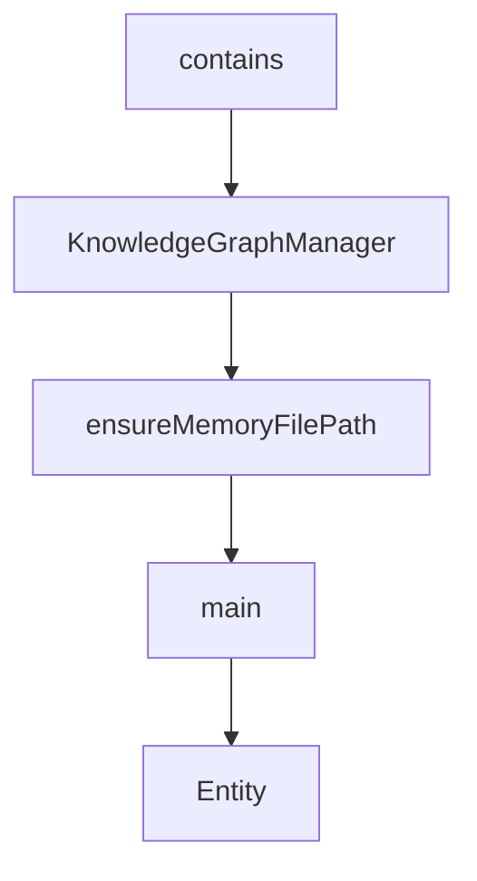

# Chapter 3: Git Server

Welcome to **Chapter 3: Git Server**. In this part of **MCP Servers Tutorial: Reference Implementations and Patterns**, you will build an intuitive mental model first, then move into concrete implementation details and practical production tradeoffs.


The git server demonstrates a practical balance between read-heavy analysis and controlled mutation.

## Core Tool Surface

The reference git server supports:

- repository state checks (`git_status`, diffs, logs)
- staging and commit operations
- branch creation and checkout
- commit inspection (`git_show`)

This mirrors common developer assistant workflows.

## Safe Usage Strategy

Start with read-only operations:

1. status
2. unstaged/staged diff
3. log and branch listing

Then enable mutating operations (`git_add`, `git_commit`, checkout/reset) only after adding explicit policy controls.

## Mutation Guardrails

For production adaptation, add:

- branch protections
- commit message policy checks
- allowlisted repo paths
- signer identity and audit logging

Without these controls, an agent can perform valid git operations that still violate team policy.

## Example Interaction Pattern

```text
analyze changes -> propose patch -> stage selected files -> commit with structured message
```

Split reasoning and execution. Force explicit confirmation between analysis and mutation steps.

## Common Failure Modes

| Failure | Root Cause | Mitigation |
|:--------|:-----------|:-----------|
| Wrong repository targeted | Ambiguous `repo_path` | Resolve canonical path and verify allowlist |
| Overscoped staging | Wildcard or broad file selection | Enforce explicit file list |
| Unsafe branch switch | Dirty working tree | Add pre-check and block on conflicts |
| Undocumented commit semantics | Inconsistent agent behavior | Standardize commit message template |

## Summary

You can now treat git server operations as a controllable pipeline instead of ad-hoc commands.

Next: [Chapter 4: Memory Server](04-memory-server.md)

## What Problem Does This Solve?

Most teams struggle here because the hard part is not writing more code, but deciding clear boundaries for `analyze`, `changes`, `propose` so behavior stays predictable as complexity grows.

In practical terms, this chapter helps you avoid three common failures:

- coupling core logic too tightly to one implementation path
- missing the handoff boundaries between setup, execution, and validation
- shipping changes without clear rollback or observability strategy

After working through this chapter, you should be able to reason about `Chapter 3: Git Server` as an operating subsystem inside **MCP Servers Tutorial: Reference Implementations and Patterns**, with explicit contracts for inputs, state transitions, and outputs.

Use the implementation notes around `patch`, `stage`, `selected` as your checklist when adapting these patterns to your own repository.

## How it Works Under the Hood

Under the hood, `Chapter 3: Git Server` usually follows a repeatable control path:

1. **Context bootstrap**: initialize runtime config and prerequisites for `analyze`.
2. **Input normalization**: shape incoming data so `changes` receives stable contracts.
3. **Core execution**: run the main logic branch and propagate intermediate state through `propose`.
4. **Policy and safety checks**: enforce limits, auth scopes, and failure boundaries.
5. **Output composition**: return canonical result payloads for downstream consumers.
6. **Operational telemetry**: emit logs/metrics needed for debugging and performance tuning.

When debugging, walk this sequence in order and confirm each stage has explicit success/failure conditions.

## Source Walkthrough

Use the following upstream sources to verify implementation details while reading this chapter:

- [MCP servers repository](https://github.com/modelcontextprotocol/servers)
  Why it matters: authoritative reference on `MCP servers repository` (github.com).

Suggested trace strategy:
- search upstream code for `analyze` and `changes` to map concrete implementation paths
- compare docs claims against actual runtime/config code before reusing patterns in production

## Chapter Connections

- [Tutorial Index](README.md)
- [Previous Chapter: Chapter 2: Filesystem Server](02-filesystem-server.md)
- [Next Chapter: Chapter 4: Memory Server](04-memory-server.md)
- [Main Catalog](../../README.md#-tutorial-catalog)
- [A-Z Tutorial Directory](../../discoverability/tutorial-directory.md)

## Depth Expansion Playbook

## Source Code Walkthrough

### `src/memory/index.ts`

The `contains` class in [`src/memory/index.ts`](https://github.com/modelcontextprotocol/servers/blob/HEAD/src/memory/index.ts) handles a key part of this chapter's functionality:

```ts
}

// The KnowledgeGraphManager class contains all operations to interact with the knowledge graph
export class KnowledgeGraphManager {
  constructor(private memoryFilePath: string) {}

  private async loadGraph(): Promise<KnowledgeGraph> {
    try {
      const data = await fs.readFile(this.memoryFilePath, "utf-8");
      const lines = data.split("\n").filter(line => line.trim() !== "");
      return lines.reduce((graph: KnowledgeGraph, line) => {
        const item = JSON.parse(line);
        if (item.type === "entity") {
          graph.entities.push({
            name: item.name,
            entityType: item.entityType,
            observations: item.observations
          });
        }
        if (item.type === "relation") {
          graph.relations.push({
            from: item.from,
            to: item.to,
            relationType: item.relationType
          });
        }
        return graph;
      }, { entities: [], relations: [] });
    } catch (error) {
      if (error instanceof Error && 'code' in error && (error as any).code === "ENOENT") {
        return { entities: [], relations: [] };
      }
```

This class is important because it defines how MCP Servers Tutorial: Reference Implementations and Patterns implements the patterns covered in this chapter.

### `src/memory/index.ts`

The `KnowledgeGraphManager` class in [`src/memory/index.ts`](https://github.com/modelcontextprotocol/servers/blob/HEAD/src/memory/index.ts) handles a key part of this chapter's functionality:

```ts
}

// The KnowledgeGraphManager class contains all operations to interact with the knowledge graph
export class KnowledgeGraphManager {
  constructor(private memoryFilePath: string) {}

  private async loadGraph(): Promise<KnowledgeGraph> {
    try {
      const data = await fs.readFile(this.memoryFilePath, "utf-8");
      const lines = data.split("\n").filter(line => line.trim() !== "");
      return lines.reduce((graph: KnowledgeGraph, line) => {
        const item = JSON.parse(line);
        if (item.type === "entity") {
          graph.entities.push({
            name: item.name,
            entityType: item.entityType,
            observations: item.observations
          });
        }
        if (item.type === "relation") {
          graph.relations.push({
            from: item.from,
            to: item.to,
            relationType: item.relationType
          });
        }
        return graph;
      }, { entities: [], relations: [] });
    } catch (error) {
      if (error instanceof Error && 'code' in error && (error as any).code === "ENOENT") {
        return { entities: [], relations: [] };
      }
```

This class is important because it defines how MCP Servers Tutorial: Reference Implementations and Patterns implements the patterns covered in this chapter.

### `src/memory/index.ts`

The `ensureMemoryFilePath` function in [`src/memory/index.ts`](https://github.com/modelcontextprotocol/servers/blob/HEAD/src/memory/index.ts) handles a key part of this chapter's functionality:

```ts

// Handle backward compatibility: migrate memory.json to memory.jsonl if needed
export async function ensureMemoryFilePath(): Promise<string> {
  if (process.env.MEMORY_FILE_PATH) {
    // Custom path provided, use it as-is (with absolute path resolution)
    return path.isAbsolute(process.env.MEMORY_FILE_PATH)
      ? process.env.MEMORY_FILE_PATH
      : path.join(path.dirname(fileURLToPath(import.meta.url)), process.env.MEMORY_FILE_PATH);
  }
  
  // No custom path set, check for backward compatibility migration
  const oldMemoryPath = path.join(path.dirname(fileURLToPath(import.meta.url)), 'memory.json');
  const newMemoryPath = defaultMemoryPath;
  
  try {
    // Check if old file exists and new file doesn't
    await fs.access(oldMemoryPath);
    try {
      await fs.access(newMemoryPath);
      // Both files exist, use new one (no migration needed)
      return newMemoryPath;
    } catch {
      // Old file exists, new file doesn't - migrate
      console.error('DETECTED: Found legacy memory.json file, migrating to memory.jsonl for JSONL format compatibility');
      await fs.rename(oldMemoryPath, newMemoryPath);
      console.error('COMPLETED: Successfully migrated memory.json to memory.jsonl');
      return newMemoryPath;
    }
  } catch {
    // Old file doesn't exist, use new path
    return newMemoryPath;
  }
```

This function is important because it defines how MCP Servers Tutorial: Reference Implementations and Patterns implements the patterns covered in this chapter.

### `src/memory/index.ts`

The `main` function in [`src/memory/index.ts`](https://github.com/modelcontextprotocol/servers/blob/HEAD/src/memory/index.ts) handles a key part of this chapter's functionality:

```ts
);

async function main() {
  // Initialize memory file path with backward compatibility
  MEMORY_FILE_PATH = await ensureMemoryFilePath();

  // Initialize knowledge graph manager with the memory file path
  knowledgeGraphManager = new KnowledgeGraphManager(MEMORY_FILE_PATH);

  const transport = new StdioServerTransport();
  await server.connect(transport);
  console.error("Knowledge Graph MCP Server running on stdio");
}

main().catch((error) => {
  console.error("Fatal error in main():", error);
  process.exit(1);
});

```

This function is important because it defines how MCP Servers Tutorial: Reference Implementations and Patterns implements the patterns covered in this chapter.


## How These Components Connect


