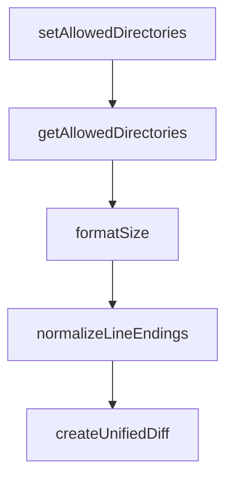

# Chapter 4: Memory Server

Welcome to **Chapter 4: Memory Server**. In this part of **MCP Servers Tutorial: Reference Implementations and Patterns**, you will build an intuitive mental model first, then move into concrete implementation details and practical production tradeoffs.


The memory server is a clean reference for persistent, structured memory using a local knowledge graph.

## Data Model

The official model uses three primitives:

- **Entities**: named nodes with types and observations
- **Relations**: directed edges between entities
- **Observations**: atomic facts attached to entities

This encourages explicit memory structure instead of opaque long-context accumulation.

## Tool Groups

The server groups operations into:

- create: entities and relations
- update: add observations
- delete: entities/relations/observations
- query: search nodes, open nodes, read entire graph

This surface is small but expressive enough for many memory patterns.

## Design Advantages

- easy to inspect and debug state
- selective deletion and correction
- relation-based retrieval beyond plain text search
- portable JSON-like structures for external storage

## Operational Caveats

Memory quality degrades quickly without governance.

Add controls for:

- duplicate entities and alias handling
- contradictory observations
- stale relations
- source attribution and confidence labels

## Prompting Pattern

A practical pattern is:

1. retrieve relevant nodes first
2. reason with retrieved memory
3. apply bounded updates only when confidence is high

Avoid writing memory for every interaction. Quality beats quantity.

## Summary

You now understand how graph-based memory differs from ad-hoc conversation history and why it can be productionized more safely.

Next: [Chapter 5: Multi-Language Servers](05-multi-language-servers.md)

## What Problem Does This Solve?

Most teams struggle here because the hard part is not writing more code, but deciding clear boundaries for core abstractions in this chapter so behavior stays predictable as complexity grows.

In practical terms, this chapter helps you avoid three common failures:

- coupling core logic too tightly to one implementation path
- missing the handoff boundaries between setup, execution, and validation
- shipping changes without clear rollback or observability strategy

After working through this chapter, you should be able to reason about `Chapter 4: Memory Server` as an operating subsystem inside **MCP Servers Tutorial: Reference Implementations and Patterns**, with explicit contracts for inputs, state transitions, and outputs.

Use the implementation notes around execution and reliability details as your checklist when adapting these patterns to your own repository.

## How it Works Under the Hood

Under the hood, `Chapter 4: Memory Server` usually follows a repeatable control path:

1. **Context bootstrap**: initialize runtime config and prerequisites for `core component`.
2. **Input normalization**: shape incoming data so `execution layer` receives stable contracts.
3. **Core execution**: run the main logic branch and propagate intermediate state through `state model`.
4. **Policy and safety checks**: enforce limits, auth scopes, and failure boundaries.
5. **Output composition**: return canonical result payloads for downstream consumers.
6. **Operational telemetry**: emit logs/metrics needed for debugging and performance tuning.

When debugging, walk this sequence in order and confirm each stage has explicit success/failure conditions.

## Source Walkthrough

Use the following upstream sources to verify implementation details while reading this chapter:

- [MCP servers repository](https://github.com/modelcontextprotocol/servers)
  Why it matters: authoritative reference on `MCP servers repository` (github.com).

Suggested trace strategy:
- search upstream code for `Memory` and `Server` to map concrete implementation paths
- compare docs claims against actual runtime/config code before reusing patterns in production

## Chapter Connections

- [Tutorial Index](README.md)
- [Previous Chapter: Chapter 3: Git Server](03-git-server.md)
- [Next Chapter: Chapter 5: Multi-Language Servers](05-multi-language-servers.md)
- [Main Catalog](../../README.md#-tutorial-catalog)
- [A-Z Tutorial Directory](../../discoverability/tutorial-directory.md)

## Depth Expansion Playbook

## Source Code Walkthrough

### `src/filesystem/lib.ts`

The `setAllowedDirectories` function in [`src/filesystem/lib.ts`](https://github.com/modelcontextprotocol/servers/blob/HEAD/src/filesystem/lib.ts) handles a key part of this chapter's functionality:

```ts

// Function to set allowed directories from the main module
export function setAllowedDirectories(directories: string[]): void {
  allowedDirectories = [...directories];
}

// Function to get current allowed directories
export function getAllowedDirectories(): string[] {
  return [...allowedDirectories];
}

// Type definitions
interface FileInfo {
  size: number;
  created: Date;
  modified: Date;
  accessed: Date;
  isDirectory: boolean;
  isFile: boolean;
  permissions: string;
}

export interface SearchOptions {
  excludePatterns?: string[];
}

export interface SearchResult {
  path: string;
  isDirectory: boolean;
}

// Pure Utility Functions
```

This function is important because it defines how MCP Servers Tutorial: Reference Implementations and Patterns implements the patterns covered in this chapter.

### `src/filesystem/lib.ts`

The `getAllowedDirectories` function in [`src/filesystem/lib.ts`](https://github.com/modelcontextprotocol/servers/blob/HEAD/src/filesystem/lib.ts) handles a key part of this chapter's functionality:

```ts

// Function to get current allowed directories
export function getAllowedDirectories(): string[] {
  return [...allowedDirectories];
}

// Type definitions
interface FileInfo {
  size: number;
  created: Date;
  modified: Date;
  accessed: Date;
  isDirectory: boolean;
  isFile: boolean;
  permissions: string;
}

export interface SearchOptions {
  excludePatterns?: string[];
}

export interface SearchResult {
  path: string;
  isDirectory: boolean;
}

// Pure Utility Functions
export function formatSize(bytes: number): string {
  const units = ['B', 'KB', 'MB', 'GB', 'TB'];
  if (bytes === 0) return '0 B';
  
  const i = Math.floor(Math.log(bytes) / Math.log(1024));
```

This function is important because it defines how MCP Servers Tutorial: Reference Implementations and Patterns implements the patterns covered in this chapter.

### `src/filesystem/lib.ts`

The `formatSize` function in [`src/filesystem/lib.ts`](https://github.com/modelcontextprotocol/servers/blob/HEAD/src/filesystem/lib.ts) handles a key part of this chapter's functionality:

```ts

// Pure Utility Functions
export function formatSize(bytes: number): string {
  const units = ['B', 'KB', 'MB', 'GB', 'TB'];
  if (bytes === 0) return '0 B';
  
  const i = Math.floor(Math.log(bytes) / Math.log(1024));
  
  if (i < 0 || i === 0) return `${bytes} ${units[0]}`;
  
  const unitIndex = Math.min(i, units.length - 1);
  return `${(bytes / Math.pow(1024, unitIndex)).toFixed(2)} ${units[unitIndex]}`;
}

export function normalizeLineEndings(text: string): string {
  return text.replace(/\r\n/g, '\n');
}

export function createUnifiedDiff(originalContent: string, newContent: string, filepath: string = 'file'): string {
  // Ensure consistent line endings for diff
  const normalizedOriginal = normalizeLineEndings(originalContent);
  const normalizedNew = normalizeLineEndings(newContent);

  return createTwoFilesPatch(
    filepath,
    filepath,
    normalizedOriginal,
    normalizedNew,
    'original',
    'modified'
  );
}
```

This function is important because it defines how MCP Servers Tutorial: Reference Implementations and Patterns implements the patterns covered in this chapter.

### `src/filesystem/lib.ts`

The `normalizeLineEndings` function in [`src/filesystem/lib.ts`](https://github.com/modelcontextprotocol/servers/blob/HEAD/src/filesystem/lib.ts) handles a key part of this chapter's functionality:

```ts
}

export function normalizeLineEndings(text: string): string {
  return text.replace(/\r\n/g, '\n');
}

export function createUnifiedDiff(originalContent: string, newContent: string, filepath: string = 'file'): string {
  // Ensure consistent line endings for diff
  const normalizedOriginal = normalizeLineEndings(originalContent);
  const normalizedNew = normalizeLineEndings(newContent);

  return createTwoFilesPatch(
    filepath,
    filepath,
    normalizedOriginal,
    normalizedNew,
    'original',
    'modified'
  );
}

// Helper function to resolve relative paths against allowed directories
function resolveRelativePathAgainstAllowedDirectories(relativePath: string): string {
  if (allowedDirectories.length === 0) {
    // Fallback to process.cwd() if no allowed directories are set
    return path.resolve(process.cwd(), relativePath);
  }

  // Try to resolve relative path against each allowed directory
  for (const allowedDir of allowedDirectories) {
    const candidate = path.resolve(allowedDir, relativePath);
    const normalizedCandidate = normalizePath(candidate);
```

This function is important because it defines how MCP Servers Tutorial: Reference Implementations and Patterns implements the patterns covered in this chapter.


## How These Components Connect


