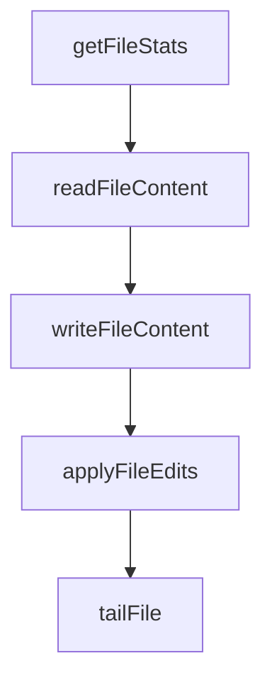

# Chapter 5: Multi-Language Servers

Welcome to **Chapter 5: Multi-Language Servers**. In this part of **MCP Servers Tutorial: Reference Implementations and Patterns**, you will build an intuitive mental model first, then move into concrete implementation details and practical production tradeoffs.


MCP reference patterns are intentionally language-agnostic. The same conceptual design appears across SDKs.

## Official SDK Coverage

The MCP organization maintains SDKs across many languages, including Python, TypeScript, Rust, Go, Java, Kotlin, C#, PHP, Ruby, and Swift.

## What Stays the Same Across Languages

- tool registration model
- request/response semantics
- safety boundary design
- transport concepts (stdio/HTTP/SSE where supported)

## What Changes by Language Ecosystem

| Area | Python | TypeScript | Systems Languages |
|:-----|:-------|:-----------|:------------------|
| Runtime style | async/await + dynamic typing with models | async event loops + schema tooling | strict compile-time interfaces |
| Packaging norms | `pip`, `uv`, virtualenv | `npm`, `pnpm`, `npx` | language-specific build pipelines |
| Concurrency model | asyncio patterns | Promise/event-driven patterns | thread/async runtime depending on stack |
| Typical deployment path | containers/services | node services/edge apps | compiled binaries/containers |

## Porting Guidance

When porting a server pattern:

1. Port data contracts first.
2. Port safety checks second.
3. Port tooling ergonomics last.

This order preserves behavior while allowing runtime-specific optimization.

## Cross-Language Consistency Tests

For teams running multiple language implementations, enforce:

- shared tool contract snapshots
- shared negative test cases
- shared security invariants

## Summary

You can now evaluate and port MCP patterns without coupling to a single language runtime.

Next: [Chapter 6: Custom Server Development](06-custom-server-development.md)

## What Problem Does This Solve?

Most teams struggle here because the hard part is not writing more code, but deciding clear boundaries for core abstractions in this chapter so behavior stays predictable as complexity grows.

In practical terms, this chapter helps you avoid three common failures:

- coupling core logic too tightly to one implementation path
- missing the handoff boundaries between setup, execution, and validation
- shipping changes without clear rollback or observability strategy

After working through this chapter, you should be able to reason about `Chapter 5: Multi-Language Servers` as an operating subsystem inside **MCP Servers Tutorial: Reference Implementations and Patterns**, with explicit contracts for inputs, state transitions, and outputs.

Use the implementation notes around execution and reliability details as your checklist when adapting these patterns to your own repository.

## How it Works Under the Hood

Under the hood, `Chapter 5: Multi-Language Servers` usually follows a repeatable control path:

1. **Context bootstrap**: initialize runtime config and prerequisites for `core component`.
2. **Input normalization**: shape incoming data so `execution layer` receives stable contracts.
3. **Core execution**: run the main logic branch and propagate intermediate state through `state model`.
4. **Policy and safety checks**: enforce limits, auth scopes, and failure boundaries.
5. **Output composition**: return canonical result payloads for downstream consumers.
6. **Operational telemetry**: emit logs/metrics needed for debugging and performance tuning.

When debugging, walk this sequence in order and confirm each stage has explicit success/failure conditions.

## Source Walkthrough

Use the following upstream sources to verify implementation details while reading this chapter:

- [MCP servers repository](https://github.com/modelcontextprotocol/servers)
  Why it matters: authoritative reference on `MCP servers repository` (github.com).

Suggested trace strategy:
- search upstream code for `Multi-Language` and `Servers` to map concrete implementation paths
- compare docs claims against actual runtime/config code before reusing patterns in production

## Chapter Connections

- [Tutorial Index](README.md)
- [Previous Chapter: Chapter 4: Memory Server](04-memory-server.md)
- [Next Chapter: Chapter 6: Custom Server Development](06-custom-server-development.md)
- [Main Catalog](../../README.md#-tutorial-catalog)
- [A-Z Tutorial Directory](../../discoverability/tutorial-directory.md)

## Depth Expansion Playbook

## Source Code Walkthrough

### `src/filesystem/lib.ts`

The `getFileStats` function in [`src/filesystem/lib.ts`](https://github.com/modelcontextprotocol/servers/blob/HEAD/src/filesystem/lib.ts) handles a key part of this chapter's functionality:

```ts

// File Operations
export async function getFileStats(filePath: string): Promise<FileInfo> {
  const stats = await fs.stat(filePath);
  return {
    size: stats.size,
    created: stats.birthtime,
    modified: stats.mtime,
    accessed: stats.atime,
    isDirectory: stats.isDirectory(),
    isFile: stats.isFile(),
    permissions: stats.mode.toString(8).slice(-3),
  };
}

export async function readFileContent(filePath: string, encoding: string = 'utf-8'): Promise<string> {
  return await fs.readFile(filePath, encoding as BufferEncoding);
}

export async function writeFileContent(filePath: string, content: string): Promise<void> {
  try {
    // Security: 'wx' flag ensures exclusive creation - fails if file/symlink exists,
    // preventing writes through pre-existing symlinks
    await fs.writeFile(filePath, content, { encoding: "utf-8", flag: 'wx' });
  } catch (error) {
    if ((error as NodeJS.ErrnoException).code === 'EEXIST') {
      // Security: Use atomic rename to prevent race conditions where symlinks
      // could be created between validation and write. Rename operations
      // replace the target file atomically and don't follow symlinks.
      const tempPath = `${filePath}.${randomBytes(16).toString('hex')}.tmp`;
      try {
        await fs.writeFile(tempPath, content, 'utf-8');
```

This function is important because it defines how MCP Servers Tutorial: Reference Implementations and Patterns implements the patterns covered in this chapter.

### `src/filesystem/lib.ts`

The `readFileContent` function in [`src/filesystem/lib.ts`](https://github.com/modelcontextprotocol/servers/blob/HEAD/src/filesystem/lib.ts) handles a key part of this chapter's functionality:

```ts
}

export async function readFileContent(filePath: string, encoding: string = 'utf-8'): Promise<string> {
  return await fs.readFile(filePath, encoding as BufferEncoding);
}

export async function writeFileContent(filePath: string, content: string): Promise<void> {
  try {
    // Security: 'wx' flag ensures exclusive creation - fails if file/symlink exists,
    // preventing writes through pre-existing symlinks
    await fs.writeFile(filePath, content, { encoding: "utf-8", flag: 'wx' });
  } catch (error) {
    if ((error as NodeJS.ErrnoException).code === 'EEXIST') {
      // Security: Use atomic rename to prevent race conditions where symlinks
      // could be created between validation and write. Rename operations
      // replace the target file atomically and don't follow symlinks.
      const tempPath = `${filePath}.${randomBytes(16).toString('hex')}.tmp`;
      try {
        await fs.writeFile(tempPath, content, 'utf-8');
        await fs.rename(tempPath, filePath);
      } catch (renameError) {
        try {
          await fs.unlink(tempPath);
        } catch {}
        throw renameError;
      }
    } else {
      throw error;
    }
  }
}

```

This function is important because it defines how MCP Servers Tutorial: Reference Implementations and Patterns implements the patterns covered in this chapter.

### `src/filesystem/lib.ts`

The `writeFileContent` function in [`src/filesystem/lib.ts`](https://github.com/modelcontextprotocol/servers/blob/HEAD/src/filesystem/lib.ts) handles a key part of this chapter's functionality:

```ts
}

export async function writeFileContent(filePath: string, content: string): Promise<void> {
  try {
    // Security: 'wx' flag ensures exclusive creation - fails if file/symlink exists,
    // preventing writes through pre-existing symlinks
    await fs.writeFile(filePath, content, { encoding: "utf-8", flag: 'wx' });
  } catch (error) {
    if ((error as NodeJS.ErrnoException).code === 'EEXIST') {
      // Security: Use atomic rename to prevent race conditions where symlinks
      // could be created between validation and write. Rename operations
      // replace the target file atomically and don't follow symlinks.
      const tempPath = `${filePath}.${randomBytes(16).toString('hex')}.tmp`;
      try {
        await fs.writeFile(tempPath, content, 'utf-8');
        await fs.rename(tempPath, filePath);
      } catch (renameError) {
        try {
          await fs.unlink(tempPath);
        } catch {}
        throw renameError;
      }
    } else {
      throw error;
    }
  }
}


// File Editing Functions
interface FileEdit {
  oldText: string;
```

This function is important because it defines how MCP Servers Tutorial: Reference Implementations and Patterns implements the patterns covered in this chapter.

### `src/filesystem/lib.ts`

The `applyFileEdits` function in [`src/filesystem/lib.ts`](https://github.com/modelcontextprotocol/servers/blob/HEAD/src/filesystem/lib.ts) handles a key part of this chapter's functionality:

```ts
}

export async function applyFileEdits(
  filePath: string,
  edits: FileEdit[],
  dryRun: boolean = false
): Promise<string> {
  // Read file content and normalize line endings
  const content = normalizeLineEndings(await fs.readFile(filePath, 'utf-8'));

  // Apply edits sequentially
  let modifiedContent = content;
  for (const edit of edits) {
    const normalizedOld = normalizeLineEndings(edit.oldText);
    const normalizedNew = normalizeLineEndings(edit.newText);

    // If exact match exists, use it
    if (modifiedContent.includes(normalizedOld)) {
      modifiedContent = modifiedContent.replace(normalizedOld, normalizedNew);
      continue;
    }

    // Otherwise, try line-by-line matching with flexibility for whitespace
    const oldLines = normalizedOld.split('\n');
    const contentLines = modifiedContent.split('\n');
    let matchFound = false;

    for (let i = 0; i <= contentLines.length - oldLines.length; i++) {
      const potentialMatch = contentLines.slice(i, i + oldLines.length);

      // Compare lines with normalized whitespace
      const isMatch = oldLines.every((oldLine, j) => {
```

This function is important because it defines how MCP Servers Tutorial: Reference Implementations and Patterns implements the patterns covered in this chapter.


## How These Components Connect


