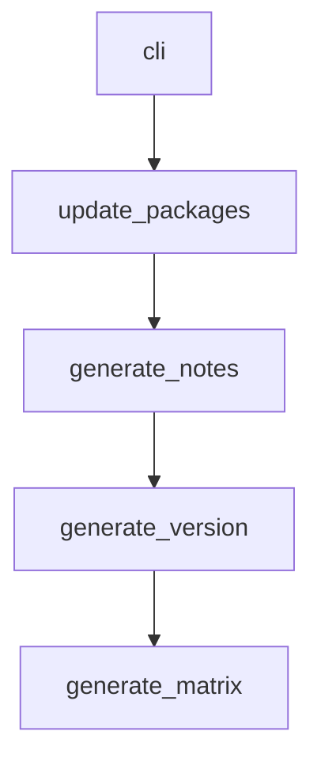

# Chapter 6: Custom Server Development

Welcome to **Chapter 6: Custom Server Development**. In this part of **MCP Servers Tutorial: Reference Implementations and Patterns**, you will build an intuitive mental model first, then move into concrete implementation details and practical production tradeoffs.


This chapter turns reference patterns into your own server implementation approach.

## Build Sequence

Use this sequence instead of coding tools ad hoc:

1. Define tool contracts (inputs, outputs, error types).
2. Define authorization and side-effect policy.
3. Implement read-only tools first.
4. Add mutating tools with explicit confirmations.
5. Add observability hooks before rollout.

## Recommended Starting Point

Pick the closest reference server to your domain.

- file-centric automation -> filesystem
- repository workflows -> git
- conversational memory -> memory
- utility helpers -> time/fetch

Reuse structure, not just code snippets.

## Tool Contract Template

```text
name
purpose
input schema
output schema
idempotency behavior
destructive behavior
failure taxonomy
```

If this template is incomplete, production operation will likely be painful.

## Implementation Checklist

- Strict schema validation on input/output
- Deterministic error objects
- Timeouts and cancellation handling
- Bounded retries where safe
- Safe defaults for missing optional fields

## Verification Before Release

Run both protocol-level and behavior-level checks:

- protocol handshake and tool listing
- negative tests for malformed inputs
- side-effect tests in sandbox environments
- audit log completeness checks

## Summary

You now have a repeatable way to turn reference ideas into a maintainable custom MCP server.

Next: [Chapter 7: Security Considerations](07-security-considerations.md)

## What Problem Does This Solve?

Most teams struggle here because the hard part is not writing more code, but deciding clear boundaries for `schema`, `behavior`, `name` so behavior stays predictable as complexity grows.

In practical terms, this chapter helps you avoid three common failures:

- coupling core logic too tightly to one implementation path
- missing the handoff boundaries between setup, execution, and validation
- shipping changes without clear rollback or observability strategy

After working through this chapter, you should be able to reason about `Chapter 6: Custom Server Development` as an operating subsystem inside **MCP Servers Tutorial: Reference Implementations and Patterns**, with explicit contracts for inputs, state transitions, and outputs.

Use the implementation notes around `purpose`, `input`, `output` as your checklist when adapting these patterns to your own repository.

## How it Works Under the Hood

Under the hood, `Chapter 6: Custom Server Development` usually follows a repeatable control path:

1. **Context bootstrap**: initialize runtime config and prerequisites for `schema`.
2. **Input normalization**: shape incoming data so `behavior` receives stable contracts.
3. **Core execution**: run the main logic branch and propagate intermediate state through `name`.
4. **Policy and safety checks**: enforce limits, auth scopes, and failure boundaries.
5. **Output composition**: return canonical result payloads for downstream consumers.
6. **Operational telemetry**: emit logs/metrics needed for debugging and performance tuning.

When debugging, walk this sequence in order and confirm each stage has explicit success/failure conditions.

## Source Walkthrough

Use the following upstream sources to verify implementation details while reading this chapter:

- [MCP servers repository](https://github.com/modelcontextprotocol/servers)
  Why it matters: authoritative reference on `MCP servers repository` (github.com).

Suggested trace strategy:
- search upstream code for `schema` and `behavior` to map concrete implementation paths
- compare docs claims against actual runtime/config code before reusing patterns in production

## Chapter Connections

- [Tutorial Index](README.md)
- [Previous Chapter: Chapter 5: Multi-Language Servers](05-multi-language-servers.md)
- [Next Chapter: Chapter 7: Security Considerations](07-security-considerations.md)
- [Main Catalog](../../README.md#-tutorial-catalog)
- [A-Z Tutorial Directory](../../discoverability/tutorial-directory.md)

## Source Code Walkthrough

### `scripts/release.py`

The `cli` function in [`scripts/release.py`](https://github.com/modelcontextprotocol/servers/blob/HEAD/scripts/release.py) handles a key part of this chapter's functionality:

```py
# requires-python = ">=3.12"
# dependencies = [
#     "click>=8.1.8",
#     "tomlkit>=0.13.2"
# ]
# ///
import sys
import re
import click
from pathlib import Path
import json
import tomlkit
import datetime
import subprocess
from dataclasses import dataclass
from typing import Any, Iterator, NewType, Protocol


Version = NewType("Version", str)
GitHash = NewType("GitHash", str)


class GitHashParamType(click.ParamType):
    name = "git_hash"

    def convert(
        self, value: Any, param: click.Parameter | None, ctx: click.Context | None
    ) -> GitHash | None:
        if value is None:
            return None

        if not (8 <= len(value) <= 40):
```

This function is important because it defines how MCP Servers Tutorial: Reference Implementations and Patterns implements the patterns covered in this chapter.

### `scripts/release.py`

The `update_packages` function in [`scripts/release.py`](https://github.com/modelcontextprotocol/servers/blob/HEAD/scripts/release.py) handles a key part of this chapter's functionality:

```py
)
@click.argument("git_hash", type=GIT_HASH)
def update_packages(directory: Path, git_hash: GitHash) -> int:
    # Detect package type
    path = directory.resolve(strict=True)
    version = gen_version()

    for package in find_changed_packages(path, git_hash):
        name = package.package_name()
        package.update_version(version)

        click.echo(f"{name}@{version}")

    return 0


@cli.command("generate-notes")
@click.option(
    "--directory", type=click.Path(exists=True, path_type=Path), default=Path.cwd()
)
@click.argument("git_hash", type=GIT_HASH)
def generate_notes(directory: Path, git_hash: GitHash) -> int:
    # Detect package type
    path = directory.resolve(strict=True)
    version = gen_version()

    click.echo(f"# Release : v{version}")
    click.echo("")
    click.echo("## Updated packages")
    for package in find_changed_packages(path, git_hash):
        name = package.package_name()
        click.echo(f"- {name}@{version}")
```

This function is important because it defines how MCP Servers Tutorial: Reference Implementations and Patterns implements the patterns covered in this chapter.

### `scripts/release.py`

The `generate_notes` function in [`scripts/release.py`](https://github.com/modelcontextprotocol/servers/blob/HEAD/scripts/release.py) handles a key part of this chapter's functionality:

```py
)
@click.argument("git_hash", type=GIT_HASH)
def generate_notes(directory: Path, git_hash: GitHash) -> int:
    # Detect package type
    path = directory.resolve(strict=True)
    version = gen_version()

    click.echo(f"# Release : v{version}")
    click.echo("")
    click.echo("## Updated packages")
    for package in find_changed_packages(path, git_hash):
        name = package.package_name()
        click.echo(f"- {name}@{version}")

    return 0


@cli.command("generate-version")
def generate_version() -> int:
    # Detect package type
    click.echo(gen_version())
    return 0


@cli.command("generate-matrix")
@click.option(
    "--directory", type=click.Path(exists=True, path_type=Path), default=Path.cwd()
)
@click.option("--npm", is_flag=True, default=False)
@click.option("--pypi", is_flag=True, default=False)
@click.argument("git_hash", type=GIT_HASH)
def generate_matrix(directory: Path, git_hash: GitHash, pypi: bool, npm: bool) -> int:
```

This function is important because it defines how MCP Servers Tutorial: Reference Implementations and Patterns implements the patterns covered in this chapter.

### `scripts/release.py`

The `generate_version` function in [`scripts/release.py`](https://github.com/modelcontextprotocol/servers/blob/HEAD/scripts/release.py) handles a key part of this chapter's functionality:

```py

@cli.command("generate-version")
def generate_version() -> int:
    # Detect package type
    click.echo(gen_version())
    return 0


@cli.command("generate-matrix")
@click.option(
    "--directory", type=click.Path(exists=True, path_type=Path), default=Path.cwd()
)
@click.option("--npm", is_flag=True, default=False)
@click.option("--pypi", is_flag=True, default=False)
@click.argument("git_hash", type=GIT_HASH)
def generate_matrix(directory: Path, git_hash: GitHash, pypi: bool, npm: bool) -> int:
    # Detect package type
    path = directory.resolve(strict=True)
    version = gen_version()

    changes = []
    for package in find_changed_packages(path, git_hash):
        pkg = package.path.relative_to(path)
        if npm and isinstance(package, NpmPackage):
            changes.append(str(pkg))
        if pypi and isinstance(package, PyPiPackage):
            changes.append(str(pkg))

    click.echo(json.dumps(changes))
    return 0


```

This function is important because it defines how MCP Servers Tutorial: Reference Implementations and Patterns implements the patterns covered in this chapter.


## How These Components Connect


