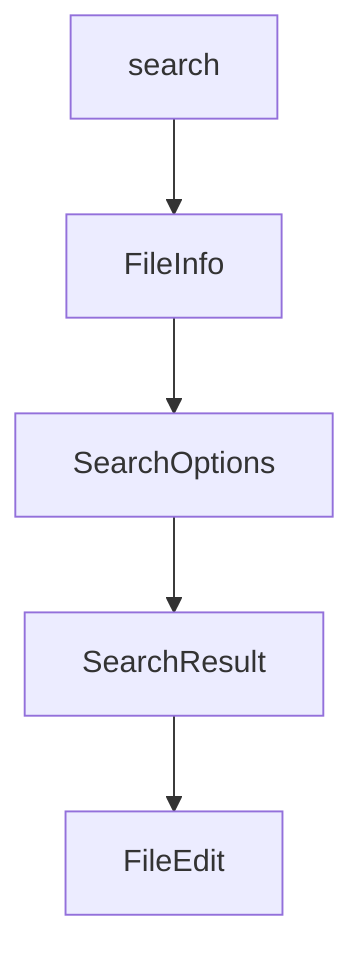

# Chapter 6: Custom Server Development

Welcome to **Chapter 6: Custom Server Development**. In this part of **MCP Servers Tutorial: Reference Implementations and Patterns**, you will build an intuitive mental model first, then move into concrete implementation details and practical production tradeoffs.


This chapter turns reference patterns into your own server implementation approach.

## Build Sequence

Use this sequence instead of coding tools ad hoc:

1. Define tool contracts (inputs, outputs, error types).
2. Define authorization and side-effect policy.
3. Implement read-only tools first.
4. Add mutating tools with explicit confirmations.
5. Add observability hooks before rollout.

## Recommended Starting Point

Pick the closest reference server to your domain.

- file-centric automation -> filesystem
- repository workflows -> git
- conversational memory -> memory
- utility helpers -> time/fetch

Reuse structure, not just code snippets.

## Tool Contract Template

```text
name
purpose
input schema
output schema
idempotency behavior
destructive behavior
failure taxonomy
```

If this template is incomplete, production operation will likely be painful.

## Implementation Checklist

- Strict schema validation on input/output
- Deterministic error objects
- Timeouts and cancellation handling
- Bounded retries where safe
- Safe defaults for missing optional fields

## Verification Before Release

Run both protocol-level and behavior-level checks:

- protocol handshake and tool listing
- negative tests for malformed inputs
- side-effect tests in sandbox environments
- audit log completeness checks

## Summary

You now have a repeatable way to turn reference ideas into a maintainable custom MCP server.

Next: [Chapter 7: Security Considerations](07-security-considerations.md)

## What Problem Does This Solve?

Most teams struggle here because the hard part is not writing more code, but deciding clear boundaries for `schema`, `behavior`, `name` so behavior stays predictable as complexity grows.

In practical terms, this chapter helps you avoid three common failures:

- coupling core logic too tightly to one implementation path
- missing the handoff boundaries between setup, execution, and validation
- shipping changes without clear rollback or observability strategy

After working through this chapter, you should be able to reason about `Chapter 6: Custom Server Development` as an operating subsystem inside **MCP Servers Tutorial: Reference Implementations and Patterns**, with explicit contracts for inputs, state transitions, and outputs.

Use the implementation notes around `purpose`, `input`, `output` as your checklist when adapting these patterns to your own repository.

## How it Works Under the Hood

Under the hood, `Chapter 6: Custom Server Development` usually follows a repeatable control path:

1. **Context bootstrap**: initialize runtime config and prerequisites for `schema`.
2. **Input normalization**: shape incoming data so `behavior` receives stable contracts.
3. **Core execution**: run the main logic branch and propagate intermediate state through `name`.
4. **Policy and safety checks**: enforce limits, auth scopes, and failure boundaries.
5. **Output composition**: return canonical result payloads for downstream consumers.
6. **Operational telemetry**: emit logs/metrics needed for debugging and performance tuning.

When debugging, walk this sequence in order and confirm each stage has explicit success/failure conditions.

## Source Walkthrough

Use the following upstream sources to verify implementation details while reading this chapter:

- [MCP servers repository](https://github.com/modelcontextprotocol/servers)
  Why it matters: authoritative reference on `MCP servers repository` (github.com).

Suggested trace strategy:
- search upstream code for `schema` and `behavior` to map concrete implementation paths
- compare docs claims against actual runtime/config code before reusing patterns in production

## Chapter Connections

- [Tutorial Index](README.md)
- [Previous Chapter: Chapter 5: Multi-Language Servers](05-multi-language-servers.md)
- [Next Chapter: Chapter 7: Security Considerations](07-security-considerations.md)
- [Main Catalog](../../README.md#-tutorial-catalog)
- [A-Z Tutorial Directory](../../discoverability/tutorial-directory.md)

## Depth Expansion Playbook

## Source Code Walkthrough

### `src/filesystem/lib.ts`

The `search` function in [`src/filesystem/lib.ts`](https://github.com/modelcontextprotocol/servers/blob/HEAD/src/filesystem/lib.ts) handles a key part of this chapter's functionality:

```ts
}

export async function searchFilesWithValidation(
  rootPath: string,
  pattern: string,
  allowedDirectories: string[],
  options: SearchOptions = {}
): Promise<string[]> {
  const { excludePatterns = [] } = options;
  const results: string[] = [];

  async function search(currentPath: string) {
    const entries = await fs.readdir(currentPath, { withFileTypes: true });

    for (const entry of entries) {
      const fullPath = path.join(currentPath, entry.name);

      try {
        await validatePath(fullPath);

        const relativePath = path.relative(rootPath, fullPath);
        const shouldExclude = excludePatterns.some(excludePattern =>
          minimatch(relativePath, excludePattern, { dot: true })
        );

        if (shouldExclude) continue;

        // Use glob matching for the search pattern
        if (minimatch(relativePath, pattern, { dot: true })) {
          results.push(fullPath);
        }

```

This function is important because it defines how MCP Servers Tutorial: Reference Implementations and Patterns implements the patterns covered in this chapter.

### `src/filesystem/lib.ts`

The `FileInfo` interface in [`src/filesystem/lib.ts`](https://github.com/modelcontextprotocol/servers/blob/HEAD/src/filesystem/lib.ts) handles a key part of this chapter's functionality:

```ts

// Type definitions
interface FileInfo {
  size: number;
  created: Date;
  modified: Date;
  accessed: Date;
  isDirectory: boolean;
  isFile: boolean;
  permissions: string;
}

export interface SearchOptions {
  excludePatterns?: string[];
}

export interface SearchResult {
  path: string;
  isDirectory: boolean;
}

// Pure Utility Functions
export function formatSize(bytes: number): string {
  const units = ['B', 'KB', 'MB', 'GB', 'TB'];
  if (bytes === 0) return '0 B';
  
  const i = Math.floor(Math.log(bytes) / Math.log(1024));
  
  if (i < 0 || i === 0) return `${bytes} ${units[0]}`;
  
  const unitIndex = Math.min(i, units.length - 1);
  return `${(bytes / Math.pow(1024, unitIndex)).toFixed(2)} ${units[unitIndex]}`;
```

This interface is important because it defines how MCP Servers Tutorial: Reference Implementations and Patterns implements the patterns covered in this chapter.

### `src/filesystem/lib.ts`

The `SearchOptions` interface in [`src/filesystem/lib.ts`](https://github.com/modelcontextprotocol/servers/blob/HEAD/src/filesystem/lib.ts) handles a key part of this chapter's functionality:

```ts
}

export interface SearchOptions {
  excludePatterns?: string[];
}

export interface SearchResult {
  path: string;
  isDirectory: boolean;
}

// Pure Utility Functions
export function formatSize(bytes: number): string {
  const units = ['B', 'KB', 'MB', 'GB', 'TB'];
  if (bytes === 0) return '0 B';
  
  const i = Math.floor(Math.log(bytes) / Math.log(1024));
  
  if (i < 0 || i === 0) return `${bytes} ${units[0]}`;
  
  const unitIndex = Math.min(i, units.length - 1);
  return `${(bytes / Math.pow(1024, unitIndex)).toFixed(2)} ${units[unitIndex]}`;
}

export function normalizeLineEndings(text: string): string {
  return text.replace(/\r\n/g, '\n');
}

export function createUnifiedDiff(originalContent: string, newContent: string, filepath: string = 'file'): string {
  // Ensure consistent line endings for diff
  const normalizedOriginal = normalizeLineEndings(originalContent);
  const normalizedNew = normalizeLineEndings(newContent);
```

This interface is important because it defines how MCP Servers Tutorial: Reference Implementations and Patterns implements the patterns covered in this chapter.

### `src/filesystem/lib.ts`

The `SearchResult` interface in [`src/filesystem/lib.ts`](https://github.com/modelcontextprotocol/servers/blob/HEAD/src/filesystem/lib.ts) handles a key part of this chapter's functionality:

```ts
}

export interface SearchResult {
  path: string;
  isDirectory: boolean;
}

// Pure Utility Functions
export function formatSize(bytes: number): string {
  const units = ['B', 'KB', 'MB', 'GB', 'TB'];
  if (bytes === 0) return '0 B';
  
  const i = Math.floor(Math.log(bytes) / Math.log(1024));
  
  if (i < 0 || i === 0) return `${bytes} ${units[0]}`;
  
  const unitIndex = Math.min(i, units.length - 1);
  return `${(bytes / Math.pow(1024, unitIndex)).toFixed(2)} ${units[unitIndex]}`;
}

export function normalizeLineEndings(text: string): string {
  return text.replace(/\r\n/g, '\n');
}

export function createUnifiedDiff(originalContent: string, newContent: string, filepath: string = 'file'): string {
  // Ensure consistent line endings for diff
  const normalizedOriginal = normalizeLineEndings(originalContent);
  const normalizedNew = normalizeLineEndings(newContent);

  return createTwoFilesPatch(
    filepath,
    filepath,
```

This interface is important because it defines how MCP Servers Tutorial: Reference Implementations and Patterns implements the patterns covered in this chapter.


## How These Components Connect


