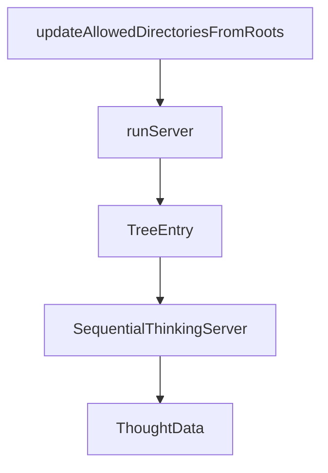

# Chapter 7: Security Considerations

Welcome to **Chapter 7: Security Considerations**. In this part of **MCP Servers Tutorial: Reference Implementations and Patterns**, you will build an intuitive mental model first, then move into concrete implementation details and practical production tradeoffs.


Security is the largest gap between reference servers and production deployment.

## Start with a Threat Model

At minimum, answer:

- What can this server read?
- What can it mutate?
- What trust boundary separates model output from side effects?
- What happens if tool arguments are malicious or malformed?

## Control Layers

| Layer | Control |
|:------|:--------|
| Input validation | Strict schema + semantic checks |
| Authorization | Allowlists for paths/resources/actions |
| Execution boundary | Sandboxing and least privilege runtime |
| Change protection | Confirmation gates for destructive operations |
| Auditing | Immutable logs with actor, inputs, outputs, and outcome |

## High-Risk Patterns to Block

- unrestricted filesystem roots
- unconstrained shell/network execution behind tools
- silent mutation without user/system confirmation
- missing source-of-truth identity for requests

## Practical Security Enhancements

- classify tools by read/write/destructive and route policies accordingly
- require explicit approval for destructive or non-idempotent operations
- redact sensitive payloads in logs while preserving traceability
- enforce policy checks before tool execution, not after

## Incident Readiness

Have a runbook with:

- emergency disable switch for tool classes
- rollback strategy for unintended mutations
- artifact and log retention windows
- owner escalation path

## Summary

You now have a concrete security baseline for adapting MCP server patterns responsibly.

Next: [Chapter 8: Production Adaptation](08-production-adaptation.md)

## What Problem Does This Solve?

Most teams struggle here because the hard part is not writing more code, but deciding clear boundaries for core abstractions in this chapter so behavior stays predictable as complexity grows.

In practical terms, this chapter helps you avoid three common failures:

- coupling core logic too tightly to one implementation path
- missing the handoff boundaries between setup, execution, and validation
- shipping changes without clear rollback or observability strategy

After working through this chapter, you should be able to reason about `Chapter 7: Security Considerations` as an operating subsystem inside **MCP Servers Tutorial: Reference Implementations and Patterns**, with explicit contracts for inputs, state transitions, and outputs.

Use the implementation notes around execution and reliability details as your checklist when adapting these patterns to your own repository.

## How it Works Under the Hood

Under the hood, `Chapter 7: Security Considerations` usually follows a repeatable control path:

1. **Context bootstrap**: initialize runtime config and prerequisites for `core component`.
2. **Input normalization**: shape incoming data so `execution layer` receives stable contracts.
3. **Core execution**: run the main logic branch and propagate intermediate state through `state model`.
4. **Policy and safety checks**: enforce limits, auth scopes, and failure boundaries.
5. **Output composition**: return canonical result payloads for downstream consumers.
6. **Operational telemetry**: emit logs/metrics needed for debugging and performance tuning.

When debugging, walk this sequence in order and confirm each stage has explicit success/failure conditions.

## Source Walkthrough

Use the following upstream sources to verify implementation details while reading this chapter:

- [MCP servers repository](https://github.com/modelcontextprotocol/servers)
  Why it matters: authoritative reference on `MCP servers repository` (github.com).

Suggested trace strategy:
- search upstream code for `Security` and `Considerations` to map concrete implementation paths
- compare docs claims against actual runtime/config code before reusing patterns in production

## Chapter Connections

- [Tutorial Index](README.md)
- [Previous Chapter: Chapter 6: Custom Server Development](06-custom-server-development.md)
- [Next Chapter: Chapter 8: Production Adaptation](08-production-adaptation.md)
- [Main Catalog](../../README.md#-tutorial-catalog)
- [A-Z Tutorial Directory](../../discoverability/tutorial-directory.md)

## Depth Expansion Playbook

## Source Code Walkthrough

### `src/filesystem/index.ts`

The `updateAllowedDirectoriesFromRoots` function in [`src/filesystem/index.ts`](https://github.com/modelcontextprotocol/servers/blob/HEAD/src/filesystem/index.ts) handles a key part of this chapter's functionality:

```ts

// Updates allowed directories based on MCP client roots
async function updateAllowedDirectoriesFromRoots(requestedRoots: Root[]) {
  const validatedRootDirs = await getValidRootDirectories(requestedRoots);
  if (validatedRootDirs.length > 0) {
    allowedDirectories = [...validatedRootDirs];
    setAllowedDirectories(allowedDirectories); // Update the global state in lib.ts
    console.error(`Updated allowed directories from MCP roots: ${validatedRootDirs.length} valid directories`);
  } else {
    console.error("No valid root directories provided by client");
  }
}

// Handles dynamic roots updates during runtime, when client sends "roots/list_changed" notification, server fetches the updated roots and replaces all allowed directories with the new roots.
server.server.setNotificationHandler(RootsListChangedNotificationSchema, async () => {
  try {
    // Request the updated roots list from the client
    const response = await server.server.listRoots();
    if (response && 'roots' in response) {
      await updateAllowedDirectoriesFromRoots(response.roots);
    }
  } catch (error) {
    console.error("Failed to request roots from client:", error instanceof Error ? error.message : String(error));
  }
});

// Handles post-initialization setup, specifically checking for and fetching MCP roots.
server.server.oninitialized = async () => {
  const clientCapabilities = server.server.getClientCapabilities();

  if (clientCapabilities?.roots) {
    try {
```

This function is important because it defines how MCP Servers Tutorial: Reference Implementations and Patterns implements the patterns covered in this chapter.

### `src/filesystem/index.ts`

The `runServer` function in [`src/filesystem/index.ts`](https://github.com/modelcontextprotocol/servers/blob/HEAD/src/filesystem/index.ts) handles a key part of this chapter's functionality:

```ts

// Start server
async function runServer() {
  const transport = new StdioServerTransport();
  await server.connect(transport);
  console.error("Secure MCP Filesystem Server running on stdio");
  if (allowedDirectories.length === 0) {
    console.error("Started without allowed directories - waiting for client to provide roots via MCP protocol");
  }
}

runServer().catch((error) => {
  console.error("Fatal error running server:", error);
  process.exit(1);
});

```

This function is important because it defines how MCP Servers Tutorial: Reference Implementations and Patterns implements the patterns covered in this chapter.

### `src/filesystem/index.ts`

The `TreeEntry` interface in [`src/filesystem/index.ts`](https://github.com/modelcontextprotocol/servers/blob/HEAD/src/filesystem/index.ts) handles a key part of this chapter's functionality:

```ts
  },
  async (args: z.infer<typeof DirectoryTreeArgsSchema>) => {
    interface TreeEntry {
      name: string;
      type: 'file' | 'directory';
      children?: TreeEntry[];
    }
    const rootPath = args.path;

    async function buildTree(currentPath: string, excludePatterns: string[] = []): Promise<TreeEntry[]> {
      const validPath = await validatePath(currentPath);
      const entries = await fs.readdir(validPath, { withFileTypes: true });
      const result: TreeEntry[] = [];

      for (const entry of entries) {
        const relativePath = path.relative(rootPath, path.join(currentPath, entry.name));
        const shouldExclude = excludePatterns.some(pattern => {
          if (pattern.includes('*')) {
            return minimatch(relativePath, pattern, { dot: true });
          }
          // For files: match exact name or as part of path
          // For directories: match as directory path
          return minimatch(relativePath, pattern, { dot: true }) ||
            minimatch(relativePath, `**/${pattern}`, { dot: true }) ||
            minimatch(relativePath, `**/${pattern}/**`, { dot: true });
        });
        if (shouldExclude)
          continue;

        const entryData: TreeEntry = {
          name: entry.name,
          type: entry.isDirectory() ? 'directory' : 'file'
```

This interface is important because it defines how MCP Servers Tutorial: Reference Implementations and Patterns implements the patterns covered in this chapter.

### `src/sequentialthinking/lib.ts`

The `SequentialThinkingServer` class in [`src/sequentialthinking/lib.ts`](https://github.com/modelcontextprotocol/servers/blob/HEAD/src/sequentialthinking/lib.ts) handles a key part of this chapter's functionality:

```ts
}

export class SequentialThinkingServer {
  private thoughtHistory: ThoughtData[] = [];
  private branches: Record<string, ThoughtData[]> = {};
  private disableThoughtLogging: boolean;

  constructor() {
    this.disableThoughtLogging = (process.env.DISABLE_THOUGHT_LOGGING || "").toLowerCase() === "true";
  }

  private formatThought(thoughtData: ThoughtData): string {
    const { thoughtNumber, totalThoughts, thought, isRevision, revisesThought, branchFromThought, branchId } = thoughtData;

    let prefix = '';
    let context = '';

    if (isRevision) {
      prefix = chalk.yellow('🔄 Revision');
      context = ` (revising thought ${revisesThought})`;
    } else if (branchFromThought) {
      prefix = chalk.green('🌿 Branch');
      context = ` (from thought ${branchFromThought}, ID: ${branchId})`;
    } else {
      prefix = chalk.blue('💭 Thought');
      context = '';
    }

    const header = `${prefix} ${thoughtNumber}/${totalThoughts}${context}`;
    const border = '─'.repeat(Math.max(header.length, thought.length) + 4);

    return `
```

This class is important because it defines how MCP Servers Tutorial: Reference Implementations and Patterns implements the patterns covered in this chapter.


## How These Components Connect


